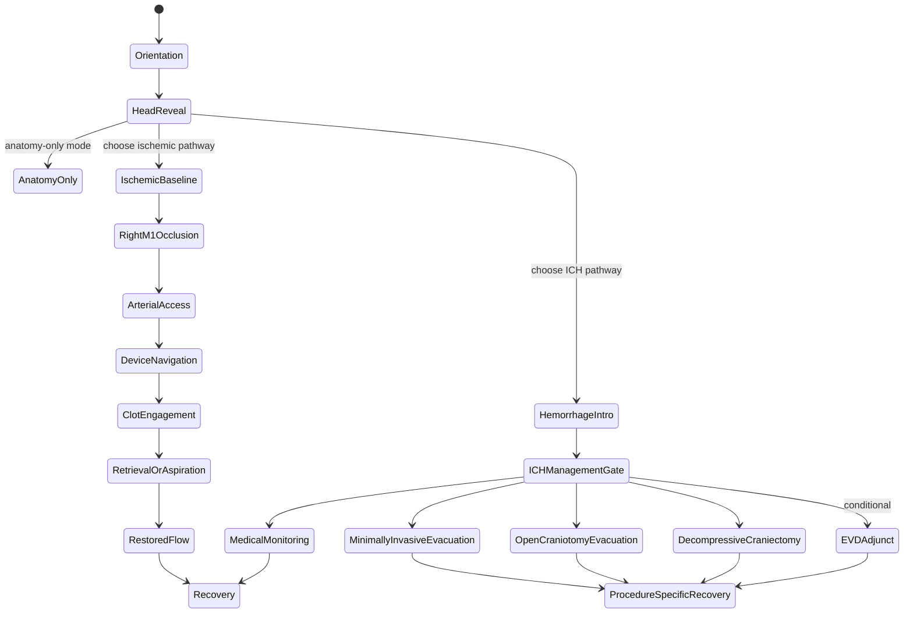

# MASTER — scene assembly, behavior, and Houdini handoff

This document is the implementation contract for assembling the repository's
150 release-catalog runtime assets into one coherent Apple Vision Pro
educational library and lesson system—not one 150-model scene. The native app
indexes all 150 and resolves only one to eight compatible packages for an
active recipe. The full source build has 152 unique package records;
two inner-ear-containing records are licence-held and not present as runtime
binaries in this publishing tree. Each release asset also has three explicit,
non-geometry presentation bindings (`minimal`, `reduced80`, and `full`) for 450
virtual variants; the runtime USDZ count remains 150.
It is written for a coding agent, technical artist, Houdini artist, or
RealityKit engineer. The individual asset descriptions live in the
[asset catalog](RealityKitContent/Assets/README.md); this file defines how the
assets relate, which ones may coexist, what owns runtime behavior, and what
must be validated before a patient-facing pilot.

> [!CAUTION]
> This is a generic educational visualization, not a medical device, digital
> twin, fluid-dynamics model, surgical rehearsal, or representation of a
> particular patient. No animation, collision, scale cue, or device motion may
> be described as measured physiology or as predicting treatment or outcome.

## 1. Authority and sources of truth

When files disagree, use this order:

1. The fourteen release JSON manifests are authoritative for asset IDs, package paths,
   units, up axis, provenance notes, and prohibited combinations.
2. This file is authoritative for assembly, state, interaction, and pathway
   rules.
3. The [asset catalog](RealityKitContent/Assets/README.md) is authoritative for
   the human-readable inventory.
4. [Licensing](docs/assets/LICENSES.md),
   [provenance](docs/assets/PROVENANCE.md), and
   [validation](docs/assets/VALIDATION.md) are release gates, not optional
   background reading.
5. The [clinical review checklist](docs/assets/source-notes/CLINICAL_REVIEW_CHECKLIST.md)
   must be signed for the exact build before any patient-facing pilot.
6. The [v3 detail catalog](docs/assets/INTRACRANIAL_ASSET_CATALOG_V3.md)
   preserves the 45 new build records one by one, including the two held records
   that are intentionally absent from the release manifest and binary tree.
7. The
   [surgical-tool stage audit](docs/assets/research/SURGICAL_TOOL_STAGE_AUDIT_V3.md)
   is authoritative for tool-category duplication checks, `EVT-*` and `OPEN-*`
   associations, branch gates, remaining gaps, qualitative physics boundaries,
   and Houdini stage slots. Stage associations are descriptive patient-education
   metadata, not operating instructions or a required clinical sequence.
   Machine readers may use the adjacent
   [stage map](docs/assets/research/surgical_tool_stage_map_v3.json) only after
   validating its IDs against the two release manifests.
8. The
   [adaptive visual research and safety contract](docs/adaptive-visuals/RESEARCH_AND_SAFETY.md)
   is authoritative for preference sources, biometric exclusions, progressive
   disclosure, family privacy, and patient-display review gates. The endpoint
   [OpenAPI contract](Services/AdaptiveAssetService/openapi.json) is
   machine-readable transport documentation, not clinical approval.
9. The
   [spatial-care environment manifest](RealityKitContent/Assets/vision_pro_stroke_kit_v2/asset_manifest_spatial_care_environment_v1.json)
   is authoritative for the ten room IDs, common-floor registration, anchor
   starting points, assembly exclusion, system-default environment rule, and
   package integrity.
10. The
    [spatial-interface resource manifest](RealityKitContent/InterfaceMedia/spatial_care_interface_v1/asset_manifest_spatial_interface_v1.json)
    is authoritative for supporting-media integrity. Its scene presets, cases,
    evidence placeholders, annotation scaffold, UI tokens, and icon mappings
    remain developer-preview/application resources—not clinical approval or a
    substitute for native visionOS implementation.
11. The
    [Page 2 surgical-state manifest](RealityKitContent/Assets/vision_pro_stroke_kit_v2/asset_manifest_figma_page2_surgical_states_v1.json)
    is authoritative for the five registered state layers, eight composition
    recipes, named flap entities, source-identity closure pose, source licences,
    and open-neurosurgery gate.
12. The
    [Page 2 interface manifest](RealityKitContent/InterfaceMedia/figma_page2_surgical_interface_v1/asset_manifest_figma_page2_surgical_interface_v1.json)
    is authoritative for its ten non-geometry resources and fail-closed pathway,
    copy, anchor, attachment, icon, token, and integrity contracts.
13. The
    [three-tier visual-detail catalog](RealityKitContent/InterfaceMedia/visual_detail_variants_v1/visual_detail_variant_catalog_v1.json),
    [category policy](RealityKitContent/InterfaceMedia/visual_detail_variants_v1/visual_detail_category_policy_v1.json),
    and exhaustive
    [text classification](RealityKitContent/InterfaceMedia/visual_detail_variants_v1/VISUAL_DETAIL_ASSET_CATEGORIES.txt)
    are authoritative for the 450 virtual `minimal`, `reduced80`, and `full`
    bindings. They add no USDZ geometry and grant no patient-display approval.
14. The native app's
    [developer handoff](Apps/StrokeImmersiveExperience/README.md),
    [Xcode project](Apps/StrokeImmersiveExperience/StrokeImmersiveExperience.xcodeproj),
    and app/core source under `Apps/StrokeImmersiveExperience/Sources` are
    authoritative for the subset that currently runs in visionOS Simulator.
    They do not override the manifests, exclusion graph, null copy/anchor
    gates, or clinical-release requirements above.
15. The native app's
    [interaction-feedback manifest](Apps/StrokeImmersiveExperience/Resources/InteractionFeedback/feedback_manifest_v1.json),
    [provenance](Apps/StrokeImmersiveExperience/Resources/InteractionFeedback/PROVENANCE.md),
    and [integration notes](Apps/StrokeImmersiveExperience/Resources/InteractionFeedback/README.md)
    are authoritative for the seven original earcons, one optional ambience
    loop, acoustic limits, cooldowns, default-off controls, and external-haptic
    boundary. They carry no therapeutic efficacy or built-in headset-vibration
    claim and do not override system accessibility settings.

The word **must** below means a release-blocking requirement. **Should** means
the default implementation unless a reviewed design decision says otherwise.

### 1.1 Current native implementation status

The repository now contains a native SwiftUI + RealityKit app at
[`Apps/StrokeImmersiveExperience`](Apps/StrokeImmersiveExperience). Its shared
scheme is `StrokeImmersiveExperience`, its developer-preview deployment target
is visionOS 27.0, and its canonical Simulator commands are:

```bash
Apps/StrokeImmersiveExperience/Scripts/run_core_smoke_tests.sh
Apps/StrokeImmersiveExperience/Scripts/InteractionFeedback/validate_earcons.py
Apps/StrokeImmersiveExperience/Tests/RuntimeAssetLoading/run_packaged_xros_probe.sh
Apps/StrokeImmersiveExperience/Scripts/build_install_launch.sh --build-only
Apps/StrokeImmersiveExperience/Scripts/build_install_launch.sh
Apps/StrokeImmersiveExperience/Scripts/build_install_launch.sh --device 'Stroke Care Vision Pro'
Apps/StrokeImmersiveExperience/Scripts/build_install_launch.sh --enable-open-preview
```

`--device` accepts an available Simulator UDID or exact name;
`--screenshot /absolute/path.png` captures after launch. The ordinary launch
keeps the open branch off. `--enable-open-preview` injects
`SIMCTL_CHILD_STROKE_ENABLE_OPEN_CRANIAL_DEVELOPER_PREVIEW=1` for that Simulator
process and still requires the in-app confirmation and developer state gate.

Implemented, with these exact boundaries:

- all 150 release USDZ packages are staged, integrity-checked, indexed, and
  searchable; an active recipe resolves only one to eight compatible packages;
- the 450 detail bindings are virtual sidecars over the same 150 USDZ packages,
  not 300 extra models; the 152-record source/build map and two held records are
  unchanged;
- the app has a black Figma-inspired window and full immersive developer space,
  fictional scenario cards, a lesson timeline, an explicit non-biometric
  detail slider, detached placeholder notes/vignettes, native controls, and a
  state-filtered toolbox;
- 14 bounded step recipes drive a default EVT lesson and a separately flagged,
  confirmed, developer-authorized open-cranial branch;
- visionOS owns gaze/focus and pinch selection; a spatial tap toggles the
  toolbox; “device,” “clot removal,” “access,” and “closure” interactions are
  reversible scripted visibility/state previews only;
- seven short original earcons mark sparse committed events, and one seamless
  water/rain ambience loop is available as an independent, default-off user
  preference. Continuous gaze, head pose, hand tracking, anatomy movement, and
  raw slider updates remain silent;
- a shared package-safe RealityKit loader retains URL/existence/byte/error
  diagnostics, exposes Retry in window and immersive views, and supports an
  installed-package probe. A clean Simulator package probe has loaded the 25
  assets used by built-in recipes/demos with zero decode failures.

Not implemented or proven:

- patient/family display (all current variant bindings remain blocked), clinical
  approval, medical-device use, physical Vision Pro execution, headset
  performance/comfort, or human usability;
- governed anatomy-pinned Figma/Page 2 notes, evidence cards, hotspots, leader
  lines, clinical copy, or completed anchor transforms; current notes and the
  vessel/micro views are detached developer placeholders;
- Page 2 decompressive-craniectomy, optional-EVD, or comprehensive pre-surgery
  and post-care branches beyond the narrow generic states in the 14 recipes;
- free-form cutting, drilling, catheter/clot manipulation, suturing, bleeding,
  fluid/tissue/device physics, force/depth/trajectory, or operative training;
- complete execution of every sidecar field. The native app preserves authored
  geometry and applies only safe whole-role/optional-layer visibility,
  saturation/contrast, label/information framing, and authored motion controls.
  It performs no inferred descendant/volume culling because semantic child
  mappings do not exist. Particle-count, texture-resolution, and specular
  values remain advisory until authored safe mappings are supplied;
- built-in tactile headset haptics. Vision Pro has no general-purpose vibration;
  only capability-detected, opted-in external accessories may consume the
  semantic haptic intents. Physical-device sound comfort, hearing-device
  behavior, and ambience preference have not been validated.

Simulator build/install evidence must remain distinct from physical-device,
clinical, accessibility, and patient-comprehension evidence.

## 2. Coordinate, scale, and registration contract

- Every shipped stage is authored **Y-up** with `metersPerUnit = 1`.
- The working USD/RealityKit convention is right-handed: +X right, +Y up, and
  -Z forward. This still does not establish anatomical laterality without
  landmark review.
- Preserve the imported asset transform. Do **not** add another Blender-to-USD
  `-90°` correction in Houdini, Reality Composer Pro, or RealityKit.
- Put user placement, orbit, pan, and zoom on an outer
  `ExperiencePlacementRoot`. Never overwrite the authored transforms inside a
  model to implement view controls.
- The realistic-v2 registered anatomy, head layers, cerebral arteries, flow
  overlay, clot, and cranial vasculature are intended to share the authored
  head frame where their manifest says `registered`.
- The semantic skull and eye context come from different atlas sources. Their
  alignment is approximate. Keep them separately selectable and do not treat
  their surfaces as millimetre-accurate contact boundaries.
- The artery-wall cutaway, RBC close-up, and microcirculation vignette are
  **magnified, scale-separated teaching views**. They belong in a separate
  vignette root and must never be overlaid on the head as if their relative
  dimensions were anatomical. V2 device inspection assets use a separate,
  non-registered domain but default to 1:1 scale; label them as magnified only
  when an inspection view actually changes their root scale.
- The neural-detail and non-held cranial-detail v3 packages are macroscopic
  generic-atlas layers in their recorded project registration frames. Preserve
  their authored transforms and semantic children; never normalize each package
  independently.
- Every intracranial-micro-v3 package uses
  `microscopic_conceptual_separate`. Its metre dimensions describe a
  presentation stage, not biological dimensions. It must be placed under
  `MicroScaleRoot`, never under `HeadRegisteredRoot`, and must keep a visible
  magnification/conceptual/non-patient warning for its entire display time.
- `brain_orientation_calm_educational_v1` belongs to a detached presentation
  domain under `AdaptivePresentationRoot`. Its authored metre/Y-up dimensions
  are preserved, but it is an orientation replacement—not a registered layer
  to overlay on the detailed brain. Never transfer its display transform,
  material profile, or simplified silhouette back into atlas geometry.
- The ten `spatial_care_environment_v1` packages share
  `experience_floor_origin`. Their room frame is X horizontal, Y up, and -Z
  into the room. Load them only under `OptionalEnvironmentRoot`; never center
  or normalize components independently. The suggested anchor transforms are
  design starting points, not safe-space, reach, comfort, or calibration proof.
- System passthrough on device and the selected Apple Vision Pro Simulator
  scene remain the default environment. The synthetic room is disabled unless
  an explicit fully immersive developer-demo or governed-review state enables
  it. Never load room geometry behind an ordinary window/volume merely to
  imitate a concept render.
- The checked-in native developer preview is a deliberate narrower exception:
  its `ImmersiveSpace` uses a black full-immersion stage and loads zero
  `spatial_care_environment_v1` packages. This is visual presentation only—not
  physical-space, boundary, reach, comfort, or device validation. A future
  patient-facing build must make its environment choice explicit and re-pass
  the governed environment and device gates.
- Tool-v3 packages use metre/Y-up presentation frames but are not registered
  patient anatomy or measured products. Handheld/display bounds are plausible
  authoring dimensions only; no asset may supply device sizing, compatibility,
  trajectory, depth, force, pressure, energy, sterility, or navigation data.
- Endovascular support packages belong only under the selected
  `EndovascularToolRoot` stage. Open-cranial packages stay under
  `LegacyHeadRoot/OpenCranialRoot`, unloaded in ordinary EVT, and require the
  explicit `clinician_selected_hemorrhage_or_decompression_only` gate.
- The five `figma_page2_surgical_states_v1` packages use the generic v2 head
  registration frame. Route scalp, cranial bone, and conceptual dura beneath
  `HeadRegisteredRoot/RegisteredOpenCranialAnatomyRoot` and its exposure,
  bone, and dura state children; route reviewed pathology context to
  `HeadRegisteredRoot/PathologyRoot`. Never normalize these layers separately,
  infer an access site, inherit a legacy-tool transform, or resolve any of them
  in ordinary EVT. Tools remain under the separately placed legacy open root and
  require an explicit reviewed tool-to-anatomy transform when shown together.
- The prototype-v1 room and body assets are staging aids, not a verified
  registration frame for v2 head anatomy. Align them visually under a separate
  parent and record the chosen transform.
- Never mirror an anatomical root to obtain the other side. Laterality is
  semantic and must be reviewed. The current ischemic v2 teaching marker is a
  conceptual **right-M1** occlusion.
- Do not infer anatomical left/right from a raw X coordinate until a clinician
  has verified the imported view and an explicit project-level laterality
  mapping has been recorded.

## 3. Canonical scene graph

Use one state owner and this logical hierarchy. Exact engine class names may
change, but ownership and separation must not.

```mermaid
flowchart TD
    R["StrokeExperienceRoot"] --> P["ExperiencePlacementRoot"]
    R --> UI["AppUIRoot"]
    UI --> IA["InterfaceAttachmentRoot"]
    UI --> WO["WindowOrnamentRoot"]
    P --> E["OptionalEnvironmentRoot"]
    P --> PT["PatientContextRoot"]
    P --> G["SpatialGuidanceRoot"]
    P --> AP["AdaptivePresentationRoot"]
    PT --> H["HeadRegisteredRoot"]
    PT --> LH["LegacyHeadRoot"]
    H --> X["ExteriorRoot"]
    H --> S["SkullRoot"]
    H --> M["MeningesRoot"]
    H --> B["BrainRoot"]
    B --> NS["NeuralSemanticRoot"]
    H --> A["ArterialRoot"]
    H --> V["VenousRoot"]
    H --> L["PathologyRoot"]
    H --> CN["CranialNerveRoot"]
    H --> OR["OrbitalSupportRoot"]
    H --> EN["EndocrineRoot"]
    H --> AW["AirwayRoot"]
    H --> MU["MuscleRoot"]
    H --> RO["RegisteredOpenCranialAnatomyRoot"]
    RO --> REX["RegisteredExposureStateRoot"]
    RO --> RBO["RegisteredBoneStateRoot"]
    RO --> RDU["RegisteredDuralStateRoot"]
    LH --> O["OpenCranialRoot"]
    PT --> PR["ProcedureToolRoot"]
    PR --> EVT["EndovascularToolRoot"]
    EVT --> EVTA["AccessSupportRoot"]
    EVT --> EVTG["GuideSupportRoot"]
    EVT --> EVTI["ImagingSupportRoot"]
    EVT --> EVTD["DeliveryRoot"]
    EVT --> EVTR["RetrievalRoot"]
    EVT --> EVTH["AccessHemostasisRoot"]
    O --> OP["PositioningRoot"]
    O --> OE["ExposureRoot"]
    O --> OB["BoneAccessRoot"]
    O --> OD["DuralAccessRoot"]
    O --> OV["EvacuationRoot"]
    O --> OH["HemostasisRoot"]
    O --> OC["ClosureRoot"]
    O --> OEVD["OptionalEVDAdjunctRoot"]
    P --> T["TeachingVignetteRoot"]
    P --> DI["DeviceInspectionRoot"]
    T --> VW["VesselWallVignetteRoot"]
    T --> MC["MicrocirculationVignetteRoot"]
    T --> RBC["RBCCloseupRoot"]
    T --> MS["MicroScaleRoot"]
```



Recommended engine names and responsibilities:

| Root | Responsibility | Transform rule |
|---|---|---|
| `StrokeExperienceRoot` | Lifecycle and lesson-state owner | Identity; never directly manipulated by gestures |
| `ExperiencePlacementRoot` | World placement, global orbit, zoom, reset | Only user-controlled spatial transform |
| `AppUIRoot` | Native SwiftUI navigation, privacy, accessibility, warnings, and global actions | App-owned; never baked into USDZ or transformed as anatomy |
| `InterfaceAttachmentRoot` | World-aware SwiftUI/RealityKit attachments for case cards, facts, labels, topic rail, scale warnings, and comfort controls | Reorients for readability; binds only to reviewed package selectors/anchors |
| `WindowOrnamentRoot` | Non-spatial windows, ornaments, fallback navigation, and exit/return controls | Always available even when immersive content is hidden or fails |
| `AdaptivePresentationRoot` | Detached low-intensity orientation replacement and app-owned presentation sidecars | Disabled by default; never co-load its calm brain candidate with the detailed source; no physics inheritance into anatomy |
| `OptionalEnvironmentRoot` | Ten `spatial_care_environment_v1` packages for an explicitly selected synthetic room | Disabled by default; assembly or components, never both; coarse static collision only after safe-space review |
| `EnvironmentRoot` | Prototype table, C-arm, monitor, IV pole, and staff for procedure-room lessons | World-scale; static or kinematic only; separate from the optional consultation room |
| `PatientContextRoot` | Supine patient and all patient-relative content | One reviewed visual alignment to room context |
| `HeadRegisteredRoot` | All compatible v2 head-space content | Preserve authored child transforms |
| `LegacyHeadRoot` | Prototype-v1 head/pathology staging | Separate manual alignment; never assumed registered to v2 |
| `ExteriorRoot` | Intact or cutaway scalp variant | Exactly one exterior variant active |
| `SkullRoot` | Optional semantic skull | Off by default in the combined cutaway |
| `MeningesRoot` | Dura and falx/tentorium variants | Use opaque toggles/cutaways |
| `BrainRoot` | Cortex/brain hero, deep structures, ventricles | Components may be progressively revealed |
| `NeuralSemanticRoot` | v3 cortical parcels, cerebellum/brainstem, deep nuclei, ventricles, white matter, and pathways | Registered macroscopic atlas domain; use semantic variants/cutaways and hierarchy exclusions |
| `ArterialRoot` | Cerebral and neck-access arteries | Static anatomy plus optional illustrative overlay |
| `VenousRoot` | Sinuses, jugulars, supplemental veins | Choose components or one aggregate, never both |
| `PathologyRoot` | Registered v2 ischemic clot and future reviewed registered pathology | Pathway-exclusive state |
| `CranialNerveRoot` | Non-held v3 cranial-nerve groups or their nerve-only review assembly | Static generic atlas layers; components or assembly, never both |
| `OrbitalSupportRoot` | Extraocular-muscle support around the separate eye asset | Static; no ocular-motor simulation |
| `EndocrineRoot` | Source-backed anterior/posterior pituitary context | Static; no hormone or disease behavior |
| `AirwayRoot` | Nasal/paranasal and pharyngeal orientation context | Static; no airflow, swallowing, aspiration, or drainage solver |
| `MuscleRoot` | Mastication and selected head/neck orientation muscles | Static; no contraction, force, or tissue deformation |
| `RegisteredOpenCranialAnatomyRoot` | Page 2 scalp, cranial-bone, and conceptual-dura replacement layers registered to the generic v2 head frame | Child of `HeadRegisteredRoot`; preserve authored transforms; never inherit placement from legacy tools |
| `RegisteredExposureStateRoot` | Page 2 scalp access/closure replacement | Exactly one base/replacement scalp state; open-neurosurgery gate required |
| `RegisteredBoneStateRoot` | Page 2 cranial-bone access/closure replacement | Branch-correct craniotomy-replace versus decompressive-leave-off state |
| `RegisteredDuralStateRoot` | Page 2 conceptual-dura access/closure replacement | Exactly one base/replacement dura state; no tissue/closure mechanics |
| `ProcedureToolRoot` | Authored in-patient guidewire/catheter/tool poses | Kinematic narrative motion only; must have a reviewed placement |
| `EndovascularToolRoot` | Stage-gated EVT access, guide, imaging, delivery, retrieval-support, and access-hemostasis categories | Enabled only for the ischemic-EVT branch; each optional category follows its reviewed `EVT-*` association |
| `AccessSupportRoot` | Access needle/wire/sheath and access review variants | Detached or reviewed access-context placement; not a route, puncture, depth, or size specification |
| `GuideSupportRoot` | Guide-catheter/valve and Y-connector/torque accessories | Static/kinematic recognition only; no compatibility, torque, seal, or navigation behavior |
| `ImagingSupportRoot` | Contrast/flush props and suite controls | No fluid identity/dose/pressure, radiation, control mapping, or equipment operation |
| `DeliveryRoot` | Existing guidewire/microcatheter routed instances | One reviewed qualitative pose path; no vessel contact, force, or trajectory claim |
| `RetrievalRoot` | Existing retriever/aspiration variants plus conditional external aspiration support | `EVT-06A`, `06B`, and `06C` are explicit alternatives; no efficacy or solver claim |
| `AccessHemostasisRoot` | Conditional post-access compression/closure-option cues | Alternatives/adjuncts only; no pressure, timing, method, or aftercare instruction |
| `DeviceInspectionRoot` | Detached v2 device inspection/comparison tray | Separate registration domain; 1:1 default, labelled if scaled; not a vessel path |
| `OpenCranialRoot` | Conditional open-neurosurgery anatomy states and generic instrument categories | Unloaded by default; disabled for ordinary EVT; requires the clinician-selected hemorrhage/decompression gate |
| `PositioningRoot` | Open-branch positioning/orientation context | No clamp/pin, measurement, navigation, or patient-suitability claim |
| `ExposureRoot` | Surface marking, scalpel/dissector, retractor/hemostat, and scalp state | Non-graphic static/kinematic recognition only; no incision, tissue plane, force, or technique |
| `BoneAccessRoot` | Bone-flap state, prototype drill, perforator/craniotome, and branch-correct fixation | No cutting/drilling physics; fixation prohibited for decompressive leave-off |
| `DuralAccessRoot` | Dural scissors/hooks/forceps and optional microinstrument context | No opening pattern, corridor, clearance, or trajectory claim |
| `EvacuationRoot` | Mutually exclusive open or minimally invasive evacuation context | No tissue removal, suction, completion, or outcome simulation |
| `HemostasisRoot` | Bipolar/irrigation, suction/microdissector, and protective retractor context | Highlight/pose only; no energy, flow, pressure, tissue contact, or efficacy |
| `ClosureRoot` | Dural closure/patch, branch-correct bone state, scalp closure | No suture tension, watertightness, fixation torque, or wound-care instruction |
| `OptionalEVDAdjunctRoot` | Existing or detailed conditional CSF-access explanation | Off unless separately approved; no target, trajectory, depth, leveling, pressure, or drainage logic |
| `TeachingVignetteRoot` | Magnified, scale-separated explanations | Place beside the patient with a visible scale label |
| `MicroScaleRoot` | v3 conceptual BBB, blood, thrombus, neural-cell, myelin, synapse, CSF-interface, and ischemic-zone vignettes | Separate presentation stage; never registered to or nested inside the head |
| `SpatialGuidanceRoot` | World-space step markers and arrows | Inherits placement/orbit/scale with the experience |
| `AppUIRoot` | Captions, replay, warnings, non-spatial controls | App-owned UI; not transformed with world content |

## 4. Composition rules

### 4.1 Components versus convenience assemblies

Several packages repeat geometry from their component files. A convenience
assembly is a **replacement view**, not another layer to stack on top:

| Convenience asset | Replaces while active |
|---|---|
| `thrombectomy_registered_hero_v2.usdz` | Brain anatomy, deep structures, ventricles, semantic skull, embedded eyes, cerebral arteries, and right-M1 clot |
| `layered_head_cutaway_registered_v2.usdz` | Separate scalp cutaway, conceptual dura cutaway, meningeal partitions, and brain |
| `meningeal_partitions_atlas_v2.usdz` | Separate falx and tentorium packages |
| `dural_sinuses_jugulars_realistic_v2.usdz` | Separate dural sinuses and internal jugular packages |
| `head_neck_veins_expanded_realistic_v2.usdz` | Core sinuses/jugulars plus supplemental veins |
| `cranial_vascular_registered_assembly_v2.usdz` | Expanded venous layer plus neck-access arteries |
| `artery_cutaway_complete_v2.usdz` | Separate artery-wall and interior-flow packages |
| `cerebral_bloodflow_teaching_set_v2.usdz` | Complete cutaway, Circle-of-Willis overlay, RBC close-up, and microcirculation in a rearranged static comparison layout; it excludes the animation |
| `thrombectomy_device_set_educational_v2.usdz` | The four v2 device close-ups in a comparison layout |
| `neural_detail_registered_review_assembly_v3.usdz` | All 14 v3 neural-detail packages; while focused, also replace the opaque v2 brain/deep/ventricle layers that obscure or duplicate its source-backed review view |
| `cranial_nerves_complete_assembly_v3.usdz` | The nine independent cranial-nerve group packages |
| `intracranial_micro_teaching_set_v3.usdz` | All 11 independent scale-separated micro vignettes |
| `vascular_access_setup_review_assembly_v3.usdz` | The access needle, short access wire, sheath/dilator, and puncture-site hemostasis-option packages |
| `endovascular_tools_workflow_review_assembly_v3.usdz` | All ten independent endovascular-support packages and the nested vascular-access review assembly |
| `cranial_access_tools_review_assembly_open_neurosurgery_v3.usdz` | The five surface-marking, soft-tissue exposure, retraction/hemostat, perforator/craniotome, and bone-fixation component sets |
| `intradural_closure_tools_review_assembly_open_neurosurgery_v3.usdz` | The six dural-instrument, bipolar/irrigation, suction/microdissector, brain-retractor, microinstrument-tray, and dural-closure component sets; conditional CSF access is intentionally excluded |
| `brain_orientation_calm_educational_v1.usdz` | The active detailed brain/orientation view only after an external governed release approves the exact asset and adaptive policy; it is never an additive anatomy layer |

The Page 2 state packages are also replacement layers, not a transparent stack:

| Page 2 asset | Replaces while active |
|---|---|
| `scalp_access_closure_registered_conceptual_v1.usdz` | Intact/cutaway scalp variants for the gated open state |
| `cranial_bone_access_closure_registered_conceptual_v1.usdz` | `skull_semantic_realistic_v2` in the gated access/closure state |
| `dural_access_closure_registered_conceptual_v1.usdz` | Intact/cutaway conceptual dura variants in the gated open state |
| `intracerebral_hematoma_registered_conceptual_v1.usdz` | Any other primary pathology context selected for that reviewed Page 2 treatment state |
| `cerebral_edema_registered_conceptual_v1.usdz` | Any other primary pathology context selected for that reviewed Page 2 treatment state |

The current `figma_page2_open_branch_treatment` recipe permits zero or one of
the two pathology contexts. This is a fail-closed presentation rule, not a claim
that hematoma and edema cannot coexist clinically. A future combined state needs
its own reviewed composition, copy, anchors, and manifest revision.

`cranial_support_registered_assembly_v3` would contain all 16 cranial
components and transitively overlap the nerve assembly, but it is a held
source-build record—not a release asset. A loader must fail closed if that ID
appears until its hold is formally cleared and a new release manifest is
reviewed.

Loading an aggregate and its parts together causes duplicate geometry,
z-fighting, unnecessary memory use, and ambiguous state ownership. Enforce
mutual exclusion in code rather than relying on an artist to remember it.

Exclusion must be **transitive**. Maintain a recursively expanded
`containedLeafAssetIDs` set for every component and aggregate. Before enabling
an asset, reject the transition if its leaf set intersects the leaf set of any
active asset. For example, the hero and layered-head aggregates both contain
the brain even though neither is the other's direct component; the vascular
assembly overlaps the expanded-veins aggregate; and the teaching set overlaps
the complete cutaway. All three pairs must be rejected.

The calm orientation candidate forms a replacement group with every detailed
brain view it may stand in for. While it is active, disable the source brain,
registered hero/review assemblies, pathology, vessels, blood/flow particles,
and surgical tools. Restore the source before any medical-detail step. Because
the current manifest and endpoint both require review, the runtime loader must
fail closed before file resolution in patient mode; developer preview is a
separate, visibly labelled state.

Apply the same recursive rule to v3. The neural review assembly excludes
N01–N14; the cranial-nerve assembly excludes C01–C09; the micro teaching set
excludes M01–M11. Also enforce semantic-overlap groups that are not literal
package containment: broad `major_white_matter_regions_v3` and detailed
`commissural_sensory_pathways_v3` must not be presented as disjoint tissue
volumes, `ventricular_spaces_v3` replaces `brain_ventricles_v2` in a focused
view, and v3 cortical/deep layers require hiding or cutting any opaque v2 brain
surface that would duplicate or obscure them.

Apply the rule to tools without weakening the pathway gates. The access review
assembly excludes its four components. The endovascular workflow assembly
excludes all ten endovascular components **and** the access assembly. The
cranial-access assembly excludes its five components; the intradural/closure
assembly excludes its six. Existing semantic overlaps also require replacement:
the new access close-up replaces overlapping children of `arterial_access_site`,
the detailed open suction view replaces `suction_and_forceps`, the conditional
CSF close-up replaces the detailed view of `optional_evd_system`, and the
perforator/craniotome package must not create a coincident second drill motor
beside `cranial_drill_generic`.

### 4.2 Reveal policy

- Use opaque layer swaps, cutaway geometry, and visibility toggles. Do not stack
  transparent skin, skull, dura, vessels, and brain.
- `external_head_scalp_realistic_v2` is the intact exterior. Swap it for
  `external_head_scalp_cutaway_v2` to reveal internal anatomy.
- The opaque intact scalp will hide the skull and brain; this is correct.
- Eyes are optional orientation context and are off by default in the layered
  cutaway.
- The semantic skull is an isolated inspection layer unless its approximate
  cross-source fit has been accepted for a specific shot.
- A cutaway window is an educational reveal, not a claimed incision,
  craniotomy, operative corridor, or planned opening.
- Neural detail follows an explicit drill-down, not an opacity pile:
  macroscopic brain context → one cortical/deep/ventricular/pathway focus →
  semantic child highlight. A transition to cell-scale teaching opens a
  separate `MicroScaleRoot` stage and never zooms the head geometry until it
  appears to become a literal cell model.

### 4.3 Pathway exclusivity

The experience has anatomy-only mode plus two distinct pathology pathways.
Within the haemorrhage pathway, management is an explicit clinician-approved
branch; open surgery is not the automatic next step. Never make these branches
appear to be successive steps of one operation.



The app must require an explicit pathway choice before enabling intervention
assets. Changing pathway performs a full state reset.

## 5. Master relationship map — 152 build records / 150 release assets

The `Parent` column is the canonical scene slot. `Relationship / rule` tells an
agent how each package fits into the constructed experience. Records 1–65 are
the original release baseline; records 66–110 are the intracranial-detail v3
expansion; and records 111–136 are the surgical-tool v3 expansion. Records 92
and 98 are held audit records with no published binary; record 137 is the
adaptive visual derivative, records 138–147 are the optional environment
module, and records 148–152 are the Page 2 surgical-state module, leaving 150
release assets. Asset IDs, not sequence
numbers, are the runtime keys.

### 5.1 Realistic v2 core anatomy

| # | Asset ID | Parent | Relationship / rule |
|---:|---|---|---|
| 1 | `brain_anatomy_realistic_v2` | `BrainRoot` | Preferred brain context. Base for registered arterial, clot, meningeal, and vascular layers. Keep static. |
| 2 | `brain_deep_structures_v2` | `BrainRoot/DeepStructures` | Optional progressive reveal inside the main brain; do not imply every structure is visible through opaque cortex. |
| 3 | `brain_ventricles_v2` | `BrainRoot/Ventricles` | Optional internal orientation layer; reveal after hiding/cutting the obscuring brain surface. |
| 4 | `skull_semantic_realistic_v2` | `SkullRoot` | Optional named-bone inspection. Cross-source registration is approximate; keep off in the default cutaway assembly. |
| 5 | `cerebral_arteries_realistic_v2` | `ArterialRoot/Cerebral` | Preferred static cerebral arterial anatomy; spatial host for the right-M1 clot and conceptual flow overlay. |
| 6 | `ischemic_mca_clot_v2` | `PathologyRoot/Ischemic` | Conceptual right-M1 occlusion marker. Visible only in ischemic occlusion/engagement states; never used as a lesion measurement. |
| 7 | `thrombectomy_registered_hero_v2` | `HeadRegisteredRoot/ReviewVariant` | Heavy combined review asset. Use for QA/demo stills or a lazy-loaded overview; replace its duplicated individual layers while active. |

### 5.2 Head exterior and meningeal layers

| # | Asset ID | Parent | Relationship / rule |
|---:|---|---|---|
| 8 | `external_head_scalp_realistic_v2` | `ExteriorRoot/Intact` | Default orientation exterior. Mutually exclusive with the cutaway scalp. |
| 9 | `external_head_scalp_cutaway_v2` | `ExteriorRoot/Cutaway` | Reveal variant for internal anatomy. The window is illustrative, not an operative opening. |
| 10 | `eyes_context_realistic_v2` | `HeadRegisteredRoot/Eyes` | Optional facial orientation cue. Off by default and never treated as precisely registered orbital anatomy. |
| 11 | `dura_mater_conceptual_v2` | `MeningesRoot/DuraIntact` | Conceptual opaque cerebral-hull shell. Mutually exclusive with the dura cutaway; thickness is non-physiologic. |
| 12 | `dura_mater_cutaway_conceptual_v2` | `MeningesRoot/DuraCutaway` | Reveal variant aligned with the educational head window. Not a planned dural opening. |
| 13 | `falx_cerebri_atlas_v2` | `MeningesRoot/Partitions/Falx` | Individual falx layer; hide when the combined partitions asset is active. |
| 14 | `tentorium_cerebelli_atlas_v2` | `MeningesRoot/Partitions/Tentorium` | Bilateral tentoria layer; hide when the combined partitions asset is active. |
| 15 | `meningeal_partitions_atlas_v2` | `MeningesRoot/Partitions/Combined` | Combined falx and tentoria review variant replacing assets 13–14. |
| 16 | `layered_head_cutaway_registered_v2` | `HeadRegisteredRoot/LayeredReviewVariant` | Preferred quick layered-head overview. Replaces separate scalp cutaway, dura cutaway, partitions, and main brain while active; skull/eyes remain separate. |

### 5.3 Cranial and neck vasculature

| # | Asset ID | Parent | Relationship / rule |
|---:|---|---|---|
| 17 | `dural_venous_sinuses_realistic_v2` | `VenousRoot/Core/Sinuses` | Individual 16-structure sinus layer. Purple/blue is a UI convention, not blood colour or oxygenation. |
| 18 | `internal_jugular_veins_realistic_v2` | `VenousRoot/Core/Jugulars` | Bilateral outflow context; may pair with asset 17 unless their combined package is used. |
| 19 | `dural_sinuses_jugulars_realistic_v2` | `VenousRoot/Core/Combined` | Replaces assets 17–18 for a single progressive layer. |
| 20 | `head_neck_veins_supplemental_v2` | `VenousRoot/Supplemental` | Adds facial, scalp, ophthalmic, vertebral, jugular, and neck context to assets 17–19. Excludes the core group. |
| 21 | `head_neck_veins_expanded_realistic_v2` | `VenousRoot/Expanded` | Complete 56-structure venous variant replacing assets 17–20. |
| 22 | `neck_access_arteries_realistic_v2` | `ArterialRoot/NeckAccess` | Carotid/vertebral access context. May pair with cerebral arteries after reviewed registration; do not imply a patient-specific catheter route. |
| 23 | `cranial_vascular_registered_assembly_v2` | `HeadRegisteredRoot/VascularReviewVariant` | Combined expanded veins and neck-access arteries. Replaces assets 17–22 while active; intended for review, not the default patient scene. |

### 5.4 Blood-flow teaching views

| # | Asset ID | Parent | Relationship / rule |
|---:|---|---|---|
| 24 | `artery_wall_cutaway_v2` | `TeachingVignetteRoot/VesselWall/Wall` | Magnified wall-only reveal. Pair with asset 25 or replace both with asset 26. |
| 25 | `artery_interior_bloodflow_v2` | `TeachingVignetteRoot/VesselWall/Interior` | Magnified lumen, cells, arrows, and streamlines. Illustrative only; may be added after asset 24. |
| 26 | `artery_cutaway_complete_v2` | `TeachingVignetteRoot/VesselWall/Combined` | Replaces assets 24–25 for a combined cutaway. |
| 27 | `circle_of_willis_flow_overlay_v2` | `ArterialRoot/FlowOverlay` | Conceptual directional overlay in the v2 head frame. It may accompany cerebral arteries but must not be called perfusion or CFD. |
| 28 | `red_blood_cells_closeup_v2` | `TeachingVignetteRoot/RBCCloseup` | Magnified cell-form vignette. Never compare its size directly with head or artery geometry. |
| 29 | `microcirculation_arterial_venous_v2` | `TeachingVignetteRoot/Microcirculation` | Scale-separated arteriole–capillary–venule explanation. It is not a continuation of the registered cranial vessel mesh. |
| 30 | `cerebral_bloodflow_animation_v2` | `ArterialRoot/AnimatedFlowCue` | Four-second baked transform cue with 24 imported animation resources. Explicitly play/replay; no physical time or velocity meaning. |
| 31 | `cerebral_bloodflow_teaching_set_v2` | `TeachingVignetteRoot/ReviewVariant` | Static comparison set replacing the relevant individual teaching vignettes while active. Keep outside the anatomical-scale head root. |

### 5.5 Generic v2 thrombectomy-device concepts

| # | Asset ID | Parent | Relationship / rule |
|---:|---|---|---|
| 32 | `guidewire_educational_v2` | `DeviceInspectionRoot/Guidewire` | Generic detached close-up. It is not registered to the body or vessel. A procedural instance requires a separately authored path/pose layer. No sizing, force, or tip-behaviour claim. |
| 33 | `microcatheter_educational_v2` | `DeviceInspectionRoot/Microcatheter` | Detached delivery-catheter concept. It is not registered to the patient; do not infer wall contact from overlap. |
| 34 | `aspiration_catheter_educational_v2` | `DeviceInspectionRoot/AspirationCatheter` | Detached aspiration concept. Its lumen and construction are illustrative, not a product specification or registered pathway. |
| 35 | `stent_retriever_educational_v2` | `DeviceInspectionRoot/StentRetriever` | Detached conceptual deployed lattice. Use only in the ischemic arterial lesson and never for ICH evacuation. |
| 36 | `thrombectomy_device_set_educational_v2` | `DeviceInspectionRoot/Comparison` | Four-device comparison layout replacing assets 32–35 as close-ups. It is not registered inside the patient or vessel. |

### 5.6 Prototype-v1 anatomy and pathology

| # | Asset ID | Parent | Relationship / rule |
|---:|---|---|---|
| 37 | `head_skin_generic` | `LegacyHeadRoot/Exterior` | Low-poly fallback only. Prefer v2 intact/cutaway exterior for patient-facing visuals. Do not overlay it on the v2 head frame. |
| 38 | `skull_cranium_generic` | `LegacyHeadRoot/Skull` | Low-poly sequencing fallback; do not stack with the v2 skull. |
| 39 | `brain_structures_generic` | `LegacyHeadRoot/Brain` | Low-poly brain fallback; do not combine with v2 brain as if complementary anatomy. |
| 40 | `cerebral_arteries_generic` | `LegacyHeadRoot/Arterial` | Low-poly arterial fallback; replace with v2 arteries where possible. |
| 41 | `ischemic_lvo_clot` | `LegacyHeadRoot/Pathology/Ischemic` | Prototype obstruction cue. Use instead of, not in addition to, the v2 right-M1 clot. |
| 42 | `ich_hematoma` | `LegacyHeadRoot/Pathology/Hemorrhage` | Conceptual escaped-blood volume for the separate haemorrhage pathway. Never remove it with a stent retriever. |
| 43 | `edema_swelling` | `LegacyHeadRoot/Pathology/Edema` | Conceptual swelling state. It may accompany a reviewed haemorrhage/decompression explanation, not a quantitative pressure simulation. |

### 5.7 Prototype-v1 room and patient context

| # | Asset ID | Parent | Relationship / rule |
|---:|---|---|---|
| 44 | `patient_supine_generic` | `PatientContextRoot/Body` | Neutral body/context shell. Visually align the head root under it; do not claim anatomical registration. |
| 45 | `angiography_operating_table` | `EnvironmentRoot/Table` | Static room anchor; parent the patient context to a reviewed table transform if helpful. |
| 46 | `vital_sign_monitor` | `EnvironmentRoot/Monitor` | Static contextual prop. Never show fabricated patient measurements as real data. |
| 47 | `iv_pole_and_bag` | `EnvironmentRoot/IV` | Static contextual prop; no medication, dose, or infusion claim. |
| 48 | `clinical_team_generic` | `EnvironmentRoot/Staff` | Static/kinematic scale context. Avoid implying these silhouettes represent the actual treating team. |

### 5.8 Prototype-v1 mechanical-thrombectomy sequence

| # | Asset ID | Parent | Relationship / rule |
|---:|---|---|---|
| 49 | `angiography_c_arm` | `EnvironmentRoot/Imaging` | Static/kinematic room context. A pose change is illustrative, not a collision-checked equipment motion. |
| 50 | `arterial_access_site` | `PatientContextRoot/AccessCue` | Conceptual entry-point vignette for the ischemic endovascular path; specialist must review terminology and position. |
| 51 | `catheter_body_to_brain_route` | `PatientContextRoot/RouteCue` | Conceptual route joining body context to head context. Do not call it a patient-specific vascular path. |
| 52 | `guidewire_microcatheter_set` | `ProcedureToolRoot/PrototypeDelivery` | Separated low-poly components suited to an authored transform sequence. Prefer v2 devices for detached close-up appearance. |
| 53 | `stent_retriever` | `ProcedureToolRoot/PrototypeRetriever` | Prototype captured-clot cue. Alternative to the v2 close-up, never combined with ICH. |
| 54 | `aspiration_catheter` | `ProcedureToolRoot/PrototypeAspiration` | Prototype alternative route. Do not show aspiration and retrieval as simultaneous unless narration explicitly compares techniques. |
| 55 | `angiography_contrast_flow` | `LegacyHeadRoot/Arterial/ContrastCue` | Conceptual before/after filling overlay for the prototype arterial frame. It is not an angiogram, dose, timing curve, or reperfusion grade. |

### 5.9 Prototype-v1 open-cranial and haemorrhage concepts

| # | Asset ID | Parent | Relationship / rule |
|---:|---|---|---|
| 56 | `scalp_incision_flap` | `OpenCranialRoot/ScalpFlap` | Non-graphic open-cranial reveal. Prohibited in a thrombectomy-only sequence. |
| 57 | `craniotomy_bone_flap` | `OpenCranialRoot/BoneFlap` | Kinematic removable bone concept. If the state is labelled decompressive craniectomy, do not replace it at the end. |
| 58 | `cranial_drill_generic` | `OpenCranialRoot/Drill` | Stylised tool shown only in the reviewed open-cranial pathway; no cutting-force or trajectory claim. |
| 59 | `suction_and_forceps` | `OpenCranialRoot/Instruments` | Separated open-surgery concepts. Do not depict interaction with anatomy as validated tissue mechanics. |
| 60 | `scalp_closure_sutures` | `OpenCranialRoot/Closure` | Non-graphic closed-incision state for an applicable closure narrative. |
| 61 | `dural_patch` | `OpenCranialRoot/DuralPatch` | Configurable expansion/repair teaching object; only for a clinician-reviewed applicable procedure. |
| 62 | `minimally_invasive_evacuator_port` | `OpenCranialRoot/Evacuator` | Conceptual haemorrhage-evacuation trajectory. Keep distinct from arterial thrombectomy devices. |
| 63 | `optional_evd_system` | `OpenCranialRoot/EVD` | Optional ventricular drainage concept, never a universal/default stroke step. It has no assumed registration to the v2 ventricles; any combined view needs an authored, reviewed transform. |

### 5.10 Recovery and guidance

| # | Asset ID | Parent | Relationship / rule |
|---:|---|---|---|
| 64 | `postoperative_head_dressing` | `LegacyHeadRoot/Recovery` | Generic v1 head-space dressing only after an applicable cranial-access procedure. Do not use after ordinary thrombectomy or monitoring-only care; any non-legacy placement needs a reviewed transform. It is not evidence of success. |
| 65 | `spatial_step_markers` | `SpatialGuidanceRoot/Markers` | Eight markers in one wide entity. Use as authored or create app-owned labels; do not place the entire package at head origin or imply that every pathway has eight steps. |

### 5.11 Neural-detail v3 — build records 66–80

These 15 packages are release-eligible generic HRA atlas layers. Build numbers
remain stable across the complete 152-record build map; runtime code must use the
asset ID, not the number.

| Build # | Asset ID | Parent | Relationship / rule |
|---:|---|---|---|
| 66 | `frontal_cortex_parcellation_v3` | `NeuralSemanticRoot/Cortex/Frontal` | Semantic frontal alternative beneath/instead of opaque v2 cortex; use a cutaway or hide the obscuring brain surface. |
| 67 | `parietal_cortex_parcellation_v3` | `NeuralSemanticRoot/Cortex/Parietal` | Semantic parietal focus; preserve bilateral named children and never infer patient function or deficit. |
| 68 | `temporal_cortex_parcellation_v3` | `NeuralSemanticRoot/Cortex/Temporal` | Semantic temporal/auditory-plane focus; static atlas anatomy, not a functional map. |
| 69 | `occipital_cortex_parcellation_v3` | `NeuralSemanticRoot/Cortex/Occipital` | Semantic occipital focus; colour is a selection convention, not vision status. |
| 70 | `insular_opercular_cortex_v3` | `NeuralSemanticRoot/Cortex/InsularOpercular` | Internal focus requiring an opaque cutaway/hide state; do not stack it beneath an opaque whole brain. |
| 71 | `cingulate_parahippocampal_cortex_v3` | `NeuralSemanticRoot/Cortex/Medial` | Medial cortical focus; static atlas relationship only, with no cognition, memory, or outcome claim. |
| 72 | `cerebellar_substructures_v3` | `NeuralSemanticRoot/Cerebellum` | Detailed cerebellar alternative for the broader v2 cerebellar context; do not co-render overlapping opaque source levels. |
| 73 | `brainstem_substructures_v3` | `NeuralSemanticRoot/Brainstem` | Detailed brainstem focus; no pathway conduction, deficit, or procedural safe-margin meaning. |
| 74 | `basal_ganglia_deep_nuclei_v3` | `NeuralSemanticRoot/Deep/BasalGanglia` | Higher-detail alternative to broad `brain_deep_structures_v2`; reveal only after hiding/cutting obscuring tissue. |
| 75 | `thalamic_hypothalamic_nuclei_v3` | `NeuralSemanticRoot/Deep/ThalamicHypothalamic` | Detailed child nuclei with overlapping broad parents deliberately omitted; do not reconstruct the omitted parents as new anatomy. |
| 76 | `hippocampal_amygdala_limbic_nuclei_v3` | `NeuralSemanticRoot/Deep/Limbic` | Semantic limbic focus; atlas anatomy does not encode memory, emotion, seizure, prognosis, or patient findings. |
| 77 | `ventricular_spaces_v3` | `NeuralSemanticRoot/Ventricles` | Higher-detail replacement for `brain_ventricles_v2` in the focused state; a space surface, not CSF volume, flow, or pressure. |
| 78 | `major_white_matter_regions_v3` | `NeuralSemanticRoot/WhiteMatter/Broad` | Broad source volumes; alternate hierarchy level to asset 79, not a disjoint compartment or tractography result. |
| 79 | `commissural_sensory_pathways_v3` | `NeuralSemanticRoot/WhiteMatter/Pathways` | Named source pathways; do not present as patient DTI, connectivity, conduction, or a safe surgical route. |
| 80 | `neural_detail_registered_review_assembly_v3` | `HeadRegisteredRoot/NeuralReviewVariant` | Opaque unilateral review assembly. Replaces assets 66–79 and the obscuring/duplicated v2 brain, deep, and ventricle layers while active; lazy-load for review only. |

### 5.12 Cranial-support v3 — build records 81–98

Records 81–91 and 93–97 are in the release tree. Records 92 and 98 are audit
records only; their binaries and release-manifest entries are absent.

| Build # | Asset ID | Parent | Relationship / rule |
|---:|---|---|---|
| 81 | `cranial_nerve_olfactory_i_bilateral_v3` | `CranialNerveRoot/I` | Pair optionally with nasal context for orientation; visibility/colour does not encode smell function. |
| 82 | `cranial_nerve_optic_ii_bilateral_v3` | `CranialNerveRoot/II` | Pair with the separate eye asset without duplicating eyeballs; approximate cross-source contact is not navigation geometry. |
| 83 | `cranial_nerves_ocular_motor_iii_iv_vi_v3` | `CranialNerveRoot/OcularMotor` | Pair with orbital support for static explanation only; no eye-motion, palsy, or conduction simulation. |
| 84 | `cranial_nerve_trigeminal_v_expanded_v3` | `CranialNerveRoot/V` | Semantic trigeminal roots/divisions/branches; not a complete peripheral map, pain map, block target, or surgical corridor. |
| 85 | `cranial_nerve_facial_vii_bilateral_v3` | `CranialNerveRoot/VII` | Static facial/chorda paths; not a facial-expression rig, deficit model, or monitoring system. |
| 86 | `cranial_nerve_vestibulocochlear_viii_v3` | `CranialNerveRoot/VIII` | Source-identity-preserving VIII pathways; may be shown without the held ear asset and encodes no hearing/balance function. |
| 87 | `cranial_nerves_glossopharyngeal_ix_vagus_x_v3` | `CranialNerveRoot/IX_X` | Long atlas-provided paths into the neck; static orientation, not swallowing, autonomic, airway, or stimulation logic. |
| 88 | `cranial_nerve_accessory_xi_bilateral_v3` | `CranialNerveRoot/XI` | Static neck pathway; no strength, range-of-motion, monitoring, or deficit inference. |
| 89 | `cranial_nerve_hypoglossal_xii_bilateral_v3` | `CranialNerveRoot/XII` | Static pathway; no tongue-motion, swallowing, deficit, or safe-margin claim. |
| 90 | `extraocular_muscles_orbital_support_v3` | `OrbitalSupportRoot/Muscles` | Pair with assets 82–83 and optional eyes; static anatomy with no contraction or gaze mechanics. |
| 91 | `pituitary_adenohypophysis_neurohypophysis_v3` | `EndocrineRoot/Pituitary` | Two exact source lobes; static generic atlas context with no endocrine function, lesion, or patient interpretation. |
| 92 | `middle_inner_ear_bilateral_v3` | `NOT_PUBLISHED` | `HOLD_FOR_INNER_EAR_LICENSE_REVIEW`; binary absent. Never create a fallback path to a local/quarantine copy. |
| 93 | `nasal_cavity_paranasal_spaces_v3` | `AirwayRoot/NasalParanasal` | Partial source-backed sinonasal context; no invented maxillary sinus, airflow, drainage, infection, or operative claim. |
| 94 | `pharyngeal_upper_airway_context_v3` | `AirwayRoot/Pharyngeal` | Static naso/oro/laryngopharyngeal orientation; no airflow, swallowing, aspiration, obstruction, or ventilation solver. |
| 95 | `muscles_of_mastication_bilateral_v3` | `MuscleRoot/Mastication` | Static context between scalp/skull and trigeminal paths; no chewing, jaw force, deformation, or approach simulation. |
| 96 | `head_neck_orientation_muscles_v3` | `MuscleRoot/HeadNeck` | Partial orientation set; not complete myology and contains no contraction, stiffness, or access-corridor meaning. |
| 97 | `cranial_nerves_complete_assembly_v3` | `CranialNerveRoot/ReviewVariant` | Nerve-only review assembly replacing assets 81–89; use individual payloads for interactive states. |
| 98 | `cranial_support_registered_assembly_v3` | `NOT_PUBLISHED` | Held, binary absent, and transitively duplicates assets 81–97 while also containing held asset 92. It must never resolve at runtime. |

### 5.13 Conceptual intracranial-micro v3 — build records 99–110

All 12 packages belong exclusively to `MicroScaleRoot`. They are magnified
presentation models, not histology, quantitative physiology, or head-registered
anatomy. Their displayed dimensions and object counts have no biological
measurement meaning.

| Build # | Asset ID | Parent | Relationship / rule |
|---:|---|---|---|
| 99 | `blood_brain_barrier_neurovascular_unit_conceptual_v3` | `MicroScaleRoot/BBB` | Conceptual opened capillary/NVU overview; complements v2 microcirculation but is not a continuation of its geometry. |
| 100 | `capillary_endothelium_tight_junctions_conceptual_v3` | `MicroScaleRoot/BBB/Endothelium` | Endothelium/junction close-up; do not infer real cell count, barrier permeability, thickness, or molecular mechanism. |
| 101 | `formed_blood_elements_magnified_v3` | `MicroScaleRoot/BloodElements` | Illustrative RBC/leukocyte/platelet forms; not a blood film, count, morphology finding, oxygenation cue, or pathology classification. |
| 102 | `platelet_fibrin_thrombus_microstructure_conceptual_v3` | `MicroScaleRoot/Thrombus` | Complements the macro clot markers without registration; composition, strand count, texture, and packing are illustrative. |
| 103 | `multipolar_neuron_detailed_conceptual_v3` | `MicroScaleRoot/NeuralCell/Neuron` | Generic teaching morphology; not a sampled cell, connectome, firing model, or patient tissue. |
| 104 | `astrocyte_capillary_endfeet_conceptual_v3` | `MicroScaleRoot/NeuralCell/Astrocyte` | Conceptual astrocyte/endfeet relationship; placement and coverage are not measured. |
| 105 | `oligodendrocyte_myelinated_axons_conceptual_v3` | `MicroScaleRoot/NeuralCell/Oligodendrocyte` | Conceptual glia/internode overview; counts, spacing, and connections are not histology. |
| 106 | `myelinated_axon_node_of_ranvier_conceptual_v3` | `MicroScaleRoot/NeuralCell/Node` | Enlarged node/internode close-up; no electrophysiology, channel density, conduction velocity, or nerve registration. |
| 107 | `chemical_synapse_closeup_conceptual_v3` | `MicroScaleRoot/NeuralCell/Synapse` | Conceptual terminal/vesicle/cleft/receptor-location cues; no neurotransmitter, kinetics, receptor density, or signaling solver. |
| 108 | `choroid_plexus_csf_interface_conceptual_v3` | `MicroScaleRoot/CSFInterface` | Conceptual interface/direction cues; not registered choroid plexus and contains no CSF production, pressure, composition, or flow rate. |
| 109 | `ischemic_tissue_zones_conceptual_v3` | `MicroScaleRoot/IschemicZones` | Qualitative nested teaching zones only; never map them to patient tissue, perfusion thresholds, time, prognosis, or treatment eligibility. |
| 110 | `intracranial_micro_teaching_set_v3` | `MicroScaleRoot/ReviewVariant` | Review gallery replacing assets 99–109. Never co-load with those components or use the gallery as an interactive patient view. |

### 5.14 Endovascular support tools v3 — build records 111–122

These 12 packages are original generic education props under
`EndovascularToolRoot`. Their `EVT-*` associations are conditional filters, not
a required procedure, sequence, route, or device list. The models are static or
qualitatively kinematic and encode no force, depth, pressure, flow, radiation,
compatibility, sizing, navigation, device operation, training, or clinical
performance.

| Build # | Asset ID | Parent | Relationship / rule |
|---:|---|---|---|
| 111 | `vascular_access_needle_educational_v3` | `EndovascularToolRoot/AccessSupportRoot/Needle` | Optional `EVT-02_ARTERIAL_ACCESS` close-up. It complements/replaces the overlapping access detail in `arterial_access_site`; no route, gauge, angle, target, depth, or puncture technique. |
| 112 | `vascular_access_wire_educational_v3` | `EndovascularToolRoot/AccessSupportRoot/AccessWire` | Optional `EVT-02` short-wire recognition cue, separate from the v2 intracranial guidewire inspection model; no coating, length, diameter, motion, or vessel interaction. |
| 113 | `introducer_sheath_dilator_set_educational_v3` | `EndovascularToolRoot/AccessSupportRoot/SheathDilator` | Optional `EVT-02` access-support category; dimensions, taper, valve, sidearm, insertion depth, compatibility, and order are illustrative. |
| 114 | `guide_catheter_hemostatic_valve_educational_v3` | `EndovascularToolRoot/GuideSupportRoot/GuideValve` | Optional `EVT-03_GUIDE_ACCESS`/`EVT-05_DISTAL_DELIVERY` proximal-support category; no named curve, navigation, support, seal, setting, or connector claim. |
| 115 | `aspiration_pump_canister_tubing_educational_v3` | `EndovascularToolRoot/RetrievalRoot/AspirationSupport` | Enable only for selected `EVT-06B_CONTACT_ASPIRATION` or `EVT-06C_COMBINED`; no vacuum, pressure, duration, connection, aspirate volume, alarm, clot capture, or efficacy. |
| 116 | `contrast_manifold_syringe_flush_educational_v3` | `EndovascularToolRoot/ImagingSupportRoot/ContrastFlush` | Conditional `EVT-04_BASELINE_ANGIOGRAPHY`/`EVT-07_VERIFICATION` prop; no agent identity, dose, route, pressure, stopcock position, timing, injection, or renal/allergy decision. |
| 117 | `torque_device_y_connector_accessories_educational_v3` | `EndovascularToolRoot/GuideSupportRoot/Accessories` | Optional `EVT-03`/`EVT-05` accessory context; no torque magnitude, seal adjustment, connection order, manipulation, or compatibility. |
| 118 | `puncture_site_hemostasis_options_educational_v3` | `EndovascularToolRoot/AccessHemostasisRoot/Options` | `EVT-08_WITHDRAWAL_HEMOSTASIS` alternatives/adjuncts, not a simultaneous setup; method, pressure, timing, deployment, monitoring, and aftercare remain clinician/local-protocol decisions. |
| 119 | `sterile_endovascular_instrument_tray_educational_v3` | `EndovascularToolRoot/AccessSupportRoot/SterileTray` | Optional `EVT-01_SUITE_SETUP` review prop; intentionally incomplete and not a sterile pack, item count, medication setup, sharps procedure, or institutional checklist. |
| 120 | `angiography_suite_controls_educational_v3` | `EndovascularToolRoot/ImagingSupportRoot/SuiteControls` | External context for `EVT-01`, `EVT-04`, or `EVT-07`; no button/pedal mapping, radiation, table/injector operation, emergency function, or operator workflow. |
| 121 | `vascular_access_setup_review_assembly_v3` | `EndovascularToolRoot/AccessSupportRoot/ReviewVariant` | Review-only non-registered gallery replacing assets 111–113 and 118. It is non-sterile/non-chronological and must never co-load with those components. |
| 122 | `endovascular_tools_workflow_review_assembly_v3` | `EndovascularToolRoot/ReviewVariant` | Review-only gallery replacing assets 111–120 and the nested asset 121. It is not a room setup, required list, clinical sequence, or patient plan. |

### 5.15 Open-cranial tools v3 — build records 123–136

All 14 packages are `open_neurosurgery_only`, prohibited from ordinary
ischemic EVT, unloaded by default, and available only after
`clinician_selected_hemorrhage_or_decompression_only`. Stage tags describe
where a reviewed lesson may introduce a category; they do not establish that
open surgery is appropriate or that every category is required.

| Build # | Asset ID | Parent | Relationship / rule |
|---:|---|---|---|
| 123 | `surface_marking_ruler_set_open_neurosurgery_v3` | `OpenCranialRoot/PositioningRoot/SurfaceOrientation` | Optional `OPEN-01_POSITION_PREP` context. Markings are non-calibrated and define no patient coordinate, measurement, incision, trajectory, or plan. |
| 124 | `scalpel_dissector_set_open_neurosurgery_v3` | `OpenCranialRoot/ExposureRoot/SoftTissueAccess` | Non-graphic `OPEN-02_SCALP_EXPOSURE` recognition only; no blade choice, incision, dissection plane, depth, force, or technique. |
| 125 | `scalp_retractor_hemostat_set_open_neurosurgery_v3` | `OpenCranialRoot/ExposureRoot/RetractionHemostasis` | Optional `OPEN-02` exposure/hemostasis category; no tissue contact, retraction force/duration, clamp pressure, or efficacy. |
| 126 | `perforator_craniotome_system_open_neurosurgery_v3` | `OpenCranialRoot/BoneAccessRoot/PerforatorCraniotome` | `OPEN-03_BONE_ACCESS` detail replacing/supplementing the overlapping prototype drill view; no speed, torque, path, cutting, heat, stop, or safety simulation. |
| 127 | `bone_flap_fixation_set_open_neurosurgery_v3` | `OpenCranialRoot/ClosureRoot/BoneFixation` | `OPEN-07A_CRANIOTOMY_CLOSURE` only when the reviewed branch replaces the flap; prohibited for decompressive leave-off; no implant, dimension, compatibility, placement, or torque claim. |
| 128 | `dural_scissors_hooks_forceps_set_open_neurosurgery_v3` | `OpenCranialRoot/DuralAccessRoot/Instruments` | `OPEN-04_DURAL_ACCESS` recognition view; no opening pattern, corridor, clearance, trajectory, tissue contact, or technique. |
| 129 | `bipolar_forceps_irrigation_set_open_neurosurgery_v3` | `OpenCranialRoot/HemostasisRoot/BipolarIrrigation` | Optional `OPEN-05A_OPEN_EVACUATION`/`OPEN-06_HEMOSTASIS_INSPECTION` context; no electrical/thermal energy, fluid identity/rate, temperature, sealing, or efficacy. |
| 130 | `suction_microdissector_set_open_neurosurgery_v3` | `OpenCranialRoot/EvacuationRoot/SuctionMicrodissector` | Optional `OPEN-05A`/`OPEN-06` replacement for the overlapping `suction_and_forceps` close-up; no pressure, flow, tissue removal, manipulation, bleeding, or completeness metric. |
| 131 | `brain_spatula_retractor_set_open_neurosurgery_v3` | `OpenCranialRoot/EvacuationRoot/ProtectionRetraction` | Conditional `OPEN-05A` recognition only; no placement, corridor, width choice, pressure, duration, deformation, or safety meaning. |
| 132 | `microscope_microinstrument_tray_open_neurosurgery_v3` | `OpenCranialRoot/DuralAccessRoot/MicroinstrumentTray` | Optional detached `OPEN-04`/`OPEN-05A` comparison; not an operating-microscope model, complete/sterile tray, optical specification, or setup. |
| 133 | `dural_closure_suture_patch_set_open_neurosurgery_v3` | `OpenCranialRoot/ClosureRoot/DuralClosure` | Branch-appropriate `OPEN-07A`/`OPEN-07B` material-category view; no selection, pattern, tension, watertightness, compatibility, or outcome. |
| 134 | `conditional_csf_access_instrument_set_open_neurosurgery_v3` | `OpenCranialRoot/OptionalEVDAdjunctRoot/InstrumentCloseup` | Hidden by default; `OPEN-EVD_OPTIONAL` only after separate approval, replacing the detailed view of `optional_evd_system`; no target, trajectory, depth, leveling, pressure, waveform, or management. |
| 135 | `cranial_access_tools_review_assembly_open_neurosurgery_v3` | `OpenCranialRoot/ReviewVariant/CranialAccess` | Review-only layout replacing assets 123–127. Transitive exclusions are mandatory; placement is not a sterile tray, patient registration, or sequence. |
| 136 | `intradural_closure_tools_review_assembly_open_neurosurgery_v3` | `OpenCranialRoot/ReviewVariant/IntraduralClosure` | Review-only layout replacing assets 128–133 except asset 134, which is intentionally excluded. It encodes no required order or operative arrangement. |

### 5.16 Adaptive visual-comfort derivative — build record 137

| Build # | Asset ID | Parent | Relationship / rule |
|---:|---|---|---|
| 137 | `brain_orientation_calm_educational_v1` | `AdaptivePresentationRoot/OrientationCandidate` | Generic HRA-derived external brain orientation with matte pastel materials and no vessels, blood, pathology, incision, tools, or dense labels. It is a display-blocked candidate, not an anxiety treatment or approved patient asset. After exact asset + policy + mapping review, it may replace the detailed brain for orientation only; never co-load it, transfer its materials into clinical-detail views, or hide material facts. |

### 5.17 Optional spatial-care environment — build records 138–147

These records are original presentation geometry, not anatomy or clinical
content. They share `experience_floor_origin` and remain disabled while the app
uses passthrough or a configured Simulator scene. The complete assembly is a
replacement for all nine components, never an additional layer.

| Build # | Asset ID | Parent | Relationship / rule |
|---:|---|---|---|
| 138 | `calm_consultation_room_shell_v1` | `OptionalEnvironmentRoot/Architecture/RoomShell` | Open-front room/floor/ceiling boundary scaffold. Optional coarse static floor/boundary collision only after safe-space review; no verified physical clearance. |
| 139 | `curved_feature_wall_architecture_v1` | `OptionalEnvironmentRoot/Architecture/FeatureWall` | Blank hero backdrop and wood-slat rhythm. App-native UI owns every word, panel, portrait, label, and control placed in front of it. |
| 140 | `modular_lounge_seating_set_v1` | `OptionalEnvironmentRoot/Furniture/Lounge` | Two rear lounge modules used for composition and scale only. No collision by default; never invite the viewer to sit or lean on virtual furniture. |
| 141 | `consultation_armchair_pair_v1` | `OptionalEnvironmentRoot/Furniture/RoleChairs` | Foreground teal/sand pair supporting visual role framing only. Family/presenter choice, authorization, and identity remain app state. |
| 142 | `round_spatial_display_dais_v1` | `OptionalEnvironmentRoot/Presentation/Dais` | Central rug/plinth/ring beneath the hero anchor. It is not a calibration target, tracked boundary, measurement guide, or physical step. |
| 143 | `low_table_side_table_set_v1` | `OptionalEnvironmentRoot/Furniture/Tables` | Noninteractive coffee/side tables. Exclude before core architecture when reducing decor cost. |
| 144 | `clinical_credenza_storage_v1` | `OptionalEnvironmentRoot/Decor/Credenza` | Closed privacy-neutral storage/decor. It contains no records, medication, devices, or clinical supplies. |
| 145 | `calm_botanical_planter_set_v1` | `OptionalEnvironmentRoot/Decor/Plants` | Three procedural planters/foliage landmarks. No therapeutic, calming, or anxiety-reduction meaning; no collision or motion by default. |
| 146 | `ambient_lighting_fixture_set_v1` | `OptionalEnvironmentRoot/Decor/Fixtures` | Non-emissive lamp, ring, and sconce meshes. App-owned IBL/RealityKit lights determine actual illumination and must be profiled separately. |
| 147 | `spatial_care_consultation_environment_assembly_v1` | `OptionalEnvironmentRoot/ReviewAssembly` | Complete registered room replacing records 138–146. Use for the simplest gated demo or whole-room authoring review; unload all component packages first. |

### 5.18 Figma Page 2 surgical states — build records 148–152

These five packages are generic registered presentation layers. Records
148–150 require the open-neurosurgery gate; records 151–152 require a separately
reviewed pathology context and remain prohibited in ordinary EVT. They are not
steps, plans, targets, measurements, or training content by themselves.

| Build # | Asset ID | Parent | Relationship / rule |
|---:|---|---|---|
| 148 | `scalp_access_closure_registered_conceptual_v1` | `HeadRegisteredRoot/RegisteredOpenCranialAnatomyRoot/RegisteredExposureStateRoot` | HRA-derived scalp remainder and named source-surface flap. Replaces other scalp variants for the gated state. Opening is not an incision or patient marking; flap motion is host-only rigid interpolation to source identity. |
| 149 | `cranial_bone_access_closure_registered_conceptual_v1` | `HeadRegisteredRoot/RegisteredOpenCranialAnatomyRoot/RegisteredBoneStateRoot` | Visible-Human-derived cranial-bone state with named detached flap. Replaces the semantic skull while active. Replaced-flap closure is craniotomy-only and prohibited in decompressive leave-off state. |
| 150 | `dural_access_closure_registered_conceptual_v1` | `HeadRegisteredRoot/RegisteredOpenCranialAnatomyRoot/RegisteredDuralStateRoot` | Registered conceptual dura with named source-surface flap. Replaces other dura variants. Its opening and thickness are conceptual; no corridor, tissue mechanics, or watertight closure is encoded. |
| 151 | `intracerebral_hematoma_registered_conceptual_v1` | `HeadRegisteredRoot/PathologyRoot` | Refined legacy project hematoma concept registered to the generic v2 brain frame. Zero-or-one reviewed Page 2 pathology alternative; not a segmentation, volume, target, or outcome cue. |
| 152 | `cerebral_edema_registered_conceptual_v1` | `HeadRegisteredRoot/PathologyRoot` | Refined legacy project edema concept registered to the generic v2 brain frame. Gated to reviewed edema/decompression context; no extent, mass-effect, pressure, or prognosis meaning. |

### 5.19 Known gaps and omission rule

The surgical-tool set is representative, not exhaustive. The current build has
no dedicated access-ultrasound prop, diagnostic or balloon-guide catheter
variant, radiation-shielding set, neurosurgical head holder, manual rongeur,
periosteal-elevator set, operating microscope/illumination model, generator
console, patties/hemostatic-material set, external surgical
suction/irrigation console, skin stapler, stereotactic navigation pointer, or
complete external EVD leveling/drainage system. The existing prototype EVD and
room/device context may be reused only within their documented boundaries.

Do not invent a missing category from unrelated geometry, copy commercial CAD
or product appearance, or interpret omission as evidence that the category is
clinically unnecessary. A future addition needs a unique semantic delta,
project-owned or verified compatible source, the same branch/stage metadata,
technical/visual QA, specialist review, and an updated release count.

## 6. Recommended lesson assembly

### 6.0 Four-state spatial interface composition

The project-owned
[`spatial_scene_preset_catalog_v1.json`](RealityKitContent/InterfaceMedia/spatial_care_interface_v1/spatial_scene_preset_catalog_v1.json)
maps the supplied reference to four design-contract states. The checked-in
native app implements a black, Figma-inspired developer-preview interpretation
of this composition, not every unresolved preset field. It is not a clinically
approved screen.

| State | USDZ composition | Native visionOS / app composition | Required boundary |
|---|---|---|---|
| `landing` | The Presenter-framing preview may load `brain_orientation_calm_educational_v1`; Family framing uses an abstract fallback. No synthetic room is loaded. | Wordmark, short placeholder orientation copy, Family/Presenter framing actions, persistent developer status. | The calm brain remains unauthorized for patient display and replaces rather than overlays detailed anatomy. The framing choice grants no authorization. |
| `caseBrowser` | Keep lesson anatomy unloaded until selection. | Four native fictional scenario cards. Current card artwork is app-owned/SF Symbol presentation; the InterfaceMedia portraits remain supporting resources rather than proof of use. | No PHI, real timestamps, recommendations, eligibility, or outcomes. |
| `guidedHead` | Bounded recipes load compatible subsets of the v2 cutaway, brain, arterial/neck route, right-M1 marker, and qualitative flow packages. Never more than eight; current recipes are smaller. | Native step rail, detached placeholder note, state-filtered toolbox, explicit detail slider, Pause/Replay, Previous/Next, Reset/Home, and system gaze/pinch controls. | Notes/anchors are not approved or anatomy-pinned. Never stack aggregate over components; flow remains non-CFD/nonquantitative. |
| `scholarHead` | Brain + arteries + right-M1 marker, with at most one focus. A detached vignette may load the artery cutaway or one conceptual micro package under a separate presentation. | Calm/Guided/Scholar framing, circular detached vignette, topic rail, warnings, and Reset/Home. No evidence claim is rendered. | “Scholar” means more placeholder information density, not diagnosis or approval. Micro warnings stay visible. |

System-owned hands, gaze, hover, pinch, passthrough, safe-space boundaries, and
Simulator environment are never represented by authored meshes. SwiftUI or
RealityKit attachments own panels, text, buttons, icons, leader lines, portal
frames, progress, topic navigation, and accessibility. The four-panel
ImageGen storyboard is a non-runtime target only; generated copy inside it is
not approved implementation copy.

#### 6.0.1 Interface resource ownership

| Manifest resource ID | Consumer | Rule |
|---|---|---|
| `spatial_scene_preset_catalog_v1` | App state/scene loader | Validate every referenced ID against the release manifests before loading; preserve component/aggregate and laterality exclusions. |
| `demo_case_library_v1` | Native case browser | Four fictional demo records only; no data entry or link to a real person. Keep them local/non-sensitive unless an institution supplies a separately governed backend. |
| `educational_evidence_card_catalog_v1` | Evidence-card renderer | All claims are null and display-blocked. Hide in patient/family mode until the exact reviewed content tuple is complete. |
| `spatial_annotation_anchor_map_v1` | Annotation authoring workflow | Intentional scaffold: selectors, local transforms, and copy are null. Render nothing until each exact package hash/selector/anchor/copy/review record is approved. |
| `spatial_annotation_anchor_map_v1_schema` | Build/review tooling | Draft 2020-12 schema for completed anchor records. Validate with a conforming third-party tool before accepting a reviewed map. |
| `spatial_ui_design_tokens_v1` | SwiftUI design system | Starting points only. Respect Dynamic Type, VoiceOver, Increase Contrast, Reduce Transparency, Reduce Motion, seated/reclined reach, and physical-device QA. |
| `spatial_icon_catalog_v1` | Native icon resolver | Prefer available SF Symbols; fall back to localized text. Icons never communicate diagnosis, clinical success, measurement, or treatment. |
| `stroke_care_wordmark_v1` | Landing brand mark | Project-owned vector; do not convert it into a medical-certification mark. |
| `fictional_case_portrait_01_v1` | Native case browser | Synthetic identifier for Fictional Scenario 01/right-M1 orientation; never present it as a patient photograph. |
| `fictional_case_portrait_02_v1` | Native case browser | Synthetic identifier for Fictional Scenario 02/qualitative flow cues; never present it as a patient photograph. |
| `fictional_case_portrait_03_v1` | Native case browser | Synthetic identifier for Fictional Scenario 03/structural detail; never present it as a patient photograph. |
| `fictional_case_portrait_04_v1` | Native case browser | Synthetic identifier for Fictional Scenario 04/detached vessel teaching; never present it as a patient photograph. |
| `spatial_care_interface_storyboard_v1` | Design review/docs | Supporting visual target only; not shipped as a screen, anatomical texture, Simulator capture, or clinical evidence. |
| `image_generation_provenance_v1` | Provenance/release review | Preserve the five generated-image hashes, prompt intent, source-reference hash, and restrictions; the record grants no clinical approval. |

`asset_manifest_spatial_interface_v1.json` is the build-time envelope for these
14 records. Verify every file by declared byte count and SHA-256, and do not
count these non-USDZ resources as 3D runtime assets.

#### 6.0.2 Optional environment loading

The following remains the general environment contract. The current native app
does not expose the synthetic-room toggle: it renders the lesson against a
black full-immersion developer stage and loads zero room USDZ packages.

1. Default `environmentMode = systemPassthroughOrSimulatorScene`; load no
   `spatial_care_environment_v1` geometry.
2. Only an explicit developer-demo/governed-review action may set
   `environmentMode = syntheticConsultationRoom`.
3. Choose the assembly **or** registered components. For progressive loading,
   load shell + feature wall + dais, then seating/tables, then optional decor.
4. Keep interface and anatomy under their own roots. Environment unload must
   not destroy case, lesson, or presentation state.
5. Before leaving the immersive demo—or whenever system safety requires—unload
   the room, restore system passthrough/Simulator presentation, and retain an
   immediate native Exit/Return control.

#### 6.0.3 Figma Page 2 six-step composition

The Page 2 interface pack preserves the supplied composition as design intent
while failing closed on anatomy anchors and clinical copy. The open walkthrough
is reachable only after `OPEN_CRANIOTOMY` is selected and the clinician open
gate is true. `DECOMPRESSIVE_CRANIECTOMY` has a separate closure sequence, and
ordinary `EVT` never enters this table.

Implementation status: the native app currently provides a separately flagged,
confirmed, developer-authorized six-state **open-craniotomy** preview using
non-graphic visibility/state swaps. It does not implement the table's governed
hotspots or anatomy-pinned copy, the separate decompressive-craniectomy closure
path, optional EVD, or a comprehensive pre-operative/post-care pathway. The
rows below remain the wider Page 2 handoff contract, not proof that every branch
runs in the app.

| UI step | Interface scene ID | USDZ/state recipe | Native attachment responsibility |
|---:|---|---|---|
| 1 | `OPEN_CONFIRM_SITE` / `OPEN_CONFIRM_POSITION` | `figma_page2_craniotomy_position_planning`; realistic brain + registered scalp + cranial-bone state, with only reviewed generic orientation highlights | Title pill, open-branch badge, content warning, timeline, reviewed hotspot, Pause/Reset/Exit |
| 2 | `OPEN_ESTABLISH_CRANIAL_ACCESS` / `OPEN_CREATE_ACCESS` | Scalp + cranial-bone access layers; visibility and named-flap pose are app state | Layer controls and conceptual-motion disclosure; no drill/cut physics or patient-plan wording |
| 3 | `OPEN_ESTABLISH_DURAL_ACCESS` / `OPEN_DURAL_ACCESS` | `figma_page2_dura_access`; add realistic brain and conceptual dura layer | Non-graphic disclosure, reviewed label/hotspot, previous/next controls |
| 4 | `OPEN_TREAT_REVIEWED_CONDITION` / `OPEN_TREAT_CONDITION` | `figma_page2_open_branch_treatment`; clinician selects zero or one reviewed pathology context | Variant chooser, non-training disclosure, warning and reviewed detail card; no inferred procedure |
| 5 | `OPEN_REPLACE_AND_FIX_BONE_FLAP` / `OPEN_CLOSE_DURA_SKULL` | `figma_page2_dura_bone_flap_closure` for craniotomy only; host may restore named flaps toward source identity | Closure-variant disclosure and timeline. Decompressive leave-off must use its separate scene and no fixation |
| 6 | `OPEN_POST_CLOSURE_REVIEW` / `OPEN_CHECK_RESULT` | `figma_page2_final_closed_result`; unload access layers and return to existing closed assets | Outcome-uncertainty disclosure, reviewed comparison, Return to Overview/Reset/Exit |

Figma-intent labels above are identifiers, not approved localized display copy.
Use the ten-resource pack's copy catalog and anchor map: any null title, body,
voiceover, accessibility label, citation, locale, asset revision, selector,
transform, or review ID means **render nothing**. The title pill, left sticker
rail, right topic/detail cards, warning, hotspots, and bottom timeline remain
native SwiftUI/RealityKit attachments under `InterfaceAttachmentRoot`.

### 6.1 Orientation and layer reveal

1. Load the room context only if it materially helps the lesson: table, patient,
   monitor, IV pole, staff, and C-arm.
2. Load `external_head_scalp_realistic_v2` under `ExteriorRoot` and the brain
   asynchronously but keep internal layers disabled.
3. On **Reveal**, swap the intact scalp for
   `external_head_scalp_cutaway_v2`; do not fade multiple transparent shells
   through each other.
4. Progressively enable the conceptual dura cutaway, falx/tentorium or their
   combined variant, brain, arteries, and optional venous context.
5. Offer deep structures, ventricles, eyes, and skull as separately labelled
   optional inspection layers.
6. Reset restores the intact exterior, default camera/placement transform,
   ischemic/haemorrhage choice to `none`, and all optional layers to off.

#### 6.1.1 Adaptive visual-comfort presentation

The checked-in native app does not call the HTTP adaptive endpoint. Its explicit
0–1 slider resolves `minimal|reduced80|full` locally from the 450-binding
catalog with hysteresis and no biometric input. The numbered endpoint flow
below remains a governed integration contract for a future client.

1. Ask the viewer directly for `overview`, `simplified`, `standard`, or
   `clinical_detail`, plus `system_default`, `reduced`, or `static` motion.
   Never turn pupil, gaze, hand-joint, or body movement into an anxiety score.
2. Send only the manifest asset ID, audience, explicit preference source,
   detail tier, and motion choice to `POST /v1/visual-adaptations`.
3. In the current prototype, accept the returned recipe for developer preview
   only. `patient_display_authorized` is always false until a governed external
   release approves the exact source asset, semantic entity mapping, and
   adaptive policy/profile together.
4. Apply only semantically mapped, reviewed visibility, material, opacity,
   motion, label-density, and pacing values as a non-destructive app-side
   presentation layer. The current native executor implements only safe
   whole-role/optional-layer visibility, saturation/contrast,
   label/information framing, and authored motion controls. It performs no
   inferred semantic-child culling. If semantic groups do not match, use the
   safe 2D/source fallback; never hide content silently.
5. Treat `brain_orientation_calm_educational_v1` as a display-blocked
   orientation candidate. After future exact-version approval, it may replace
   the detailed brain under `AdaptivePresentationRoot`; never overlay it.
6. Keep an adaptation badge, changed-property disclosure, Show Less, Show More,
   Pause, Exit/Return, and Restore Original visible. Restore the source before
   revealing pathology, vessels, procedures, or clinical detail.
7. Preserve risks, benefits, alternatives, uncertainty, and all
   clinician-approved material facts in accessible plain language regardless
   of visual tier. A family view additionally requires patient participation or
   authorization and privacy confirmation.

#### 6.1.2 Three-tier asset-detail variants

This is a separate, narrower state dimension from the lesson-level adaptive
profile above. Every release asset has exactly three revision-bound virtual
variants; the runtime USDZ inventory remains 150 packages. The table records
catalog policy intent. It is not evidence that the current renderer executes
every field.

| Tier | Catalog policy target | Blood/flow policy target and current boundary |
| --- | --- | --- |
| `minimal` | Request the smallest meaning-preserving presentation: recognizable silhouette/equivalent, active learning objective, pathway/laterality, warnings, and accessible material facts | Policy requests sparse/static direction cues. The current app can suppress a whole mapped qualitative-flow role or stop authored motion; it does not synthesize markers, count particles, or cull descendants. |
| `reduced80` | Target `0.8` semantic density, not polygon count: retain the focus and most landmarks while reducing mapped secondary roles, labels, shine, particles, and motion | Policy requests reduced flow density and slower motion. Current code applies authored motion controls but does not enforce a particle count without an authored particle/semantic mapping. |
| `full` | Load the exact source USDZ bytes/SHA and apply no presentation mutation | Preserve the source-authored presentation and its conceptual/non-CFD warning |

Across all three tiers, the current app retains authored geometry. It never
uses visual bounds or child volume to infer which anatomy, pathology, assembly,
tool, or flow descendants are expendable. `particleOrFlowCountRatio`,
`textureResolutionScale`, and `specularMultiplier` remain advisory. Adding a
runtime implementation for any of them requires authored semantic/material or
particle mappings plus new regression tests.

For every selection:

1. Require an explicit `assetID`, tier, and expected source SHA-256. There is no
   implicit/default tier and no pupil, gaze, movement, biometric, or inferred
   anxiety input. An upstream prototype may deliberately map its three UI
   labels to these neutral tiers, but only the tier crosses this boundary.
   Discover with `GET /v1/detail-variants/{asset_id}` and resolve with
   `POST /v1/detail-variants`; a stale expected SHA must return HTTP 409.
2. Resolve the asset's one primary category and, for an aggregate, its explicit
   assembly-domain override from `visual_detail_variant_catalog_v1.json`.
3. For `full`, verify bytes/SHA and use the immutable source package. For lower
   tiers, keep that package immutable and apply only the resolved reversible
   presentation parameters.
4. Preserve pathway, laterality, registration, pathology/closure identity,
   warnings, uncertainty, scale/magnification disclosures, accessibility, and
   material medical facts at all three tiers.
5. For an assembly at a lower tier, unload the assembly and select approved leaf
   components recursively. Never decimate or partly hide a composite in place,
   and never co-load the assembly with its leaves.
6. Treat a missing/stale hash, unknown category/tier, incomplete policy,
   prohibited combination, or unavailable reviewed proxy as a hard failure.
   Keep the prior state and provide the accessible source/text fallback.
7. Keep `patient_display_authorized=false` until the exact package, category
   recipe, entity mapping, controls, accessibility behavior, and human-factors
   review share a governed approval record.

### 6.2 Ischemic thrombectomy educational path

| State | Show | Hide / replace | App behavior |
|---|---|---|---|
| `ischemicBaseline` | Brain + cerebral arteries + optional flow overlay/animation | Clot and devices | Label flow cues illustrative |
| `rightM1Occlusion` | Add `ischemic_mca_clot_v2`; change overlay to restricted-flow styling in app | Restored-flow cue | Use a discrete lesson state, not simulated pressure |
| `arterialAccess` | Room C-arm, access-site cue, neck arteries, route cue | Open-cranial root | Add narration and a reviewed body-to-head path |
| `deviceNavigation` | Reviewed procedural guidewire/microcatheter pose sequence; v2 devices may appear in a detached close-up | Unused alternative device | Move a derived procedural instance kinematically along an authored guide path |
| `clotEngagement` | Stent-retriever **or** aspiration concept with clot visible | Haemorrhage assets | Use authored poses; no tissue/device force claim |
| `retrievalOrAspiration` | Animate selected device and clot cue to a completed state | Competing treatment animation | Reparent/hide the clot at a deterministic event marker |
| `restoredFlow` | Remove occlusion cue; replay a clearly labelled conceptual flow animation/contrast cue | Engaged-clot state | Never claim a reperfusion grade, velocity, or outcome |
| `recovery` | Neutral head/patient monitoring context | Intervention close-ups and cranial dressing | Ordinary thrombectomy does not create a cranial incision; explain uncertainty without guarantees |

The stent-retriever and aspiration options are alternative explanations. If
shown in one lesson, present them as a comparison with an explicit reset
between them.

#### 6.2.1 Endovascular tool-stage associations

This table controls visibility for patient education; it is not an operative
checklist or mandatory order. A clinician-reviewed lesson may omit any optional
category or use a different approved narration.

| Educational state | Eligible tool-v3 category | Required exclusions / meaning boundary |
|---|---|---|
| `EVT-00_SELECTION` | None | All invasive tool props off; generic geometry never decides eligibility. |
| `EVT-01_SUITE_SETUP` | `sterile_endovascular_instrument_tray_educational_v3`, optional `angiography_suite_controls_educational_v3` | Open-cranial tools off; tray is incomplete and controls have no functional mapping. |
| `EVT-02_ARTERIAL_ACCESS` | Needle, short access wire, and sheath/dilator components **or** access review assembly | Choose only a reviewed route context; no gauge, site, angle, depth, or required access method. |
| `EVT-03_GUIDE_ACCESS` | Guide-catheter/valve and optional torque/Y-connector accessories | No clot engagement, head opening, navigation, compatibility, seal, or torque behavior. |
| `EVT-04_BASELINE_ANGIOGRAPHY` | Contrast/flush set and optional suite controls | No agent/dose/pressure/radiation or claim that the qualitative overlay is measured angiography. |
| `EVT-05_DISTAL_DELIVERY` | Existing v2 guidewire/microcatheter instances plus optional guide/accessory context | One reviewed qualitative path; retrieval action stays off until a technique variant is selected. |
| `EVT-06A_STENT_RETRIEVER` | Existing stent-retriever concept; proximal support only if reviewed | Aspiration-only action and pump hidden unless the explicit combined variant is selected. |
| `EVT-06B_CONTACT_ASPIRATION` | Existing aspiration-catheter concept plus aspiration pump/canister/tubing | Deployed retriever action hidden; pump has no vacuum, pressure, timing, or efficacy data. |
| `EVT-06C_COMBINED` | Existing retriever/aspiration categories plus conditional pump/proximal support | Separate reviewed variant; no superiority, compatibility, simultaneity, or success inference. |
| `EVT-07_VERIFICATION` | Contrast/flush set and optional suite controls | Retrieval action off; no reperfusion score, perfusion, dose, or outcome claim. |
| `EVT-08_WITHDRAWAL_HEMOSTASIS` | Puncture-site hemostasis options or the access review assembly | Components withdrawn/hidden; options are alternatives/adjuncts with no pressure, timing, or aftercare instruction. |
| `EVT-09_POST_PROCEDURE` | None from tool-v3 | No open-cranial tool, EVD, cranial closure, or head dressing in ordinary EVT. |

### 6.3 Haemorrhage/open-cranial educational path

1. Reset and unload every endovascular clot-removal/device state.
2. Switch to `LegacyHeadRoot` and use the v1 brain/head context with
   `ich_hematoma` and, only if the reviewed lesson needs it,
   `edema_swelling`. These pathology assets are not registered to the v2 head.
   Disable `HeadRegisteredRoot` unless a derived v1-to-v2 transform has been
   explicitly authored and specialist-reviewed for the exact combined view.
3. Enter a management gate: medical monitoring, minimally invasive evacuation,
   open craniotomy evacuation, decompressive craniectomy, or a conditional EVD
   adjunct. Do not imply that every ICH receives surgery.
4. Use scalp flap, bone flap, drill, evacuator port, EVD, instruments, dural
   patch, closure, and dressing only in the sequence approved for the exact
   selected branch.
5. A decompressive craniectomy is not clot removal. If a step is labelled
   decompressive craniectomy, do not animate replacement of the bone flap.
6. Do not imply every haemorrhagic stroke needs open surgery, evacuation, EVD,
   patching, or the same recovery path.

#### 6.3.1 Open-cranial tool-stage associations

This table becomes available only after
`clinicalSelectionConfirmed == true` for the open hemorrhage/decompression
branch. The stages and tools are conditional explanations, not a universal
operation or training sequence.

| Educational state | Eligible tool-v3 category | Required exclusions / meaning boundary |
|---|---|---|
| `OPEN-00_SELECTION` | None | Open tools off; generic hematoma/edema size never selects surgery. |
| `OPEN-01_POSITION_PREP` | Surface marker/ruler; review-table context only if useful | Endovascular tools off; no measurement, incision, head fixation, or navigation claim. |
| `OPEN-02_SCALP_EXPOSURE` | Scalpel/dissector and retractor/hemostat sets | Bone/dural/evacuation actions off; no incision, tissue plane, force, pressure, or hemostatic efficacy. |
| `OPEN-03_BONE_ACCESS` | Perforator/craniotome set with the existing bone-flap state | Avoid a coincident second drill motor; no cutting, speed, torque, heat, path, or safety simulation. |
| `OPEN-04_DURAL_ACCESS` | Dural scissors/hooks/forceps and optional detached microinstrument tray | Existing educational cutaways are not operative openings; no corridor or opening pattern. |
| `OPEN-05A_OPEN_EVACUATION` | Bipolar/irrigation, suction/microdissector, brain spatula/retractor, optional microinstrument tray | Hide MIS port; detailed suction replaces `suction_and_forceps`; no tissue, pressure, flow, energy, retraction, or completeness model. |
| `OPEN-05B_MINIMALLY_INVASIVE_EVACUATION` | Existing `minimally_invasive_evacuator_port` only unless another category is separately reviewed | Hide open-craniotomy instrument action; keep distinct from EVT aspiration. |
| `OPEN-05C_DECOMPRESSION` | Bone-access categories only as a static recap if approved | No promise of hematoma removal/outcome; do not replace or fix the bone flap in the leave-off state. |
| `OPEN-06_HEMOSTASIS_INSPECTION` | Bipolar/irrigation and suction/microdissector | Static/kinematic highlights only; no bleeding rate, energy, fluid, pressure, sealing, or success metric. |
| `OPEN-07A_CRANIOTOMY_CLOSURE` | Dural closure/suture/patch plus bone-flap fixation | Only when the selected branch replaces the flap; no closure tension, watertightness, implant, placement, or torque claim. |
| `OPEN-07B_CRANIECTOMY_CLOSURE` | Dural closure/suture/patch; branch-appropriate existing scalp closure | Bone-flap fixation off and flap absent; do not call this craniotomy closure. |
| `OPEN-EVD_OPTIONAL` | Conditional CSF-access set **or** existing `optional_evd_system` detailed view | Separate specialist approval; never routine or co-loaded as duplicate; no target, depth, leveling, pressure, waveform, or management. |
| `OPEN-08_POSTOPERATIVE` | No active tool-v3 package; existing dressing only if branch-appropriate | Drills, cutting tools, open dura, intravascular devices, and intervention close-ups off. |

### 6.4 Procedure-specific recovery

- Monitoring-only: no surgical closure or dressing.
- Ordinary thrombectomy: no cranial sutures, bone flap, or head dressing;
  return to monitoring/context and preserve uncertainty.
- Open craniotomy: a reviewed sequence may replace the bone flap, show scalp
  closure, then show a dressing.
- Decompressive craniectomy: the bone flap remains absent in that operation;
  a reviewed scalp closure/dressing may follow.
- Minimally invasive evacuation or EVD: show only the access/device/dressing
  approved for that branch.
- Never animate the brain instantly returning to normal, a neurological deficit
  disappearing, a recovery percentage, or a guaranteed outcome.

### 6.5 Intracranial semantic drill-down

Use one reversible presentation sequence:

1. Start from a macroscopic v2 brain/head orientation state.
2. Swap to exactly one v3 semantic focus: cortical region, deep nuclei,
   ventricles, broad white matter, detailed pathway, cranial nerve, orbital,
   pituitary, airway, or muscle context.
3. Preserve source semantic children for highlighting and labels. Hide or cut
   the opaque parent anatomy that would obscure or spatially duplicate the
   focus.
4. If a cellular explanation is selected, keep the macroscopic state as a
   labelled thumbnail/context cue and open one M-series asset under
   `MicroScaleRoot` in a separate stage. Do not animate a literal coordinate
   zoom from the head into the micro package.
5. Keep “magnified conceptual view — not to anatomical scale; not histology,
   quantitative physiology, or patient-specific” persistently visible.
6. Returning to macro context unloads the micro assembly/component, clears its
   highlights, and restores the prior reviewed macro variant exactly.

No v3 detail package changes the selected ischemic/haemorrhage treatment
branch. Anatomy exploration and intervention sequencing remain independent
state dimensions.

## 7. Runtime state and deterministic logic

One reducer/state machine must be the only writer of asset visibility. Scene
entities should not decide clinical sequence independently. The engine must
never infer treatment from geometry, a monitor display, symptoms, or user
gestures. A clinician-approved lesson configuration selects the branch;
otherwise only anatomy-only mode is available.

```swift
enum EducationPathway: String, Codable, Hashable {
    case none
    case ischemicThrombectomy
    case intracerebralHemorrhage
}

enum LessonStep: String, Codable {
    case orientation, headReveal, baselineFlow, occlusion
    case arterialAccess, deviceNavigation, clotEngagement
    case retrievalOrAspiration, restoredFlow
    case hemorrhageIntro, ichManagementGate, medicalMonitoring
    case minimallyInvasiveEvacuation, openCraniotomyEvacuation
    case decompressiveCraniectomy, evdAdjunct
    case procedureSpecificRecovery, recovery
}

enum FlowPresentation: String, Codable {
    case hidden, baselineIllustrative, restrictedIllustrative, restoredIllustrative
}

enum VisualDetailPreference: String, Codable {
    case overview, simplified, standard, clinicalDetail
}

// Exact asset-presentation tier. This is explicit UI input, not an anxiety
// measurement and not an alias for VisualDetailPreference.
enum AssetVisualDetailTier: String, Codable {
    case minimal, reduced80, full
}

enum VisualMotionPreference: String, Codable {
    case systemDefault, reduced, staticPresentation
}

enum AdaptationPreferenceSource: String, Codable {
    case selfReportPreference, clinicianOverride, simulatedDemo
}

enum SpatialInterfaceMode: String, Codable {
    case landing, caseBrowser, guidedHead, scholarHead, detachedVignette
}

enum EnvironmentPresentationMode: String, Codable {
    case systemPassthroughOrSimulatorScene
    case syntheticConsultationRoomDeveloperDemo
}

enum ICHManagementBranch: String, Codable {
    case none, medicalMonitoring, minimallyInvasiveEvacuation
    case openCraniotomyEvacuation, decompressiveCraniectomy, evdAdjunct
}

enum EVTStage: String, Codable {
    case none, selection, suiteSetup, arterialAccess, guideAccess
    case baselineAngiography, distalDelivery, reperfusionVariant
    case verification, withdrawalHemostasis, postProcedure
}

enum EVTTechnique: String, Codable {
    case none, stentRetriever, contactAspiration, combined
}

enum OpenStage: String, Codable {
    case none, selection, positionPrep, scalpExposure, boneAccess, duralAccess
    case openEvacuation, minimallyInvasiveEvacuation, decompression
    case hemostasisInspection, craniotomyClosure, craniectomyClosure
    case optionalEVD, postoperative
}

enum OpenApproach: String, Codable {
    case none, openEvacuation, minimallyInvasive, decompressive
}

enum BoneClosure: String, Codable {
    case notApplicable, craniotomyReplace, decompressiveLeaveOff
}

enum Page2Pathway: String, Codable {
    case none, evt, openCraniotomy, decompressiveCraniectomy, optionalEVD
}

enum Page2SceneState: String, Codable {
    case headOrientation = "figma_page2_head_orientation"
    case strokeFlowExplanation = "figma_page2_stroke_flow_explanation"
    case craniotomyPositionPlanning = "figma_page2_craniotomy_position_planning"
    case duraAccess = "figma_page2_dura_access"
    case openBranchTreatment = "figma_page2_open_branch_treatment"
    case duraBoneFlapClosure = "figma_page2_dura_bone_flap_closure"
    case finalClosedResult = "figma_page2_final_closed_result"
    case authoringReview = "figma_page2_authoring_review"
}

enum Page2OpenStep: Int, Codable {
    case confirmPosition = 1, createAccess, duralAccess, treatCondition
    case closeDuraSkull, checkResult
}

enum Page2Pathology: String, Codable {
    case none, hematomaConcept, edemaConcept
}

struct StrokeExperienceState: Equatable {
    var interfaceMode: SpatialInterfaceMode = .landing
    var environmentMode: EnvironmentPresentationMode = .systemPassthroughOrSimulatorScene
    var syntheticEnvironmentComponentIDs: Set<String> = []
    var selectedFictionalCaseID: String? = nil
    var pathway: EducationPathway = .none
    var step: LessonStep = .orientation
    var visibleAssetIDs: Set<String> = []
    var selectedAggregateIDs: Set<String> = []
    var flow: FlowPresentation = .hidden
    var ichManagement: ICHManagementBranch = .none
    var evtStage: EVTStage = .none
    var evtTechnique: EVTTechnique = .none
    var openStage: OpenStage = .none
    var openApproach: OpenApproach = .none
    var boneClosure: BoneClosure = .notApplicable
    var page2Pathway: Page2Pathway = .none
    var page2SceneState: Page2SceneState? = nil
    var page2OpenStep: Page2OpenStep? = nil
    var page2Pathology: Page2Pathology = .none
    var clinicalOpenSelectionConfirmed = false
    var clinicalEVDSelectionConfirmed = false
    var magnifiedViewIsActive = false
    var activeScaleDomain: String = "macroscopic_generic_atlas"
    var semanticFocusAssetID: String? = nil
    var visualDetailPreference: VisualDetailPreference = .standard
    var assetVisualDetailTier: AssetVisualDetailTier = .full
    var expectedAssetPackageSHA256: String? = nil
    var activeVirtualVariantID: String? = nil
    var visualMotionPreference: VisualMotionPreference = .systemDefault
    var adaptationPreferenceSource: AdaptationPreferenceSource = .selfReportPreference
    var adaptivePresentationActive = false
    var adaptivePatientDisplayAuthorized = false
    var familyParticipationOrAuthorizationConfirmed = false
    var privacyConfirmationActive = false
    var approvedEvidenceCardIDs: Set<String> = []
    var approvedAnnotationRequestIDs: Set<String> = []
    var adaptiveRecipeRevision = 0
    var animationRevision = 0       // increment to replay deterministically
    var clinicalWarningsVisible = true
}

struct AssetAssemblyRule: Decodable {
    let assetID: String
    let canonicalParent: String
    let frameID: String              // registered_v2, neural_hra, cranial_z, legacy_v1, vignette, micro_separate, device_tray
    let directContainedAssetIDs: Set<String>
    let allowedPathways: Set<EducationPathway>
    let scaleMode: String            // anatomical_1_to_1, magnified, or detached_1_to_1
    let requiresClinicalApproval: Bool
}
```

Build `containedLeafAssetIDs` as the recursive closure of
`directContainedAssetIDs`; a non-composite asset's closure is the asset itself.
Cache that graph after validating that it is acyclic, then use it for every
visibility transition and duplication test.

Reducer invariants:

```text
if environmentMode == systemPassthroughOrSimulatorScene:
    assert no spatial_care_environment_v1 asset is loaded

if environmentMode == syntheticConsultationRoomDeveloperDemo:
    require explicit developer-demo or governed-review gate
    require assembly XOR selected independent components
    assert app-native Exit/Return remains available

if interfaceMode == caseBrowser:
    require selected case data is fictional_demo_only
    require fictional educational badge is visible
    assert no real patient identifier or absolute event timestamp is present

if audience == family:
    require familyParticipationOrAuthorizationConfirmed
    require privacyConfirmationActive

if selected pathology == ischemic_mca_clot_v2:
    require displayed laterality copy == conceptual right-M1 occlusion
    reject left-MCA copy and mirrored geometry

if evidence card has any null source/review/display field:
    hide it in patient/family mode

if annotation selector, local anchor, copy, package hash, or review is incomplete:
    render no annotation for that request

if pathway changes:
    stop all animations
    clear device/clot/open-cranial states
    restore the reviewed default layer set

if page2Pathway == evt:
    reject every figma_page2_surgical_states_v1 asset before file resolution
    require page2SceneState is headOrientation or strokeFlowExplanation or finalClosedResult

if page2Pathway == openCraniotomy:
    require clinicalOpenSelectionConfirmed
    require page2OpenStep maps to the reviewed OPEN_CRANIOTOMY scene

if page2Pathway == decompressiveCraniectomy:
    reject duraBoneFlapClosure when it would restore/fix the bone flap
    use the separate decompressive scene catalog and boneClosure == decompressiveLeaveOff

if any Page 2 copy or anchor field is null or display_authorized == false:
    render no associated attachment, hotspot, evidence, or clinical copy

if an aggregate becomes visible:
    recursively expand its containedLeafAssetIDs
    reject if that set intersects any active asset's expanded leaf set

if license_review_status begins with "HOLD_" or assetID is a held build record:
    reject before resolving a file URL

if ischemicThrombectomy:
    OpenCranialRoot.isEnabled = false
    ich_hematoma and edema_swelling are disabled
    every open_neurosurgery_only asset is rejected before file resolution
    evt tool visibility is filtered by evtStage and evtTechnique

if intracerebralHemorrhage:
    ProcedureToolRoot endovascular children are disabled
    DeviceInspectionRoot endovascular treatment comparison is disabled
    ischemic clot and arterial retrieval cues are disabled

if an open_neurosurgery_only asset is requested:
    require pathway == intracerebralHemorrhage
    require clinicalOpenSelectionConfirmed == true
    require its stage association includes openStage

if evtTechnique == stentRetriever:
    aspiration-only action and aspiration pump are disabled

if evtTechnique == contactAspiration:
    stent-retriever action is disabled

if boneClosure == decompressiveLeaveOff:
    craniotomy_bone_flap replacement and bone_flap_fixation are disabled

if ichManagement == evdAdjunct and lesson configuration lacks EVD approval:
    reject the transition and keep the prior state

if conditional_csf_access_instrument_set_open_neurosurgery_v3 is requested:
    require clinicalEVDSelectionConfirmed == true
    require openStage == optionalEVD
    hide the overlapping detailed optional_evd_system view

if magnified vignette is active:
    show “Magnified educational view — not to anatomical scale”

if activeScaleDomain == "microscopic_conceptual_separate":
    require parent == MicroScaleRoot
    require registered_to_head == false
    keep “conceptual, nonquantitative, not patient-specific” visible
    prevent head-space registration, shared bounds fitting, and physical-unit comparison

if DeviceInspectionRoot scale != 1:
    show “Magnified educational view” and an explicit scale indicator

if adaptive recipe contains biometric/anxiety inference or an unknown field:
    reject the response and keep the prior presentation

if adaptivePatientDisplayAuthorized == false:
    do not resolve an orientation candidate or apply the recipe in patient mode

if assetVisualDetailTier selection lacks asset ID, exact expected package SHA, or explicit tier:
    reject the selection and keep the prior presentation

resolve assetVisualDetailTier from the 150-asset/450-variant catalog:
    require exactly one primary category and exactly one variant for the requested tier
    require observed source bytes/SHA == catalog source bytes/SHA
    require geometry_mutation_allowed == false
    require patient_display_authorized == false in this prototype

if assetVisualDetailTier == full:
    bind exact source USDZ and apply no visual-detail sidecar mutation

if assetVisualDetailTier in {minimal, reduced80}:
    apply only the resolved category/tier presentation parameters
    preserve source entity state for immediate Restore Full
    preserve material facts, warnings, pathway, laterality, registration, and selected focus

if selected asset category == BLOOD_FLOW_TEACHING and assetVisualDetailTier == minimal:
    use sparse static direction markers
    set continuous blood-cell animation off

if selected asset category == COMPOSITE_ASSEMBLY and assetVisualDetailTier != full:
    unload the assembly and use reviewed domain-governed leaves
    reject assembly + leaf co-loading

if visualDetailPreference == overview:
    set blood/particle opacity to zero
    disable procedure motion, pathology, vessels, and tool close-ups
    require static or reduced motion and keep full facts available on request

if brain_orientation_calm_educational_v1 becomes active:
    require exact asset + semantic mapping + adaptive policy approval
    parent only under AdaptivePresentationRoot
    disable every detailed source/aggregate replacement leaf
    prohibit co-load with pathology, vasculature, blood/flow, and tools

if audience == family:
    require familyParticipationOrAuthorizationConfirmed and privacy confirmation
    prohibit detail beyond the patient's authorized level

on reset:
    restore placement/orbit/zoom, visibility, pathway, step, labels,
    animation time, highlights, interaction selections, visual-detail/motion
    preferences, adaptation badge, and original source presentation
```

Asset entities should be keyed by the manifest ID, not an imported USD root
name. After loading, set the outer container's name to the manifest ID. Do not
assume every package has a unique internal `defaultPrim` name.

## 8. Physics and animation contract

“Physics” in this project means interaction classification and deterministic
visual logic. It does **not** mean a validated biomechanical or haemodynamic
simulation.

| Content | Runtime body | Collision use | Motion / solver rule |
|---|---|---|---|
| Brain, skull, scalp, dura, partitions | Static; no gravity | Input hit shape only when selectable | Visibility swap or rigid transform only; no tissue deformation claim |
| v3 neural parcels, deep nuclei, ventricles, white matter, and pathways | Static; no gravity | Coarse input proxy only | Semantic highlight/cutaway/variant only; no conduction, tractography, tissue, or lesion solver |
| v3 cranial nerves, orbital/pituitary/airway/muscle context | Static; no gravity | Coarse input proxy only | Selection/visibility only; no nerve conduction, contraction, swallowing, airflow, or endocrine behavior |
| Arteries, veins, sinuses | Static; no gravity | Usually none; broad selection trigger if needed | Never infer compliance, pressure, flow, or contact from the mesh |
| Clot | Kinematic state object | Optional trigger for authored engagement event | Discrete visible/engaged/removed states; no friction, adhesion, compression, or measured deformation |
| Guidewire and catheters | Kinematic | Optional coarse trigger, not physical vessel contact | Follow a pre-authored path/pose sequence; no force, torque, buckling, perforation, or navigation accuracy claim |
| Stent retriever | Kinematic | Optional authored event trigger | Swap/reveal deployed and withdrawn poses; do not claim self-expansion mechanics |
| Flow markers/arrows/RBCs | No rigid body | None | Transform or particle-cue animation; direction and timing are illustrative and dimensionless |
| Room equipment | Static or kinematic | Coarse safety/selection volumes only | No verified C-arm/table collision envelope |
| Optional consultation-room shell/furniture/decor | Static; no gravity | None by default; optional coarse floor/boundary proxies only in the gated immersive demo | No dynamic furniture, fabric, plant, lighting, walking, seating, leaning, or safe-space simulation |
| Patient/staff | Static | Input/comfort exclusion only if needed | No ragdoll or human biomechanics |
| Prototype open-cranial tools/flaps | Kinematic | Optional trigger for lesson sequencing | Authored transforms only; no cutting, drilling, suction, tissue, or force simulation |
| v3 endovascular support tools | Static; detached pickup may use a kinematic presentation proxy | Coarse UI picking only; never vessel/device contact | Stage visibility, highlight, exploded comparison, or return-to-tray pose only; no puncture, connection, injection, aspiration, pressure, radiation, compatibility, navigation, or operating simulation |
| v3 open-cranial instrument sets | Static; detached pickup may use a kinematic presentation proxy | Coarse UI picking only; never anatomy/tool contact | Stage visibility, highlight, exploded comparison, or return-to-tray pose only; no marking, cutting, drilling, retraction, suction, irrigation, energy, fixation, closure, CSF access, or tissue simulation |
| v3 micro cells, thrombus, BBB, myelin, synapse, CSF interface, and tissue zones | Static; illustrative markers may be kinematic | None except coarse UI picking | Separate-stage visibility or qualitative cue motion only; no fluid, diffusion, electrophysiology, reaction, perfusion, histology, or viability solver |
| Adaptive orientation candidate and material/visibility sidecar | Static; no gravity | None except coarse UI selection on the detached root | Replacement/visibility/material transition only; no deformation, physiology, anxiety-response, or sensor-driven motion |
| Page 2 scalp, cranial-bone, and dural state layers | Static package; named flap may use an app-owned kinematic presentation proxy | Coarse input proxy only; never anatomy/tool contact | Interpolate authored open pose toward source-identity closed pose only; no gravity, cutting, deformation, collision response, trajectory, technique, timing, watertightness, or fixation claim |
| Page 2 hematoma and edema contexts | Static; no gravity | None except reviewed selection proxy | Visibility/highlight only; no growth, evacuation, pressure, mass effect, tissue response, or outcome solver |
| SwiftUI/RealityKit attachments and procedural focus rings | App/UI-owned; no gravity | Native input target or hit region only | Camera-readable placement and reversible emphasis only; no anatomical surface, measurement, lesion boundary, or clinical result meaning |

Implementation rules:

- Disable gravity and dynamic rigid-body response for anatomy and procedural
  tools.
- For taps or gestures, use an input target plus a generated/coarse collision
  shape. If collision is only for input, use filtering that avoids unnecessary
  physics interaction.
- Use triggers only to advance a deterministic authored event; never let a
  collision decide a clinical outcome.
- Tool-mesh bounds may support selection and presentation layout only. They must
  never become a sterilization clearance, safe corridor, grip/ergonomic measure,
  puncture/insertion depth, device fit, collision safety margin, or contact
  detector.
- Keep a separate `ViewerFitRoot`/placement parent for scaling and centering so
  baked animation channels remain untouched.
- Discover imported animation through `availableAnimations`, choose the
  reviewed clip deterministically, call `playAnimation`, and expose Replay.
- `cerebral_bloodflow_animation_v2` is a four-second explanatory transform
  sequence. Its duration is not cardiac-cycle, transit-time, velocity, or
  perfusion data.
- Describe a restriction only as “blood flow may be reduced.” Collateral
  circulation is not modeled, so the visualization must not guarantee zero
  downstream flow.
- Never assign tissue density/stiffness, nerve conductivity, membrane
  permeability, clot composition, CSF production, diffusion, reaction kinetics,
  channel density, perfusion threshold, or cell population values from v3 mesh
  appearance. Such metadata is absent.
- If a presentation arrow, particle, pulse, or colour transition is added to a
  v3 micro asset, keep it app-owned or in a separate behavior layer, mark it
  `conceptual=true` and `quantitative=false`, and expose no physical units.
- A future Houdini FLIP, FEM, Vellum, wire, or tissue solve is an **offline
  visual authoring aid only** until independently validated. It must be reduced
  to a supported baked representation and retain the conceptual label.
- The three Page 2 flap entities have no authored time samples. The host app
  owns duration, easing, pause, replay, Reduce Motion, interruption, and reset.
  A static cross-fade/visibility swap must be available; progress never means
  procedure completion or success.

## 9. Houdini / Solaris assembly instructions

### 9.1 Non-destructive working layout

1. Work in Solaris/LOPs and keep each asset as a referenced or payloaded
   component. Do not merge the 150 release packages into one destructive mesh.
2. Prefer the source USDC interchange file when available. If only a USDZ is
   present in this repository, unpack it to a temporary working directory with
   USD tooling; never edit the committed package in place.
3. Create a root layer such as `stroke_experience_master.usda` containing only
   hierarchy, references/payloads, variants, visibility defaults, and metadata.
4. Keep geometry, materials, animation, and lesson metadata in separate USD
   layers so a later agent can replace one without rebuilding everything.
5. Use the manifest ID for each reference prim, for example
   `/StrokeExperience/Patient/Head/Brain/brain_anatomy_realistic_v2`.
6. Preserve `metersPerUnit = 1`, `upAxis = "Y"`, a valid `defaultPrim`, and the
   imported transform stack.
7. Author aggregate/component relationships as a variant set or app-side
   exclusivity rule. Do not author both visible by default.
8. Use payloads for phase-specific heavy anatomy/review packages and references
   for lightweight always-needed components. A payload load decision must not
   change clinical meaning.
9. Keep eight explicit composition domains: `MACRO_HEAD` for registered
   generic atlas anatomy, `MESO_VESSEL` for magnified wall/device teaching,
   `MICRO_CELLULAR` for M-series presentation models, `EVT_TOOLS` for the gated
   endovascular branch, `OPEN_TOOLS` for the separately gated open branch, and
   `ADAPTIVE_PRESENTATION` for detached, review-gated orientation replacements
   and app-owned material/visibility sidecars, plus `OPTIONAL_ENVIRONMENT` for
   the independently registered synthetic consultation-room components, and
   `PAGE2_OPEN_STATES` for the separately gated registered access/closure and
   pathology presentation layers.
   Never pass a display scale, viewer-fit transform, tool placement, or state
   between incompatible domains.

Each publishable component should have one root `Xform`, `kind = "component"`,
and that root as the file's `defaultPrim`. The master root should use
`kind = "assembly"`; organizational scopes may use `kind = "group"`. Keep
render geometry below non-geometric containers, with optional low-resolution
`proxy` geometry kept distinct from `render` geometry.

For animated working layers, record `timeCodesPerSecond` and `framesPerSecond`
explicitly (30 for the current blood-flow clip). Houdini's Configure Layer
metadata does not rotate or scale geometry: convert a nonconforming source once
at SOP/LOP level, then author the correct metadata. Never hide the same unit or
axis conversion in several nested transforms.

Suggested Solaris graph:

```text
Sublayer/input manifests
    -> Component/reference LOPs per asset
    -> Canonical scope hierarchy
    -> Variant sets (intact/cutaway, component/aggregate, pathway)
    -> Material normalization/baked textures
    -> Animation layer
    -> Metadata and licensing customData
    -> USD ROP / USD Render ROP
    -> usdchecker
```

Recommended layer stack:

```text
00_source_payloads.usdc      # immutable geometry and semantic/source metadata
10_registration.usda         # project-frame or approved patient-frame xforms
15_optional_environment.usda # disabled-by-default room assembly/components
17_page2_open_states.usda     # gated access/closure/pathology payloads; no UI
20_look.usda                 # reviewed materials; no clinical state
25_tool_placement.usda       # illustrative static/kinematic tool poses only
30_presentation.usda         # cutaways, visibility variants, qualitative cues
32_adaptive_presentation.usda # approved comfort-profile sidecars; no geometry rewrite
35_tool_states.usda          # gated EVT/OPEN variants; no device commands
40_lesson.usda               # IDs, captions/warnings, pathway bindings
45_interface_bindings.usda   # anchor IDs only; UI/media remain app resources
90_master.usda               # composition only; no copied geometry
```

Use variant sets such as `anatomyDetail={broad,semantic}`,
`whiteMatterView={broad,pathways}`, `cranialNerves={components,assembly}`,
`microView={off,individual,review}`, and
`exterior={intact,cutaway}`. An approved adaptive handoff may add
`visualDetail={source,overview,simplified,standard,clinicalDetail}`, but the
overview state must reference a detached replacement or presentation sidecar;
it must not delete, decimate, recolor, or otherwise rewrite source anatomy.
Tool composition additionally requires
`workflowBranch={anatomyOnly,ischemicEVT,openCranialHemorrhage}`,
`evtTechnique={none,stentRetriever,contactAspiration,combined}`,
`evtAccessSupport={simplifiedExisting,detailedGeneric,reviewAssembly}`,
`openApproach={none,openEvacuation,minimallyInvasive,decompressive}`,
`boneClosure={notApplicable,craniotomyReplace,decompressiveLeaveOff}`,
`evdState={off,clinicianSelected}`, and
`toolReview={components,assembly}`. Invalid combinations must have no authored
variant, not merely rely on a default-off checkbox. Preserve HRA ontology/source
properties and Z-Anatomy `userProperties:anatomical_name`; do not flatten
semantic children or bind interaction to vertex indices.

Environment composition additionally requires
`environmentMode={systemOrSimulator,syntheticConsultationRoom}` and
`consultationRoom={components,assembly}`. The default authors no room payload.
The synthetic variant must reference record 147 **or** a selection of records
138–146 at their unchanged shared-floor transform. Keep
`45_interface_bindings.usda` limited to stable anchor identifiers; case data,
portrait paths, display copy, evidence, accessibility, and SF Symbols stay in
native app resources and must not be baked into USD.

Page 2 composition additionally requires
`page2Pathway={off,evt,openCraniotomy,decompressiveCraniectomy,optionalEVD}`,
`page2OpenStep={off,confirmPosition,createAccess,duralAccess,treatCondition,closeDuraSkull,checkResult}`,
`scalpState={base,accessOpen,sourceIdentityClosed}`,
`cranialBoneState={base,accessOpen,craniotomyReplaced,decompressiveLeaveOff}`,
`duraState={base,accessOpen,sourceIdentityClosed}`, and
`page2Pathology={none,hematomaConcept,edemaConcept}`. Author no variant that
places Page 2 open payloads in `evt`; author no decompressive variant that
restores or fixes the bone flap. Keep interface strings, cards, progress,
hotspots, and anchor transforms out of `17_page2_open_states.usda`.

#### 9.1.1 Optional environment and interface anchor handoff

| Solaris path | Runtime owner | Content / rule |
|---|---|---|
| `/World/OptionalEnvironment/RoomShell` | `OptionalEnvironmentRoot` | Record 138; optional coarse proxy collision only after device/safe-space review. |
| `/World/OptionalEnvironment/FeatureWall` | `OptionalEnvironmentRoot` | Record 139; central surface remains free of baked interface content. |
| `/World/OptionalEnvironment/Furniture` | `OptionalEnvironmentRoot` | Records 140–143; static composition only, no physical-seating affordance. |
| `/World/OptionalEnvironment/Decor` | `OptionalEnvironmentRoot` | Records 144–146; lazy-load and unload before core architecture under pressure. |
| `/World/OptionalEnvironment/Assembly` | `OptionalEnvironmentRoot` | Record 147; transitive replacement for all component paths. |
| `/World/InterfaceAnchors/Welcome` | App `InterfaceAttachmentRoot` | Stable identifier for optional orientation brain and role-choice attachment; not a baked panel. |
| `/World/InterfaceAnchors/CaseCarousel` | App `InterfaceAttachmentRoot` | Stable identifier only; portraits and fictional case data remain application resources. |
| `/World/InterfaceAnchors/HeroHead` | `HeadRegisteredRoot` outer placement | Places the existing registered head composition without editing anatomy transforms. |
| `/World/InterfaceAnchors/Guidance` | App `InterfaceAttachmentRoot` | Guidance/evidence/topic attachments; all content remains review-gated. |
| `/World/InterfaceAnchors/MagnifiedVignette` | `TeachingVignetteRoot` | Detached vessel or micro stage with persistent scale warning. |

Do not invent anatomical attachment transforms in Houdini. The committed
`spatial_annotation_anchor_map_v1.json` contains null selectors, transforms,
and copy intentionally. Fill a request only after binding it to the exact USDZ
hash and reviewed local entity selector; clinical and accessibility reviewers
then approve structural copy and spatial readability for that revision.

#### 9.1.2 Page 2 surgical-state handoff

| Solaris path | Canonical root | Content / rule |
|---|---|---|
| `/World/Patient/Head/RegisteredOpenCranial/Exposure/Page2ScalpState` | `RegisteredExposureStateRoot` | Record 148; replace base scalp in the v2 head frame. Preserve the named flap child and source-identity closed pose. |
| `/World/Patient/Head/RegisteredOpenCranial/Bone/Page2CranialBoneState` | `RegisteredBoneStateRoot` | Record 149; replace base skull in the v2 head frame. Craniotomy replacement and decompressive leave-off are mutually exclusive. |
| `/World/Patient/Head/RegisteredOpenCranial/Dura/Page2DuralState` | `RegisteredDuralStateRoot` | Record 150; replace base dura in the v2 head frame. Preserve named flap; no tissue or watertightness solver. |
| `/World/Patient/Head/Pathology/Page2HematomaConcept` | `PathologyRoot` | Record 151; zero-or-one reviewed Page 2 pathology alternative. |
| `/World/Patient/Head/Pathology/Page2EdemaConcept` | `PathologyRoot` | Record 152; zero-or-one reviewed Page 2 pathology alternative. |
| `/World/InterfaceAnchors/Page2/*` | App `InterfaceAttachmentRoot` | Stable reviewed IDs only. Copy, cards, icons, timeline, warning and transforms remain app resources and fail closed while null. |

Reference each package as an immutable payload. Put only variant opinions and
host-owned rigid flap transforms in `17_page2_open_states.usda`; keep clinical
branch/copy/authorization state in `40_lesson.usda` or the app contract. Do not
copy the five payloads into a combined head/review asset.

Legacy open tools remain under `/World/OpenCranial` / `LegacyHeadRoot` and do
not inherit the registered anatomy transform. If a reviewed scene shows a tool
with Page 2 anatomy, author an explicit, versioned tool-to-anatomy placement in
`25_tool_placement.usda`; never derive it from proximity, bounds, or a Figma
image and never treat it as a trajectory or navigation transform.

#### 9.1.3 Surgical-tool payload and state slots

Reference source tool geometry without modification and author only reviewed
presentation transforms in `25_tool_placement.usda`. Room-scale support props
may be physically parented under `EnvironmentRoot`, but their state owner stays
with the relevant branch. Detached inspection/review layouts belong under
`DeviceInspectionRoot` and require a persistent magnification label whenever
their scale is changed.

| Solaris path | Canonical state root | Eligible content |
|---|---|---|
| `/World/ProcedureTools/Endovascular/AccessSupport` | `AccessSupportRoot` | Access components or access review assembly; sterile tray only in reviewed setup context |
| `/World/ProcedureTools/Endovascular/GuideSupport` | `GuideSupportRoot` | Guide-catheter/valve and torque/Y-connector accessory categories |
| `/World/ProcedureTools/Endovascular/ImagingSupport` | `ImagingSupportRoot` | Contrast/flush props and suite controls; qualitative imaging cues remain separate |
| `/World/ProcedureTools/Endovascular/Delivery` | `DeliveryRoot` | Existing wire/microcatheter routed instances, never detached close-up payloads reused as paths |
| `/World/ProcedureTools/Endovascular/Retrieval` | `RetrievalRoot` | Existing retriever/aspiration technique variants plus conditional external pump support |
| `/World/ProcedureTools/Endovascular/AccessHemostasis` | `AccessHemostasisRoot` | Post-access hemostasis alternatives/adjuncts |
| `/World/ProcedureTools/Endovascular/Review` | `EndovascularToolRoot/ReviewVariant` | Full tool gallery; excludes access assembly and all ten components |
| `/World/OpenCranial/Positioning` | `PositioningRoot` | Surface orientation and future reviewed positioning context |
| `/World/OpenCranial/Exposure` | `ExposureRoot` | Scalpel/dissector and retractor/hemostat categories plus scalp state |
| `/World/OpenCranial/BoneAccess` | `BoneAccessRoot` | Existing drill/bone-flap context and perforator/craniotome detail |
| `/World/OpenCranial/DuralAccess` | `DuralAccessRoot` | Dural instruments and optional detached microinstrument tray |
| `/World/OpenCranial/Evacuation` | `EvacuationRoot` | Mutually exclusive open/MIS/decompression context and eligible static tool categories |
| `/World/OpenCranial/Hemostasis` | `HemostasisRoot` | Bipolar/irrigation and suction/microdissector context |
| `/World/OpenCranial/Closure` | `ClosureRoot` | Dural closure and branch-correct bone fixation/closure context |
| `/World/OpenCranial/OptionalEVD` | `OptionalEVDAdjunctRoot` | Existing or detailed conditional CSF-access view, never both |
| `/World/OpenCranial/Review` | `OpenCranialRoot/ReviewVariant` | One open review assembly or its components, never both |

Write only semantic events such as `procedure.stage.entered`,
`procedure.variant.selected`, `tool.category.shown`, and
`warning.educational.presented`. Do not create device-command or clinical-result
events such as `path.safe`, `device.success`, `reperfusion.achieved`,
`hemostasis.complete`, or `evd.correct`. Stage timing belongs in the lesson/app
layer and may not destructively alter payload geometry.

#### 9.1.4 Adaptive presentation handoff

- Reference the immutable source asset and, if approved, the calm orientation
  candidate as separate payloads. Never build the candidate by modifying the
  source payload in place.
- Author semantic groups (`orientation`, `anatomy_primary`,
  `anatomy_secondary`, `flow`, `device`, `labels`, and explicitly graphic
  groups) as stable collections/prim metadata so RealityKit can apply a recipe
  without guessing from material color or mesh names.
- Put reviewed look overrides, visibility opinions, and LOD selection only in
  `32_adaptive_presentation.usda`; keep warnings, preference source, approval
  hashes, and lesson pacing in the app-owned lesson/configuration record.
- Export a deterministic mapping from every recipe group to exact prim paths.
  Missing mappings fail to a plain-language/source fallback rather than
  silently hiding arbitrary geometry.
- Houdini must not consume pupil, gaze, joint motion, an anxiety score, or an
  inferred mental state. It authors presentation variants, not behavioral
  diagnosis or a closed-loop medical response.
- A generated procedural USDA remains a detached review draft outside the
  release layer stack until it completes the full asset, provenance,
  specialist, accessibility, and human-factors gates.
- Treat `minimal`, `reduced80`, and `full` as presentation opinions in
  `32_adaptive_presentation.usda`, never as destructive edits to a payload.
  `full` must reference the exact source package revision; lower tiers may
  author opaque visibility, material, label, motion, and leaf-selection
  opinions only.
- Drive the sidecar from the asset's primary category and optional
  assembly-domain override in `visual_detail_variant_catalog_v1.json`. Do not
  infer a category from prim names or appearance, and do not author an
  unreviewed substitute when the policy cannot be satisfied.
- For `BLOOD_FLOW_TEACHING/minimal`, author sparse static direction markers and
  no continuous cell animation. For `reduced80`, reduce marker/cell density and
  slow authored motion. These remain qualitative non-CFD cues.
- For a composite lower tier, switch to approved leaf payloads before applying
  presentation opinions. Never partially decimate a composed assembly or leave
  the complete assembly loaded behind its leaves.

### 9.2 Curves, devices, and procedural motion

- Store a reviewed access route as a dedicated guide curve, separate from the
  anatomy mesh and clearly named `conceptual_access_path`.
- In Houdini, generate guidewire/catheter poses from that curve, then bake a
  small number of reviewed transforms or deformed geometry samples. Do not
  expose a live procedural solver as a runtime medical simulation.
- Store semantic events such as `accessComplete`, `atOcclusion`, `engaged`,
  `withdrawalComplete`, and `flowCueRestored` in the app-owned lesson manifest,
  mapped to reviewed clip names/times. Alternatively, split them into named
  clips. Advance with deterministic app timing or RealityKit playback-complete
  handling; do not assume arbitrary custom USD event markers import into
  RealityKit.
- Keep stent-deployed, clot-engaged, and withdrawn states as explicit variants
  or clips. Avoid topology-changing runtime assumptions unless a RealityKit
  import test proves the exact representation.
- Preserve original device meshes as immutable source references; apply path
  deformation or pose generation in a derived layer.
- Do not simply reparent an unregistered v2 device close-up into
  `HeadRegisteredRoot`. A procedural instance must carry an explicitly reviewed
  registration transform/curve and remain distinguishable from the immutable
  inspection asset.

### 9.3 Fluid and blood-flow authoring

- The preferred patient-facing representation is sparse directional markers,
  arrows, emissive paths, or app particles—not a photoreal volumetric blood
  simulation.
- If Houdini FLIP is explored, cache it offline, keep the cache outside the
  runtime repository, and use it only to derive a lightweight visual cue.
- Do not package a VDB/volume-based blood effect in USDZ. USD volume prims
  reference external volume files, and the USDZ delivery path does not support
  that volume payload as a self-contained RealityKit fluid.
- Never export a dense FLIP cache, volumetric field, or changing high-resolution
  mesh as the default Vision Pro asset. Fluid caches grow quickly and do not
  establish physiological validity.
- Convert approved flow visuals to one of: baked rigid transforms, a small
  skeletal/point-marker animation proven to import, an optimized mesh sequence
  proven on device, or app-owned RealityKit particles.
- Document any visual parameter in qualitative language (`slow cue`,
  `restricted cue`, `restored cue`), not physical units. Do not expose pressure,
  velocity, wall shear, perfusion, collateral score, or reperfusion grade.
- Name authoring controls `presentationSpeed`, `illustrativeDensity`, and
  `sequenceProgress`; do not name them `bloodVelocity`, `pressure`, `flowRate`,
  `perfusion`, or `wallShear`.

### 9.4 Materials and export

- Target simple metallic-workflow PBR: base colour, metallic, roughness, normal,
  and optional ambient occlusion/emissive inputs.
- Base-colour textures are sRGB. Roughness, metallic, AO, and normal maps are
  linear/data. Normal maps must use the OpenGL tangent convention expected by
  the current Apple pipeline.
- Bake unsupported Houdini/Blender procedural networks to textures. Do not
  assume a custom shader or arbitrary MaterialX network will survive USDZ and
  RealityKit import.
- Treat the three ImageGen micro-v3 maps only as project-owned base-colour
  appearance references. They are not calibrated material measurements,
  microscopy, histology, anatomy, pathology, or a source for geometry/physics.
  Preserve their hashes and prompt record in
  [`IMAGEGEN_INTRACRANIAL_MICRO_V3.md`](docs/assets/source-notes/IMAGEGEN_INTRACRANIAL_MICRO_V3.md).
- Prefer opaque surfaces. Minimize alpha overlap and double-sided materials.
- Use USDC for geometry-heavy working layers and USDZ for self-contained
  delivery. Reality Composer Pro may compile the selected content into a
  `.reality` resource for the application.
- Each delivery package must contain all of its referenced textures and stay
  independently loadable.

### 9.5 Patient-specific DICOM replacement hooks

The generic assets remain the default educational content. A future
patient-authorized clinical environment may replace only named input slots; it
must not deform an atlas until it “looks patient-specific.” This hook is an
engineering interface, not evidence that the current app is suitable for
diagnosis, planning, navigation, or treatment.

| Houdini input | Generic fallback | Permitted patient-specific replacement |
|---|---|---|
| `IN_HEAD_SKIN` | HRA skin crop | Approved CT/MRI external-surface segmentation |
| `IN_SKULL` | NIH/Z-Anatomy skull context | Reviewed thin-slice CT bone segmentation |
| `IN_BRAIN_PARENCHYMA` | HRA brain | Clinician-reviewed T1/T2/FLAIR segmentation |
| `IN_CORTEX_LABELS` | HRA named regions | Approved patient parcellation with algorithm/version |
| `IN_VENTRICLES` | HRA ventricles | Reviewed CT/MRI segmentation |
| `IN_ARTERIAL_TREE` | Z-Anatomy arteries | Reviewed CTA/MRA/3DRA/DSA-derived vessel segmentation |
| `IN_VENOUS_TREE` | Z-Anatomy dural/head veins | Reviewed CTV/MRV segmentation |
| `IN_LESION_CORE` | Generic clot/infarct teaching cue | Reviewed DWI/ADC or CT-derived lesion segmentation |
| `IN_PERFUSION_MAPS` | None | Registered clinical parametric maps with provenance |
| `IN_DTI_TRACTS` | No patient fallback | Reviewed tractography plus uncertainty metadata |
| `IN_DEVICE_PATH` | Generic educational route | Approved plan/recorded centreline; never inferred from atlas anatomy |

Routine scans generally cannot resolve cranial nerves, pia/arachnoid,
capillary beds, cellular injury, or a complete perforator network. Keep those
layers visibly labelled “generic atlas/conceptual” or omit them; never warp and
relabel them as patient anatomy.

Prefer DICOM Segmentation (SEG) or DICOM Surface Segmentation tied to the source
study and `FrameOfReferenceUID`. Preserve one patient frame; never centre each
surface independently. For column-vector points in DICOM LPS millimetres, the
exact project conversion to Houdini Y-up, right-handed metres is:

```text
x_h = -0.001 * x_lps
y_h =  0.001 * z_lps
z_h =  0.001 * y_lps

M_lps_mm_to_houdini_m =
[[-0.001,  0.000, 0.000, 0],
 [ 0.000,  0.000, 0.001, 0],
 [ 0.000,  0.001, 0.000, 0],
 [ 0.000,  0.000, 0.000, 1]]
```

If an approved tool exports RAS millimetres, use
`(x_ras, z_ras, -y_ras) * 0.001`. Parent all converted surfaces beneath one
`PATIENT_FRAME` xform and retain, inside the controlled clinical system:
`StudyInstanceUID`, `SeriesInstanceUID`, `FrameOfReferenceUID`,
`ImagePositionPatient`, `ImageOrientationPatient`, spacing, source
series/modality, segmentation algorithm/version, registration transform/hash,
review status/role/time, and de-identification status. Exported USD/USDZ must
not carry raw identifiers, private paths, or hidden DICOM metadata.

Before switching any slot from `GENERIC_ATLAS` to
`PATIENT_SEGMENTATION`, require all of:

1. source series and Frame of Reference identified;
2. unit and LPS/RAS conversion verified with at least three landmarks;
3. explicit left/right reflection check;
4. expected components, bounds, normals, and topology checked;
5. registration residual/error recorded—visual alignment alone is insufficient;
6. segmentation algorithm, parameters, and version recorded;
7. qualified reviewer approval for the intended use;
8. atlas, conceptual, and patient layers visibly distinguished;
9. PHI confined to the approved access-controlled environment; and
10. export scanned for identifiers and private paths.

Raw DICOM, identifiable facial surfaces, derived patient meshes, and PHI must
never enter this public repository or a generic app bundle. The detailed source
coverage, missing-anatomy audit, and replacement rationale are in
[`INTRACRANIAL_DETAIL_SOURCE_AUDIT.md`](docs/assets/research/INTRACRANIAL_DETAIL_SOURCE_AUDIT.md).

## 10. RealityKit integration contract

1. Decode the manifests and key records by `id`.
2. Load only the assets required for the current state, asynchronously.
3. Set the loaded container's `name` to the manifest ID.
4. Attach it beneath the canonical parent without changing its authored child
   transform.
5. Fit/center an isolated inspection view from visual bounds on a separate
   parent. Do not use manifest dimensions as lesion/device measurements.
6. Add `InputTargetComponent` and generated collision shapes only to entities
   that must accept input.
7. Drive visibility, highlighting, flow mode, playback, and pathway exclusivity
   from `StrokeExperienceState`.
8. Prefer `isEnabled`/visibility changes and resource reuse over destroy/reload
   on every step.
9. Stop old animations before switching state. Restart Replay from time zero.
10. Surface an explicit load/animation error instead of silently substituting a
    clinically different asset.
11. Reject any held ID/status before file resolution, even if a developer has a
    quarantine copy elsewhere on disk.
12. Route `microscopic_conceptual_separate` only to `MicroScaleRoot`; do not
    compare its bounds or metre values with head geometry.
13. Resolve labels/highlights from stable semantic properties, retain
    component/assembly and broad/pathway exclusions from each manifest, and
    fail catalog validation if a referenced exclusion ID is unknown.
14. Route `endovascular_tools_v3` records only through the active `EVT-*`
    branch/stage filter. Treat route, technique, contrast/flush, aspiration,
    anesthesia, controls, and hemostasis categories as conditional options.
15. Reject every `open_cranial_tools_v3` record unless the open branch and
    clinician-selection gate are true. Route it only to the matching `OPEN-*`
    root and prohibit it from ordinary EVT before file resolution.
16. Treat stage tags and narrative adjacency as descriptive metadata only; the
    app owns the reviewed lesson order and must not turn a manifest into device
    instructions or a clinical checklist.
17. Send only explicit presentation preferences to the adaptive endpoint.
    Reject biometric/anxiety fields, unknown recipe versions, unknown semantic
    groups, and any response that lacks the display-authorization contract.
18. In this prototype, require `patient_display_authorized == false`; use the
    response only in a clearly labelled developer preview. A production gate
    must bind approval to the exact source hash/version, semantic mapping, and
    adaptive policy/profile before applying a patient-facing edit.
19. Keep the calm orientation package under `AdaptivePresentationRoot` and
    respect `co_load_with_source == false`. Never resolve the candidate or a
    generated draft while `display_authorized` is false.
20. Apply recipes on the main actor as reversible sidecars, atomically swap
    visible states, preserve accessible full information, and make Show Less,
    Show More, Pause, Exit/Return, and Restore Original persistent.
21. Decode `asset_manifest_spatial_interface_v1.json` separately from USDZ
    manifests. Verify every resource byte count/hash and validate every scene
    dependency against the current release catalog before exposing a preset.
22. Decode `asset_manifest_spatial_care_environment_v1.json`, but resolve no
    package unless the explicit synthetic-room developer/review state is true.
    Enforce assembly XOR components before file resolution.
23. Keep all room assets under `OptionalEnvironmentRoot` at their shared floor
    origin. Use the manifest anchor slots only as tested starting positions;
    orient attachments for the current viewer and system safety state.
24. Build cards, tools, labels, glass, warnings, scale badges, portal frames,
    and topic rails with native SwiftUI/RealityKit. Resolve SF Symbols at
    runtime and provide localized text fallbacks.
25. Treat all case records/portraits as fictional demo data. Require the
    fictional-case badge; never accept real identifiers through this pack.
26. Render no evidence claim or anatomical annotation until its complete
    fail-closed approval tuple passes. Null selector/anchor/copy fields mean
    nothing is displayed—not “use the model centre.”
27. Use system hand presence, gaze privacy, natural input, passthrough,
    boundaries, and Simulator scene. Do not load custom hand/cursor/safety
    meshes to imitate system behavior.
28. Decode `asset_manifest_figma_page2_surgical_states_v1.json` as the 14th
    USDZ manifest. Validate all eight recipe dependencies against the 150-ID
    release catalog, reject open-scoped records before file resolution in EVT,
    and route records 148–152 to their canonical roots.
    Records 148–150 inherit `HeadRegisteredRoot`; they never inherit
    `LegacyHeadRoot/OpenCranialRoot`. A co-present legacy tool needs a separately
    reviewed placement transform.
29. Decode the ten-resource `figma_page2_surgical_interface_v1` manifest
    separately. Verify byte counts/hashes; preserve null-by-default asset,
    anchor, transform, copy, citation, locale, accessibility, and review fields.
30. Key Page 2 flap motion by the three exact named child entities. Keep the
    source identity as the closed pose, stop/restart interpolation
    deterministically, provide a static Reduce Motion alternative, and restore
    the authored open/closed state on Reset.
31. Build the Page 2 title pill, rails, cards, warning, hotspots, leader lines,
    and timeline as native attachments. Starting dimensions/distances are
    design inputs only and require physical-device human-factors review.
32. Load `visual_detail_variant_catalog_v1.json` and
    `visual_detail_category_policy_v1.json` as non-geometry application
    resources. Require 150 assets, 450 unique virtual variants, all three fixed
    tiers per asset, 14 categories, and a valid observed package revision.
33. Accept only an explicit `minimal`, `reduced80`, or `full` asset-detail
    selection. Resolve `presentation_parameters` from the asset's primary
    category/assembly domain; never derive them from an anxiety value or asset
    appearance.
34. Apply lower tiers as a transaction on the main actor: snapshot source
    presentation, apply only reviewed opaque visibility/material/label/motion
    or leaf-selection operations, then support immediate Restore Full. A
    failed hash, policy, mapping, or operation restores the snapshot.
35. Keep the lower-tier response in developer preview while
    `patient_display_authorized=false`. Renderer integration may not treat a
    successful catalog lookup as clinical or human-factors approval.
36. Decode `feedback_manifest_v1.json` independently of the USDZ and interface
    manifests. Require exactly seven earcons plus one optional ambience file,
    verify byte counts/SHA-256/PCM format, and fail sound playback without
    blocking visible UI state.
37. Emit interaction feedback only after a committed action, semantic detail
    tier crossing, explicit warning/confirmation requirement, restore, or major
    view transition. Never emit from raw gaze, hover dwell, continuous head or
    hand motion, anatomy motion, every slider sample, or inferred anxiety.
38. Keep UI feedback and nature ambience independently mutable and fully
    muteable. Ambience starts off, uses the ambient/mixable audio session,
    honors the system secondary-audio silence hint, fades rather than abruptly
    starts/stops, and never attaches to or spatially tracks anatomical content.
39. Retain visible labels, selection state, dialogs, timeline progress, Retry,
    and Restore. Sound or accessory vibration may not be the sole carrier of a
    state, warning, error, or medical fact.
40. Treat `OptionalExternalHapticIntent` as a capability-gated adapter boundary,
    not proof that Vision Pro can vibrate. Default it off; require explicit user
    choice and a supported external controller/spatial accessory before emit.

The application, not a USD file, owns:

- pathway and step state;
- labels, warnings, captions, and accessibility text;
- aggregate/component mutual exclusion;
- reset/home behavior;
- gestures and selected highlights;
- clinical opt-out/pause behavior;
- qualitative baseline/restricted/restored-flow presentation;
- persistent magnification, conceptual/nonquantitative, atlas-versus-patient,
  licence-hold, and clinical-boundary warnings;
- scale-domain routing and release-manifest filtering;
- EVT/open branch gates, stage/category eligibility, technique and closure
  variants, conditional EVD approval, and all tool assembly/overlap exclusions;
- explicit visual-detail/motion preference, policy/version validation,
  adaptation disclosure, family authorization/privacy, semantic group mapping,
  and patient-display approval state;
- interface mode, environment mode, case badge/privacy state, native glass,
  layout, Dynamic Type, VoiceOver, system-symbol fallback, attachment
  readability, evidence/annotation review gates, and global Exit/Return; and
- application-owned IBL/lights, exposure, progressive room loading, and unload
  behavior;
- Page 2 pathway, six-step navigation, named-flap pose, zero-or-one pathology
  selection, progress semantics, native attachment layout, null-binding failure,
  and patient-display authorization; and
- separate open-craniotomy, decompressive-craniectomy, EVT, and optional-EVD
  scene catalogs with no automatic cross-pathway transition.

The USD/Houdini layer owns:

- geometry, materials, pivots, and semantic prim names;
- authored registration transforms;
- simple reviewed animation clips or state variants;
- asset-level provenance/licensing metadata.

The optional environment USD layer owns only static room geometry, authored
materials, common-floor transforms, and semantic component IDs. It does not own
light emission, safe-space geometry, UI, user roles, privacy, case data,
accessibility, interaction, or clinical meaning.

## 11. Performance and loading budget

- Start with a target of about **100,000 visible triangles** for the active
  teaching view until device profiling proves more headroom.
- Treat Apple's approximate guidance of 250,000 triangles in Shared Space and
  500,000 in an immersive scene as scene-level ceilings to profile, not a
  per-model entitlement.
- Also budget the whole active scene, not each file, around Apple's approximate
  Shared Space guidance of 250 draw calls/250,000 visible vertices and Full
  Space guidance of 500 draw calls/500,000 visible vertices.
- Do not preload all 150 release assets or display combined review assemblies with
  their individual components.
- `layered_head_cutaway_registered_v2` is 333,642 triangles and
  `thrombectomy_registered_hero_v2` is 440,648 triangles. Either asset alone is
  already beyond the Shared Space triangle guideline; treat it as a heavy,
  lazy-loaded review view and profile the exact Full Space presentation.
- `neural_detail_registered_review_assembly_v3` is 279,788 triangles,
  `cranial_nerves_complete_assembly_v3` is 150,722 triangles, and
  `intracranial_micro_teaching_set_v3` is 114,092 triangles across 424 model
  meshes. Each is a review/lazy-load variant, not a default layer; never
  co-load it with its components.
- `endovascular_tools_workflow_review_assembly_v3` is 135,860 triangles and
  replaces all ten endovascular components plus the access review assembly;
  `vascular_access_setup_review_assembly_v3` is 44,152 triangles and replaces
  its four access/hemostasis components.
- The two open review assemblies are 48,808 and 31,384 triangles respectively.
  They are lazy review-table variants and replace their listed component sets;
  the conditional CSF-access package remains outside both assemblies.
- `brain_orientation_calm_educational_v1` is 111,798 triangles. Even after
  release approval it replaces the detailed brain view rather than adding to
  the visible triangle budget; profile its four-model package and transition on
  physical Vision Pro hardware.
- `spatial_care_consultation_environment_assembly_v1` is 88,908 triangles,
  2,618,451 bytes, and loaded as 226 RealityKit model/material-bearing entities
  in desktop validation. It replaces all nine environment components. Start a
  component-mode demo with shell + feature wall + dais, lazy-load decor, and
  profile the final lighting/shadow configuration separately.
- The five ImageGen PNGs are interface/support media, not USDZ geometry. Decode
  portraits at the case-card display size, avoid keeping off-screen cards at
  full 1254 × 1254 resolution, and keep the storyboard out of the runtime
  bundle unless a developer design-review build explicitly needs it.
- The Page 2 state module adds 120,461 triangles and 17,779,140 USDZ bytes across
  five independently loadable packages. The three access layers account for
  119,381 triangles; load only the current replacement layers and unload them
  for `figma_page2_final_closed_result`. Their desktop RealityKit load probes
  are structural evidence, not Vision Pro timing budgets; the exact observed
  values remain in the module validation record and may vary between runs.
- The Page 2 interface pack's ten JSON/Markdown/Python resources are not render
  geometry. Parse the runtime JSON once, keep the validator/provenance/readme out
  of the app bundle unless required, and create only attachments visible in the
  current state. Do not precreate all pathway cards/hotspots.
- The held `cranial_support_registered_assembly_v3` build record is 333,360
  triangles, but its binary is not a performance option because it is not in
  the release tree.
- Lazy-load expensive head/hero assemblies, cache reusable resources, and
  unload an inactive pathway when memory pressure requires it.
- Reduce mesh/entity/material/texture counts and merge only non-interactive
  subparts that share a material. Keep clinically toggleable layers separate.
- Prefer opaque cutaways over overlapping transparent anatomy.
- Profile the assembled scene on actual Vision Pro with RealityKit Trace. A
  simulator screenshot is useful evidence, not a physical-device performance
  result.

## 12. Prohibited combinations and claims

These are hard failures:

- No scalp incision, bone flap, drill, or exposed-brain asset in a
  thrombectomy-only sequence.
- No arterial stent retriever depicted removing an intracerebral haematoma.
- No decompressive craniectomy described as clot removal.
- No replaced bone flap at the end of a scene explicitly labelled
  decompressive craniectomy.
- No generic asset presented as patient-specific or predictive.
- No pupil, gaze, hand-joint, body-motion, voice, or other biometric stream
  interpreted as an anxiety diagnosis, score, severity, or treatment trigger.
- No random `simulated_demo` preference presented as a real-person observation.
- No `minimal`, `reduced80`, or `full` asset tier described as a diagnosed or
  inferred anxiety severity. The names express presentation detail only.
- No lower tier produced by destructive USDZ decimation, geometry replacement,
  hidden material facts, lost warnings, altered laterality/pathway, or an
  unreviewed meaning-changing proxy.
- No `reduced80` claim interpreted as 80% of polygons, texture resolution,
  opacity, medical severity, or clinical completeness; it is a semantic-density
  design target.
- No adaptive recipe applied in patient mode unless the exact asset/version,
  semantic mapping, policy/profile, warnings, and controls share one governed
  approval record. The current prototype always fails this gate closed.
- No calm orientation candidate or procedural USDA draft resolved while
  `display_authorized` is false; no candidate co-loaded over its source.
- No visual tier used to remove material risks, benefits, alternatives,
  uncertainty, or clinician-approved facts, or to reveal family content beyond
  the patient's participation/authorization and privacy choices.
- No ischemic clot and intracerebral-haematoma primary state enabled together.
- No v1 and v2 equivalent anatomy enabled together without a documented,
  reviewed comparison mode.
- No cranial postoperative dressing after ordinary thrombectomy or
  medical-monitoring-only content.
- No EVD enabled as a routine/default step without an explicitly approved EVD
  branch.
- No conceptual scalp or dura viewing window labelled as a real surgical
  opening.
- No flow arrow, cell, particle, contrast cue, or animation presented as CFD,
  pressure, velocity, perfusion, collateral grading, or a reperfusion result.
- No clot geometry used as a measurement or substitute for CTA, MRA, DSA, CT
  perfusion, or clinician interpretation.
- No generic device used for selection, sizing, navigation, deployment
  training, or manufacturer-specific explanation.
- No venous blue/purple material described as the literal colour of blood.
- No magnified vignette presented as scale-matched to the head.
- No M-series geometry, presentation dimensions, counts, colours, spacing, or
  directional cues described as histology, measured physiology, or a literal
  position inside the head.
- No HRA/Z-Anatomy layer presented as a patient's segmentation, functional map,
  tractography, operative target, safe margin, or complete anatomy.
- No ImageGen appearance reference described as microscopy, histology,
  pathology, anatomical authority, or clinical evidence.
- No held inner-ear-containing build record resolved, bundled, previewed as
  released content, or restored by a developer fallback path.
- No broad white-matter parent and detailed pathway layer presented as disjoint
  tissue compartments.
- No synthetic consultation-room assembly co-loaded with any of its nine
  components, and no room asset loaded by default in passthrough, Simulator
  scene, window, or volume presentation.
- No virtual wall, floor, furniture, rug, dais, marker, or collider described
  or used as verified physical clearance, seating, leaning support, tracked
  calibration, or a replacement for visionOS boundaries.
- No custom hand, gaze cursor, pinch mesh, hover surrogate, or passthrough
  texture used to imitate system-owned natural input or privacy behavior.
- No generated portrait or fictional case presented as a real person, real
  patient, clinical record, demographic evidence, diagnosis, recommendation,
  eligibility decision, timeline, or prognosis.
- No generated storyboard wording implemented as clinical or evidence copy.
- No left-MCA label with `ischemic_mca_clot_v2` or the current baked right-MCA
  flow animation; no mirrored model used to create unreviewed laterality.
- No annotation rendered from a guessed name, colour, raw bounds, centroid, or
  null selector/transform/copy field. No evidence placeholder promoted without
  its complete reviewed source/content tuple.
- No patient scan, identifier, record, or outcome data introduced without a
  separately approved privacy, security, clinical, and regulatory workflow.
- No raw DICOM, patient-derived mesh, identifiable facial surface, or PHI in
  this repository or generic app bundle.
- No open-tool manifest record, payload, review assembly, or preview-derived
  substitute in ordinary EVT. Open tools require the clinician-selected
  hemorrhage/decompression gate and a matching `OPEN-*` state.
- No endovascular support prop outside the EVT branch or matching stage filter;
  availability never implies necessity, route, compatibility, or preferred
  technique.
- No tool mesh dimension, placement, collider, animation, material, or gallery
  layout used as force, depth, trajectory, pressure, energy, sterile setup,
  sizing, compatibility, navigation, tissue contact, device-operation, training,
  or outcome evidence.
- No access, endovascular workflow, cranial-access, or intradural/closure review
  assembly co-loaded with a direct or transitive component.
- No bone-flap fixation in a decompressive-craniectomy leave-off state; no
  conditional CSF-access set without separate approval; no detailed access,
  drill, suction/forceps, or EVD close-up stacked with its overlapping legacy
  view.
- No Page 2 scalp, bone, dura, hematoma, or edema package resolved in ordinary
  EVT; no open walkthrough reached from the EVT scene catalog.
- No Page 2 generic opening, detached flap, hotspot, or timeline described as a
  patient access site, incision, plan, navigation target, operative progress,
  completion, success, or outcome.
- No Page 2 Figma-intent label, generated look-development image, null copy
  slot, or null anchor promoted to clinical copy, anatomy, evidence, or runtime
  texture.
- No Page 2 craniotomy closure recipe reused for decompressive craniectomy; no
  cross-pathway auto-advance and no EVD content without its separate gate.

Required automated guards should fail closed:

```text
assert not (ischemic clot visible and ICH haematoma visible)
assert not (thrombectomy pathway and OpenCranialRoot enabled)
assert not (stent retriever targets ICH haematoma)
assert not (decompressive craniectomy and bone flap replacement state)
assert not (ordinary thrombectomy and postoperative head dressing visible)
assert not (EVD visible without an approved EVD branch)
assert no pair of active assets has intersecting transitive contained-leaf sets
assert not (v1 equivalent visible with v2 equivalent outside comparison mode)
assert not (magnified vignette parented under HeadRegisteredRoot)
assert not (unregistered v2 device inspection asset treated as a patient path)
assert release manifest IDs do not contain either inner-ear hold record
assert every manifest exclusion references a known build-record ID
assert not (neural review assembly visible with any N01–N14 component)
assert not (cranial-nerve assembly visible with any C01–C09 component)
assert not (micro teaching set visible with any M01–M11 component)
assert not (major white-matter regions visible with detailed pathways)
assert not (optional environment assembly visible with any environment component)
assert systemOrSimulator environment mode has zero spatial_care_environment_v1 assets
assert no custom mesh claims system hand, gaze, pinch, passthrough, or safety-boundary ownership
assert every demo case is fictional, contains_phi == false, and shows the fictional-case badge
assert not (ischemic_mca_clot_v2 visible and displayed laterality != right M1)
assert every visible annotation has exact package hash + selector + local anchor + approved copy + review record
assert every visible evidence card has approved claim + source + version + locale + accessible copy + expiry + review record
assert every microscopic_conceptual_separate asset is parented under MicroScaleRoot
assert every active micro view keeps magnification/conceptual/non-patient warnings visible
assert exported generic assets contain no DICOM identifiers or private paths
assert not (evtBranch.active and any open_neurosurgery_only asset visible)
assert not (openCranialBranch.active and any endovascular_tools_v3 asset visible)
assert every visible endovascular_tools_v3 asset is eligible for evtStage and evtTechnique
assert every visible open_cranial_tools_v3 asset is eligible for openStage
assert every visible open_cranial_tools_v3 asset requires clinicalOpenSelectionConfirmed
assert not (evtTechnique == stentRetriever and aspirationPump visible)
assert not (evtTechnique == contactAspiration and stentRetrieverAction visible)
assert not (boneClosure == decompressiveLeaveOff and boneFlapFixation visible)
assert not (conditionalCSFAccess visible and not clinicalEVDSelectionConfirmed)
assert not (access review assembly visible with any of its four components)
assert not (endovascular workflow assembly visible with access assembly or any of its ten components)
assert not (cranial-access review assembly visible with any of its five components)
assert not (intradural/closure review assembly visible with any of its six components)
assert adaptive request contains no pupil, gaze, joint-motion, biometric, anxiety-score, identifier, or free-text field
assert adaptive response policy_version is supported and every semantic group is mapped or fails to safe fallback
assert not (patient mode and adaptivePatientDisplayAuthorized == false and adaptive recipe applied)
assert every release asset has exactly one primary visual-detail category and exactly three virtual tiers
assert selected virtual variant ID == assetID + "::" + requested explicit tier
assert observed source bytes/SHA == selected variant source bytes/SHA
assert full tier applies no presentation mutation
assert lower tiers apply no source geometry mutation and preserve Restore Full state
assert BLOOD_FLOW_TEACHING/minimal uses sparse static markers and no continuous cell animation
assert lower-tier composite assembly is not loaded with any selected leaf component
assert no visual-detail response is applied in patient mode while patient_display_authorized == false
assert not (orientation candidate visible and candidate.display_authorized == false)
assert not (generated draft visible and draft.display_authorized == false)
assert not (calm orientation candidate visible with detailed source, pathology, vessels, blood/flow, or tools)
assert overview blood_and_particles opacity == 0 and procedure motion is disabled
assert Show Less, Show More, Pause, Exit/Return, Restore Original, adaptation badge, and changed-property disclosure are available
assert family adaptation requires patient participation/authorization and privacy confirmation
assert not (page2Pathway == evt and any figma_page2_surgical_states_v1 asset resolved)
assert not (page2Pathway == decompressiveCraniectomy and bone flap restored or fixation visible)
assert page2Pathology in {none, hematomaConcept, edemaConcept}
assert every visible Page 2 attachment has reviewed copy/anchor fields and display_authorized == true
assert Page 2 progress means interface navigation only
```

## 13. Validation gates

Every generated or modified asset must pass all applicable gates:

### Automated package gate

- Manifest ID is unique and matches the USDZ basename.
- File exists, is non-empty, and checksum/byte metadata is current where the
  manifest carries it.
- `/usr/bin/usdchecker --arkit --strict <asset.usdz>` exits successfully.
- Stage has a valid default prim, Y-up metadata, metre scale, nonzero mesh/model
  content, and resolvable texture references.
- RealityKit loads the package and exposes nonzero renderable bounds.
- An animated package exposes the expected animation resource(s).
- The release catalog contains 150 unique IDs and paths across 14 manifests;
  the full build map contains 152 IDs; neither held build ID
  nor binary is present.
- Every aggregate/exclusion graph is known, acyclic, recursively expanded, and
  tested against each other active asset.
- Every micro record declares `microscopic_conceptual_separate`,
  `registered_to_head=false`, `quantitative=false`,
  `histology_validated=false`, and a required magnification label.
- Every tool-v3 record is project-authored, generic, non-patient-specific,
  non-device-specific, not for planning/navigation/sizing/training, and carries
  a known stage/category mapping. All four tool review assemblies have valid,
  acyclic transitive exclusions.
- The adaptive package hash/bytes match its manifest; the endpoint contract and
  examples parse; dependency-free tests cover biometric rejection, framing,
  permissions, privacy-safe logs, display gates, reversible controls, family
  privacy, deterministic demos, and generated-draft isolation.
- All ten environment packages match their manifest hashes/bytes/budgets,
  contain no Camera or Light prim, use metres/Y-up, load with finite nonzero
  RealityKit bounds, and keep the synthetic-room default disabled.
- All 14 interface resources match their non-geometry manifest hashes/bytes;
  all JSON/SVG parses; every scene dependency resolves to one of the 150
  release IDs; all portrait dimensions/hashes match; no private path or
  metadata survives; storyboard/evidence/annotation display gates remain false.
- All five Page 2 surgical-state packages match manifest bytes/hashes, pass
  strict ARKit USD and RealityKit load/bounds probes, expose the required flap
  entities, contain no camera/light/UI/physics/time samples, and remain
  `patient_display_authorized=false`.
- All ten Page 2 interface resources match their manifest bytes/hashes and parse;
  pathway separation, null copy/anchor bindings, cross-pathway lockout, native
  UI ownership, zero-PHI, and patient-display block remain intact.
- The visual-detail pack deterministically resolves all 150 release IDs into
  exactly 450 unique virtual variants: three fixed tiers per asset, 14 mutually
  exclusive primary categories, 17 assembly-domain overrides, and 42 complete
  category/tier parameter blocks.
- All 150 `full` variants match the observed source package bytes/SHA exactly;
  all 300 lower variants are reversible sidecars with source and geometry
  unchanged. Structured numeric targets are bounded and monotonic, and every
  `reduced80` semantic-density target equals `0.8`.
- The browser/service selector rejects missing, unknown, implicit, stale, or
  biometric/anxiety-derived selections. Patient display and automatic renderer
  application remain false until separately governed review passes.
- The interaction-feedback generator reproduces all seven earcons and the
  ambience loop byte-for-byte. Validation checks format, duration, peak/RMS/DC,
  clipping, hashes, cooldowns, independent/default-off ambience policy, and
  loop sample/slope continuity. App staging must report eight verified audio
  resources.
- The installed-package RealityKit probe must load every asset used by built-in
  recipes and demo heroes from the application bundle. A failure must retain
  its underlying error and offer Retry; it must never be reported only as the
  first required asset ID.

### Visual/interaction gate

- Registration, laterality, dimensions, pivots, materials, normals, culling,
  cutaways, and labels are inspected in Reality Composer Pro or the target app.
- Aggregate/component switches produce no duplicates or z-fighting.
- Broad/semantic/pathway variants hide overlapping source hierarchy levels, and
  all M-series content opens in a visibly separate presentation stage.
- Reset restores every transform, layer, pathway, highlight, and animation.
- EVT screenshots/tests contain zero open-cranial tools; open screenshots state
  that the branch is conditional and clinician-selected. Technique, closure,
  EVD, and all component/assembly alternatives pass mutual-exclusion tests.
- The simulator build shows actual loaded content, not a spinner or placeholder.
- A physical Vision Pro pass verifies comfort, legibility, interaction, and
  frame timing.
- Adaptive visual QA verifies the exact semantic entity map, no-blood overview,
  Reduce Motion/static behavior, atomic replacement, persistent disclosure and
  controls, one-action restoration, family authorization/privacy, and failure
  of every unapproved candidate/draft on device.
- The four interface states are inspected with real native glass/attachments,
  not baked panels; right-M1 copy matches the loaded assets; Dynamic Type,
  VoiceOver, Increase Contrast, Reduce Transparency, Reduce Motion, seated
  reach, label occlusion, Pause, Reset, and Exit/Return pass.
- Default passthrough/Simulator mode loads zero room assets. The gated synthetic
  mode shows either the complete room or components, never both; transitions
  back to system presentation unload the room without losing lesson state.
- Generated storyboard wording is excluded from release copy. Fictional case
  badges remain visible and every incomplete evidence/annotation request stays
  hidden.
- Page 2 tests exercise all six open steps, previous/next/pause/reset/exit,
  static Reduce Motion closure, interruption and reset of host flap animation,
  attachment occlusion/readability, and rejection of every ordinary-EVT open
  asset request. Simulator evidence remains distinct from physical-device proof.
- Interaction-feedback QA verifies UI and ambience mute/volume independence,
  tier-detent rather than continuous-slider triggers, zero gaze/head-motion
  triggers, warning ducking, system-audio coexistence, visible equivalents,
  and absence of any headset-vibration or anxiety-treatment claim. Physical
  Vision Pro, hearing-device, and external-accessory testing remain release gates.

### Clinical/release gate

- Interventional neuroradiology reviews arterial laterality, ICA/MCA route,
  right-M1 teaching marker, and thrombectomy sequence.
- Clinical, privacy, accessibility, and human-factors reviewers approve the
  exact right-M1 lesson copy, fictional-case framing, audience/family policy,
  annotation anchors, evidence cards, and information-density modes together.
- Stroke neurology reviews mechanism, uncertainty, urgency, alternatives,
  risks, and recovery language.
- Neurosurgery reviews every open-cranial/haemorrhage sequence that is included.
- Neurosurgery, stroke neurology, neuroanatomy, patient-education, accessibility,
  privacy, and human-factors reviewers approve the exact Page 2 pathway, asset
  revisions, selectors, transforms, six-step copy, uncertainty wording,
  non-graphic presentation, and branch-correct closure together.
- Interventional neuroradiology reviews each displayed endovascular support
  category, its stage association, route/technique conditionality, and overlap
  with existing device concepts. Neurosurgery reviews every displayed open-tool
  category, conditional branch, closure state, and CSF-access gate.
- The clinical team confirms that the 26-tool catalog is described as
  representative, not exhaustive, and that no mesh or motion communicates
  force, depth, trajectory, energy, pressure, compatibility, sizing, navigation,
  sterile technique, training, or device performance.
- Neuroanatomy reviews v3 cortical, deep, white-matter, ventricular, and cranial
  nerve identity/laterality/registration; neuropathology and haematology review
  the conceptual micro/thrombus wording and imagery.
- Accessibility/human-factors review covers captions, colour-independent cues,
  seated/reclined use, opt-out, and non-graphic presentation.
- Patient-education, accessibility, privacy, and human-factors owners review the
  adaptive policy with representative patients and family members. They verify
  comprehension and access to full facts, not merely apparent calmness; no
  anxiety-reduction claim is permitted without appropriate evidence.
- Licensing, attribution, ShareAlike, source, and modification notices ship
  with the applicable assets.
- The signed checklist identifies the exact reviewed version.
- Any patient-specific replacement separately passes DICOM frame, registration,
  segmentation, privacy/security, human-factors, clinical-validation, quality,
  and regulatory gates for its intended use.

## 14. Agent handoff and definition of done

An agent or Houdini artist implementing the combined experience must deliver:

1. A non-destructive master USD/LOP scene or RealityKit composition using the
   canonical hierarchy.
2. A machine-readable mapping from every loaded manifest ID to canonical parent,
   pathway, visibility state, replacement group, and warning label.
   Preserve separate audit records for the two held IDs without runtime paths.
3. Deterministic state transitions and a complete Reset/Home test.
4. Separate ischemic and haemorrhage pathways with automated tests for every
   prohibited combination.
5. Explicit qualitative labels for magnification and flow cues.
6. An asset-loading report, USD validation log, RealityKit load result, and
   aggregate/component duplication test.
7. Simulator evidence plus a clearly separate physical-device QA record.
8. Updated manifests, checksums, provenance, licence notices, and clinical
   review version whenever geometry, materials, animation, or meaning changes.
9. A layered Solaris handoff preserving source payloads, semantic properties,
   scale domains, variants, exclusions, and separate look/presentation/lesson
   layers; USDZ is final delivery, not the editable master.
10. A test showing held IDs fail before file resolution and micro packages
    cannot enter the head registration graph.
11. If patient replacement is in scope, the controlled DICOM frame/registration
    record and all acceptance-gate evidence—never the patient data itself in
    this repository.
12. A 152-record build map / 150-file release map and deterministic tests for
    every `EVT-*`/`OPEN-*` tool-stage gate, technique/closure/EVD variant,
    assembly exclusion, legacy-overlap replacement, and representative-set
    warning, using the
    [surgical-tool audit](docs/assets/research/SURGICAL_TOOL_STAGE_AUDIT_V3.md)
    and machine-readable stage map as handoff inputs.
13. An adaptive-presentation package containing the exact semantic prim map,
    approved policy/profile version, display-authorization record, family and
    privacy gates, reversible-control tests, Reduce Motion evidence, and a test
    proving all biometric/anxiety inputs and unapproved candidate/draft display
    attempts fail closed.
14. A validated USDZ environment manifest containing ten optional environment packages,
    an assembly/component exclusion test, progressive loading/unloading,
    system-default zero-load proof, and simulator plus physical-device
    composition/performance evidence.
15. The 14-resource `spatial_interface_v1` pack integrated through native
    SwiftUI/RealityKit: four deterministic presets, fictional-case badge,
    right-M1 laterality guard, null-by-default annotation/evidence gates,
    Dynamic Type/VoiceOver/contrast/motion behavior, and no custom system-hand
    or passthrough surrogate.
16. A screenshot/evidence bundle that clearly distinguishes the ImageGen target
    board, Apple Vision Pro Simulator captures, and physical-device captures;
    none may be relabelled as another evidence class.
17. The five-package Page 2 module integrated through its eight recipes, exact
    named-flap selectors, canonical roots, ordinary-EVT rejection,
    craniotomy/decompressive closure split, zero-or-one pathology rule, and
    static/Reset animation tests.
18. The ten-resource Page 2 interface pack integrated through native
    attachments, six user-controlled open steps, null-binding failure, pathway
    lockout, accessibility/comfort tests, and a still-false patient-display gate.
19. The three-tier asset-detail pack integrated for all 150 release assets:
    exact source revision checks, one validated category per asset, three
    explicit tiers per asset, 450 unique virtual IDs, category-specific
    presentation parameters, composite-to-leaf substitution, blood/flow static
    minimal behavior, Restore Full, and fail-closed tests for every unsupported
    tier, stale package, missing policy, prohibited combination, and
    patient-display attempt.

The work is **not done** merely because the master scene opens. It is done only
when the selected assets fit without duplicate geometry, every state is
reversible, prohibited combinations are impossible in code, package loading and
on-device rendering performance are measured on the target hardware, and the
exact patient-facing build has completed the
review gates above.

## 15. Official implementation references

- Apple: [Creating USD files for Apple devices](https://developer.apple.com/documentation/usd/creating-usd-files-for-apple-devices)
- Apple: [RealityKit coordinate convention](https://developer.apple.com/videos/play/wwdc2023/10080/?time=774)
- Apple: [Reducing the rendering cost of RealityKit content on visionOS](https://developer.apple.com/documentation/visionos/reducing-the-rendering-cost-of-realitykit-content-on-visionos)
- Apple: [Optimize 3D assets for spatial computing](https://developer.apple.com/videos/play/wwdc2024/10186/)
- Apple: [Creating a Reality Composer Pro package](https://developer.apple.com/documentation/realitycomposerpro/creating-a-reality-composer-pro-package-in-your-app)
- Apple: [Analyzing performance with RealityKit Trace](https://developer.apple.com/documentation/visionos/analyzing-the-performance-of-your-visionos-app)
- Apple: [`Entity.availableAnimations`](https://developer.apple.com/documentation/realitykit/entity/availableanimations)
- Apple: [`InputTargetComponent`](https://developer.apple.com/documentation/realitykit/inputtargetcomponent)
- Apple: [`CollisionComponent`](https://developer.apple.com/documentation/realitykit/collisioncomponent)
- Apple: [RealityKit physics collision detection](https://developer.apple.com/documentation/realitykit/physics-collision-detection)
- Apple: [`ParticleEmitterComponent`](https://developer.apple.com/documentation/realitykit/particleemittercomponent)
- Apple: [Responding to gestures on an entity](https://developer.apple.com/documentation/realitykit/responding-to-gestures-on-an-entity)
- SideFX: [USD and Solaris overview](https://www.sidefx.com/docs/houdini/solaris/usd.html)
- SideFX: [Solaris overview and Component Builder](https://www.sidefx.com/docs/houdini/solaris/index.html)
- SideFX: [Component Builder](https://www.sidefx.com/docs/houdini/solaris/component_builder.html)
- SideFX: [Configure Layer LOP](https://www.sidefx.com/docs/houdini/nodes/lop/configurelayer.html)
- SideFX: [USD Export SOP](https://www.sidefx.com/docs/houdini/nodes/sop/usdexport.html)
- SideFX: [USD File Cache LOP](https://www.sidefx.com/docs/houdini/nodes/lop/filecache.html)
- SideFX: [USD output and USDZ packaging](https://www.sidefx.com/docs/houdini/solaris/output.html)
- SideFX: [USD Zip output](https://www.sidefx.com/docs/houdini/nodes/out/usdzip.html)
- SideFX: [USD volume prims](https://www.sidefx.com/docs/houdini/nodes/lop/volume.html)
- SideFX: [VDB from Polygons](https://www.sidefx.com/docs/houdini/nodes/sop/vdbfrompolygons.html)
- SideFX: [DOP simulation caching](https://www.sidefx.com/docs/houdini/dyno/cache)
- SideFX: [Fluid SOP caching](https://www.sidefx.com/docs/houdini/fluid/sopcaching.html)
- DICOM: [Patient-based coordinate system and image plane](https://dicom.nema.org/medical/dicom/current/output/chtml/part03/sect_c.7.6.2.html)
- 3D Slicer: [Segmentations module](https://slicer.readthedocs.io/en/5.8/user_guide/modules/segmentations.html)
- 3D Slicer: [Segmentation developer guide](https://slicer.readthedocs.io/en/latest/developer_guide/modules/segmentations.html)
- NIH 3D: [HRA Brain, Male 3DPX-020960](https://3d.nih.gov/entries/20960/1)
- BodyParts3D: [Licence](https://dbarchive.biosciencedbc.jp/en/bodyparts3d/lic.html)
