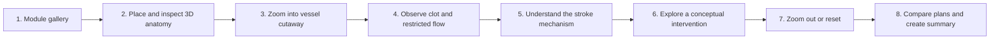
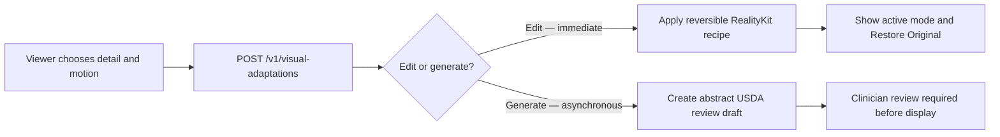

# Stroke VisionOS

An Apple Vision Pro learning experience for exploring how an ischemic stroke can interrupt blood flow, inspecting the affected vessel in 3D, and comparing conceptual response paths in spatial context.

> [!IMPORTANT]
> This repository now contains a native SwiftUI + RealityKit visionOS
> developer preview at
> [`Apps/StrokeImmersiveExperience`](Apps/StrokeImmersiveExperience), including
> an Xcode project, a visionOS Simulator build/install script, and pure-core
> smoke tests. It is not clinically approved, every catalogued variant remains
> blocked for patient/family display, and no physical Apple Vision Pro result
> has been established. Roadmap material below remains intent unless it is
> identified as implemented in the native-app section.

## Product promise

Stroke VisionOS should make a difficult biological process understandable through a direct spatial loop:

1. Choose a learning module.
2. Place and inspect a 3D anatomical model.
3. Zoom into a vessel and open a cutaway view.
4. Observe a clot and the resulting restriction in blood flow.
5. Follow the mechanism from obstruction to stroke risk.
6. Explore a conceptual intervention and restored-flow state.
7. Zoom out or reset to regain anatomical context.
8. Compare Plan A and Plan B, then generate a learning summary.



The experience should feel like an interactive spatial lesson, not a static anatomy viewer or a conventional dashboard.

## Safety and evidence boundary

This is an educational prototype. It is not a medical device and must not:

- diagnose, triage, or predict a real person's condition;
- recommend treatment, medication, dosage, or a clinical procedure;
- ingest patient records, scans, identifiers, or other protected health information;
- present simplified visuals or simulation values as clinically exact;
- claim device, simulator, build, scientific, or user-test proof that has not actually been completed.

Educational simplifications must be labelled in the interface and documentation. Scientific or clinical statements should be traceable to reputable sources before release.

## Implemented native visionOS developer preview

The current app is documented in its
[`developer handoff`](Apps/StrokeImmersiveExperience/README.md) and opens from
[`StrokeImmersiveExperience.xcodeproj`](Apps/StrokeImmersiveExperience/StrokeImmersiveExperience.xcodeproj).
It provides:

- a black, Figma-inspired window and full immersive space with native glass
  panels, fictional scenario cards, a lesson timeline, detached placeholder
  notes, a state-filtered toolbox, and an explicit Comfort & Visual Detail
  slider;
- a searchable/category-filtered index of all 150 release USDZ packages, while
  loading only one to eight compatible assets for an active recipe;
- 450 virtual `minimal`, `reduced80`, and `full` bindings that reuse the same
  150 source USDZ packages rather than duplicating geometry;
- 14 bounded step recipes, a default endovascular educational branch, and a
  separately flagged and confirmed non-graphic open-cranial developer branch;
- visionOS-owned gaze/focus and pinch selection for native controls, a spatial
  tap that toggles the toolbox, and reversible scripted visibility/state
  previews—never free-form surgery or tissue/device physics.

The app currently runs in a developer content context even when the UI uses
“Family” or “Presenter” framing. Those labels change placeholder presentation,
not authorization. Clinical copy and Figma/Page 2 anatomy anchors remain null
or unapproved, so notes and vignettes are detached and visibly labelled as
developer placeholders. Decompressive-craniectomy, optional-EVD, comprehensive
pre-operative/post-care, and complete Page 2 branches are not implemented.

From the repository root:

```bash
# Pure-core contract tests
Apps/StrokeImmersiveExperience/Scripts/run_core_smoke_tests.sh

# Compile and stage the complete 150-asset Simulator bundle
Apps/StrokeImmersiveExperience/Scripts/build_install_launch.sh --build-only

# Build, boot a matching visionOS Simulator, install, and launch
Apps/StrokeImmersiveExperience/Scripts/build_install_launch.sh

# Select an exact available Simulator by UDID or exact name
Apps/StrokeImmersiveExperience/Scripts/build_install_launch.sh \
  --device 'Stroke Care Vision Pro'

# Separately gated open-cranial developer QA
Apps/StrokeImmersiveExperience/Scripts/build_install_launch.sh --enable-open-preview
```

These commands are Simulator evidence only. They do not provision the physical
physical headset, establish device performance or comfort, approve
medical content, or authorize patient display.

## Original MVP direction and implemented subset

The following is the product direction that preceded the native app. The
current developer preview implements the gallery/library, bounded 3D scene
loading, explicit detail tiers, user-paced transport, detached vessel vignette,
and Reset/Restore behavior. Orbit/translation, true anatomical camera
fly-through, Plan A/Plan B, report generation, and free-form manipulation are
not complete.

The first coherent vertical slice should include:

- a compact module gallery;
- one placeable and rotatable 3D vessel or neurovascular scene;
- zoom, orbit, translation, and a reliable Reset/Home action;
- a reversible cutaway or “unzip” view of the vessel;
- readable clot, restricted-flow, and restored-flow states;
- a short guided sequence connecting the visual change to the learning objective;
- a simple Plan A / Plan B comparison using educational language;
- a local learning summary or report with no patient data.

Not part of the first slice: accounts, cloud sync, clinical decision support, patient-specific simulation, collaboration backends, or production analytics.

## Current 3D asset catalog

The repository includes **150 uniquely named, manifest-backed USDZ runtime
assets**:

- 65 baseline packages: 36 higher-detail v2 assets and 29 clearly labelled
  low-poly prototype-v1 assets;
- 43 release-eligible v3 detail packages: 15 HRA neural-detail assets, 16
  non-held cranial-support assets, and 12 scale-separated conceptual
  microanatomy teaching assets;
- 26 release-eligible v3 surgical-tool packages: 12 endovascular support-tool
  packages and 14 open-cranial tool packages;
- one comfort-oriented, reduced-graphic HRA brain derivative as a
  display-blocked candidate for future governed patient/family orientation;
- ten original spatial-care environment packages: nine independently loadable
  room components plus one registered review assembly;
- five Page 2 surgical-state presentation packages: registered scalp, cranial
  bone, and conceptual dura access/closure layers plus conceptual registered
  hematoma and edema context;
- 152 total build records: the detailed source build produced 87 additional
  packages, but
  `middle_inner_ear_bilateral_v3` and
  `cranial_support_registered_assembly_v3` are on an inner-ear licence hold,
  and their binaries are deliberately absent from this publishing tree.

In this inventory, “release-eligible” means present in the non-held publishing
set—not clinically approved or hospital-ready.

The higher-detail catalog covers brain/skull anatomy, head layers, cranial
vasculature, cerebral blood-flow teaching views, and generic thrombectomy
devices, plus cortical parcellations, deep nuclei, white-matter regions,
cranial nerves, orbital/airway/muscle context, blood-brain-barrier teaching,
blood elements, thrombus microstructure, neurons, glia, myelin, synapse, CSF
interface, and conceptual ischemic-tissue zones. It also includes representative,
unbranded tool-recognition sets for gated endovascular and open-cranial lesson
branches. The tool sets are not exhaustive trays, clinical sequences,
instructions, device specifications, or training simulators.

The adaptive derivative is a presentation alternative, not an extra anatomy
layer. In its lowest-detail profile it replaces the detailed brain view; it
must not be co-loaded over the source anatomy or used to hide
facts required by a future governed release.

### Three visual-detail variants for every asset

Every one of the 150 release assets now has three deterministic presentation
bindings: `minimal`, `reduced80`, and `full`—**450 virtual variants** in all.
This does not add 300 duplicate USDZ files: `full` binds the exact current
package bytes and SHA-256, while the two lower-detail choices are reversible
host-side policies for visibility, labels, materials, motion, particles, and
component selection. The source catalog therefore remains 150 USDZ packages.

- `minimal` preserves the recognizable shape, selected learning objective,
  laterality/pathway, warnings, and medical facts while showing the smallest
  policy-defined meaning-preserving explanation. Its catalog policy requests
  sparse/static flow cues, but the current native app does not synthesize or
  count those markers.
- `reduced80` targets approximately 80% of catalogued semantic information—not
  80% of polygons—with fewer secondary layers, labels, particles, highlights,
  and slower motion.
- `full` is the unmodified 100% source asset already in the repository.

Those values define the catalog contract, not a claim that the current native
renderer applies every parameter. The app applies a partial, reversible,
non-destructive subset: explicit tier selection, safe whole-role/optional-layer
visibility, view-level saturation/contrast, label/information framing, and
authored animation pause/speed. It performs no inferred descendant or
volume-ranked culling on flow, anatomy, pathology, assemblies, or tools because
authored semantic child mappings do not yet exist. `particleOrFlowCountRatio`,
`textureResolutionScale`, and `specularMultiplier` remain advisory until
semantic mappings and material/particle-safe runtime paths exist. No tier
rewrites source geometry.

The exhaustive text classification is
[`VISUAL_DETAIL_ASSET_CATEGORIES.txt`](RealityKitContent/InterfaceMedia/visual_detail_variants_v1/VISUAL_DETAIL_ASSET_CATEGORIES.txt).
The machine catalog, 14-category policy, browser selector, deterministic
builder, validator, and integration rules are documented in
[`visual_detail_variants_v1`](RealityKitContent/InterfaceMedia/visual_detail_variants_v1/README.md).
Tier selection is explicit and external; this pack does not read sensors,
infer anxiety, choose a tier automatically, or authorize patient display.
If the separate web application already has user-facing labels such as “very
anxious,” “less anxious,” and “no anxiety,” it may deliberately map them to
`minimal`, `reduced80`, and `full` respectively. Only the neutral tier value is
sent to this selector, and that upstream label must not be presented as a
diagnosis or sensor-derived measurement.

The environment module is also a presentation option, not clinical content.
Its general asset contract keeps system passthrough/Simulator presentation as
the safe default and the synthetic consultation room disabled. The current
native app deliberately uses a black full-immersion developer stage and loads
none of the synthetic room packages. That implemented black stage is not
physical-space, safe-boundary, or comfort validation.

The complete one-by-one catalog, paths, descriptions, runtime notes, manifests,
and loading guidance are in
[`RealityKitContent/Assets/README.md`](RealityKitContent/Assets/README.md).
The canonical scene hierarchy, asset relationships, pathway state machine,
interaction physics, and Houdini/RealityKit handoff are defined in
[`MASTER.md`](MASTER.md).
Licensing and provenance are recorded under [`docs/assets`](docs/assets).
The 45 v3 build records—including the two non-published hold records—are
cataloged one by one in
[`INTRACRANIAL_ASSET_CATALOG_V3.md`](docs/assets/INTRACRANIAL_ASSET_CATALOG_V3.md).


These models are generic educational material—not patient-specific anatomy,
histology, quantitative flow simulation, or clinical decision support. The
micro-detail packages must always appear in a separate magnified teaching stage
with persistent “not to anatomical scale,” conceptual/nonquantitative, and
non-patient-specific warnings.

Endovascular tools may appear only under the selected `EVT-*` educational
stage, with access route, imaging/flush, aspiration, hemostasis, and other
categories treated as conditional options. Open-cranial tools are
`open_neurosurgery_only`, prohibited from ordinary EVT, and require the explicit
`clinician_selected_hemorrhage_or_decompression_only` gate. Every tool is
static or qualitatively kinematic: no force, depth, trajectory, pressure,
energy, device sizing, compatibility, navigation, tissue interaction, or
training meaning is encoded.

The Page 2 surgical-state module is also open-branch-only except for its
orientation, ischemic-flow explanation, and closed-result composition recipes.
Its access layers are generic presentation geometry—not incisions, patient
plans, navigation targets, pressure models, technique, or outcome evidence.
Ordinary endovascular thrombectomy must reject all five new packages before
file resolution.

## Spatial-care interface resource pack

The supplied four-state interface reference is represented by a deliberately
split implementation contract:

- **USDZ** supplies the existing reviewed anatomy and the ten optional room
  packages;
- **SwiftUI/RealityKit attachments** must supply glass panels, text, role
  choices, case cards, topic rails, evidence cards, progress, warnings,
  leader lines, magnifier frames, and reversible controls;
- **visionOS** supplies passthrough, the configured Simulator environment,
  hand presence, gaze privacy, natural input, hover, and system boundaries;
- **InterfaceMedia** supplies four clearly fictional demo portraits, a
  code-native wordmark, scene presets, UI tokens, SF Symbols mappings,
  review-blocked evidence placeholders, and an intentionally incomplete
  annotation-anchor review scaffold.

The supporting target board below translates the concept into a
right-M1-compatible, non-graphic four-state flow. It is an ImageGen design
reference—not a runtime screenshot, anatomical source, Simulator proof, or
clinical evidence.


The current detailed clot and blood-flow packages depict a conceptual
**right-M1** scenario. Interface copy must say right M1; it must not reuse the
source concept's left-MCA wording. A future left-sided lesson requires
separately source-backed, registered, clinically reviewed left pathology and
flow assets—never a mirrored model.

All four case portraits and case records are synthetic fictional demo content.
They contain no patient record, clinical timeline, treatment recommendation,
eligibility decision, or predicted outcome. Keep the badge “Fictional
educational scenario — not a patient record” visible, and keep evidence cards
hidden in patient/family mode until the exact claim, current source, locale,
accessible copy, expiry policy, and review record are approved together.

The machine-readable pack is in
[`RealityKitContent/InterfaceMedia/spatial_care_interface_v1`](RealityKitContent/InterfaceMedia/spatial_care_interface_v1),
its [one-by-one interface resource catalog](RealityKitContent/InterfaceMedia/spatial_care_interface_v1/README.md)
explains all 14 supporting files, and its integration, ownership, state,
exclusion, physics, and Houdini rules are defined in
[`MASTER.md`](MASTER.md).

## Figma Page 2 surgical walkthrough

The inspected Page 2 composition is implemented as two deliberately separate
modules:

- five manifest-backed USDZ presentation layers in
  [`figma_page2_surgical_states_v1`](RealityKitContent/Assets/vision_pro_stroke_kit_v2/asset_manifest_figma_page2_surgical_states_v1.json);
- ten project-authored, non-geometry interface-contract resources in
  [`figma_page2_surgical_interface_v1`](RealityKitContent/InterfaceMedia/figma_page2_surgical_interface_v1).

The open-craniotomy design intent has six user-controlled interface steps:
confirm position, establish cranial access, establish dural access, review a
clinician-selected condition/treatment concept, review branch-correct closure,
and review the closed result. These labels are design intent, not approved
clinical copy or an operative checklist. `EVT`, `OPEN_CRANIOTOMY`,
`DECOMPRESSIVE_CRANIECTOMY`, and conditional `OPTIONAL_EVD` remain distinct
state-machine pathways; cross-pathway transitions are disabled.

The native developer preview implements only the generic orientation/default
EVT lesson and the separately gated six-state non-graphic open-craniotomy
preview. It does not implement the Page 2 decompressive-craniectomy sequence,
optional EVD pathway, a comprehensive pre-surgery/post-care journey, governed
hotspots, or anatomy-pinned clinical notes. The interface pack still describes
those wider pathways as a handoff contract; it is not evidence that they run in
the app.

All title pills, glass cards, sticker/tool rails, hotspots, warnings, and the
bottom timeline are native SwiftUI/RealityKit attachments. The ten-resource
contract keeps every clinical-copy and anatomical-anchor binding null and
display-blocked until the exact asset revision, selector, transform, wording,
citation, locale, accessibility text, and review record are approved together.
Every new USDZ and interface resource remains
`patient_display_authorized=false`. See the
[Page 2 handoff notes](docs/assets/source-notes/FIGMA_PAGE2_SURGICAL_STATES_V1_NOTES.md)
for scene roots, state enums, animation ownership, Solaris composition,
performance, exclusions, and validation gates.

The three access/closure layers inherit the generic-v2 `HeadRegisteredRoot`.
Legacy open tools remain under a separate root and may appear with them only
through an explicit reviewed tool-to-anatomy placement transform.

In the current app, open-cranial interactions are scripted asset visibility or
state changes behind an environment flag, an explicit confirmation, and an
in-session developer gate. There is no cutting, drilling, clot manipulation,
bleeding/fluid simulation, force/depth/trajectory model, suturing, fixation, or
operative physics.

## Adaptive visual-comfort endpoint

[`Services/AdaptiveAssetService`](Services/AdaptiveAssetService) provides a
small local HTTP service for changing the presentation of a catalogued source asset
without rewriting its USDZ. `POST /v1/visual-adaptations` returns an immediate,
reversible RealityKit sidecar recipe for layer visibility, material intensity,
motion, labels, and pacing. It may also report a display-blocked orientation
candidate for later governed review. A compatibility alias is
available at `/v1/adaptations`.

The separate three-tier asset selector uses the exact vocabulary
`minimal|reduced80|full` and revision-binds every response to the selected
USDZ. It is designed for a web control to choose a tier explicitly; it does not
accept anxiety, biometric, pupil, gaze, or joint-motion fields.
`GET /v1/detail-variants/{asset_id}` lists all three choices and the current
package SHA; `POST /v1/detail-variants` resolves the explicit choice only when
the caller supplies that exact SHA. A stale revision returns HTTP 409. The
response remains developer-preview data with renderer application and patient
display both unauthorized pending exact entity mapping and external review.



The service deliberately does **not** infer or diagnose anxiety. It rejects
pupil, gaze, joint-movement, biometric, and anxiety-score fields. Production
selection comes from `self_report_preference` or a governed
`clinician_override`; `simulated_demo` may make a seeded random choice only for
clearly labelled demos. The evidence and privacy contract is in
[`RESEARCH_AND_SAFETY.md`](docs/adaptive-visuals/RESEARCH_AND_SAFETY.md).

Run the dependency-free development service:

```bash
cd Services/AdaptiveAssetService
python3 -m adaptive_asset_service --port 8765
python3 -m unittest discover -s tests -v
```

The fast path is intended for on-the-spot use and preserves the source model.
In a local 250-request loopback check, the HTTP edit path measured 0.455 ms
median and 0.813 ms p95; this is development-machine evidence, not a Vision Pro
or production-network latency guarantee. Generated drafts are deterministic,
abstract, non-anatomical review artifacts and remain display-blocked until an
external authenticated clinical-review workflow approves them.
The reproducible checks and remaining gates are recorded in
[`ADAPTIVE_ENDPOINT_VALIDATION.md`](docs/adaptive-visuals/ADAPTIVE_ENDPOINT_VALIDATION.md).

## Implemented Apple stack

The repository now uses native visionOS:

- **SwiftUI** for the window, navigation, explicit detail slider, lesson
  controls, detached notes, toolbox, and other glass attachments;
- **RealityKit** for USDZ loading, the bounded spatial stage, authored
  animations, shared-root fitting, and a coarse spatial-tap target;
- **Foundation-only ExperienceCore** for the 150/450 catalog, tier hysteresis,
  state machine, safety policy, 14 recipes, toolbox policy, and smoke tests;
- **Apple Vision Pro Simulator** for the repository-owned build/install/launch
  workflow. Physical-device and human-usability validation remain separate and
  uncompleted.

The current project is
[`Apps/StrokeImmersiveExperience/StrokeImmersiveExperience.xcodeproj`](Apps/StrokeImmersiveExperience/StrokeImmersiveExperience.xcodeproj),
the shared scheme is `StrokeImmersiveExperience`, and the preview deployment
target is visionOS 27.0. The canonical scripts default to
`/Applications/Xcode-beta.app/Contents/Developer`; override that with
`STROKE_XCODE_DEVELOPER` when another installed Xcode provides the required
SDK. See the [app handoff](Apps/StrokeImmersiveExperience/README.md) for exact
flags and limitations.

## Repository layout and native app

The implemented app lives under `Apps/StrokeImmersiveExperience`; it does not
use the earlier proposed `StrokeVisionOS/` directory:

```text
Stroke-VisionOS/
├── README.md
├── Apps/
│   └── StrokeImmersiveExperience/
│       ├── StrokeImmersiveExperience.xcodeproj
│       ├── Sources/ExperienceCore/ # Catalog, tiers, recipes, gates, state
│       ├── Sources/StrokeImmersiveExperience/ # SwiftUI + RealityKit app
│       ├── Tests/ExperienceCoreTests/
│       ├── Scripts/                # Test, stage, build/install/launch
│       ├── Config/
│       ├── Info.plist
│       └── README.md               # Exact developer handoff
├── RealityKitContent/
│   ├── Assets/                     # 150 manifest-backed USDZ packages
│   └── InterfaceMedia/             # UI/config plus 450 virtual detail bindings
├── Services/
│   └── AdaptiveAssetService/       # Local visual-preference recipe endpoint
└── docs/                           # Decisions, evidence, sources, and asset records
```

The app keeps lesson/tier/pathway state in one shell/core owner and provides
Reset/Home restoration. Rich orbit, translation, bounded zoom, camera
fly-through, and incremental residency-planner integration remain incomplete;
their type-level contracts must not be reported as finished interactions.

## Collaboration model

`main` is the integrated, reviewable branch. Arnav/project lead owns merges to `main`. Everyone else—including coding agents—works on a short-lived branch and opens a pull request.

### Branch names

Use one of these forms:

```text
feature/<name>-<short-scope>
fix/<name>-<short-scope>
asset/<name>-<short-scope>
docs/<name>-<short-scope>
chore/<name>-<short-scope>
```

Examples:

```text
feature/carman-vessel-cutaway
feature/mei-learning-report
asset/jo-neurovascular-model
fix/sam-reset-transform
```

Use lowercase words separated by hyphens. Do not create vague branches such as `updates`, `final`, or `new-version`.

### Repository bootstrap status

The remote and native Xcode project already exist. Do not repeat the historical
empty-repository bootstrap or create a second scaffold. Clone the repository,
start from the current integration branch selected by the project lead, and
coordinate before editing the existing project file or shared scheme.

### Teammate workflow

```bash
# Clone once
git clone https://github.com/Arnie016/Stroke-VisionOS.git
cd Stroke-VisionOS

# Start every task from the latest main
git switch main
git pull --ff-only origin main
git switch -c feature/<your-name>-<short-scope>

# Work, then inspect exactly what changed
git status --short
git diff --check

# Commit and publish only your branch
git add <files-you-intend-to-commit>
git commit -m "feat: describe the user-visible change"
git push -u origin feature/<your-name>-<short-scope>
```

Open a pull request into `main`. Do not push directly to `main`, force-push a shared branch, or merge your own pull request unless the project lead explicitly asks.

### Commit style

Prefer small commits with an intent prefix:

- `feat:` user-visible capability;
- `fix:` defect correction;
- `asset:` model, texture, material, or animation work;
- `test:` verification only;
- `docs:` documentation only;
- `chore:` project configuration or maintenance.

Each commit should represent one understandable change. Avoid mixing feature work, asset replacement, broad formatting, and refactoring in the same commit.

## Workstream ownership

Before editing, claim a workstream in the team chat or GitHub issue. This is especially important for Xcode project files and Reality Composer Pro scenes, which are difficult to merge.

| Workstream | Typical ownership boundary | Example branch |
|---|---|---|
| Native app/project | Existing Xcode project, app/core sources, scripts, scheme and signing placeholders | `feature/name-native-app-scope` |
| Vessel explorer | Scene placement, transforms, cutaway, Reset/Home | `feature/carman-vessel-cutaway` |
| Flow and clot states | Deterministic lesson states, visuals, transitions | `feature/name-clot-flow-states` |
| Lesson UI | Gallery, step controls, labels, accessibility | `feature/name-guided-lesson-ui` |
| Adaptive presentation | Explicit visual preferences, reversible recipes, privacy/display gates | `codex/adaptive-visual-comfort` |
| Plans and report | Comparison surface and local learning summary | `feature/name-plan-report` |
| 3D assets | Model cleanup, scale, materials, provenance | `asset/name-neurovascular-model` |
| Verification | Unit tests, contract checks, build instructions | `test/name-experience-contract` |

If another branch owns the same scene or project file, coordinate before editing it. Prefer additive files and narrow changes over unrelated project-wide rewrites.

## 3D asset rules

- Agree on metres, origin, forward axis, pivot, and naming before importing assets.
- Prefer formats supported by the agreed RealityKit pipeline; keep editable sources separate from runtime exports.
- Record source URL or creator, licence, required attribution, modifications, scale, and export settings in `docs/assets/`.
- Configure Git LFS before committing large binary assets. Do not repeatedly replace large binaries in normal Git history.
- Do not commit assets with unclear rights, patient-derived data, secrets, API tokens, signing files, or private exports.
- Optimise geometry and textures deliberately; visual fidelity does not excuse an unusable frame rate.

## Pull request contract

Every pull request should answer:

1. **What changed?** Describe the user-visible behavior and list the main files.
2. **Why this scope?** Link the issue, task, or agreed workstream.
3. **How was it verified?** Include the exact command, simulator/device, and result.
4. **What remains unverified?** Call out device, hand tracking, performance, scientific review, or accessibility gates literally.
5. **What should reviewers look at?** Include screenshots or a short capture for visual/spatial work when available.

Checklist:

- [ ] Branch started from current `main`.
- [ ] Change stays inside the claimed workstream.
- [ ] `git diff --check` passes.
- [ ] The narrowest relevant tests/build were run and reported exactly.
- [ ] Reset/Home still restores every spatial transform affected by the change.
- [ ] Educational approximations and medical boundaries remain clear.
- [ ] New assets have provenance, licence, scale, and attribution records.
- [ ] No secrets, personal data, signing credentials, or generated build folders are included.
- [ ] Documentation matches the code that actually exists.

## Definition of done

A feature is done only when:

- its intended interaction works through the complete local loop;
- empty, loading, failure, and reset behavior are handled where relevant;
- labels remain readable and controls remain usable in the intended spatial context;
- deterministic state logic has a narrow test where practical;
- the app builds using the repository's documented command;
- the pull request records what was and was not tested;
- the work is reviewed and merged by the project lead.

A successful simulator build is not physical Vision Pro proof. A rendered animation is not scientific validation. A merged feature is not a clinical claim.

## Instructions for coding agents

When this repository URL is given to a coding agent, use the following contract:

```text
Read README.md completely before making changes.

1. Inspect git status, the current branch, and the actual repository contents.
2. Treat roadmap and proposed-architecture text as intent, not implemented fact.
3. Start from current main and create one short-lived branch for one bounded task.
4. Do not overwrite unrelated teammate work or broadly rewrite project files.
5. Keep the app native to visionOS unless the task explicitly changes that decision.
6. Preserve the educational/non-diagnostic boundary and never add patient data.
7. Do not add secrets, personal signing settings, paid services, or unlicensed assets.
8. Run the narrowest relevant verifier and report its exact result.
9. Do not push to main or merge. Push only the assigned branch if explicitly asked.
10. End with: changed files, verification, remaining blocker, and one next safe action.

If required context is missing and guessing would change architecture, medical meaning,
asset licensing, or another teammate's workstream, stop and ask the project lead.
```

Suggested task prompt:

```text
Work on <one bounded outcome> in https://github.com/Arnie016/Stroke-VisionOS.
Follow README.md and create <branch-name> from current main. Own only <files/workstream>.
Do not push to main or merge. Verify with <expected check>. Return changed files,
the exact verification result, the nearest blocker, and one next safe action.
```

## Build and verification status

The asset catalog has package-level USD/RealityKit validation documented in
[`docs/assets/VALIDATION.md`](docs/assets/VALIDATION.md). The adaptive service
has the Python test command documented above and in its own README. The native
app now has repository-owned verification and build commands:

```bash
# 150 assets, 450 bindings and 14 bounded-recipe/core policy checks
Apps/StrokeImmersiveExperience/Scripts/run_core_smoke_tests.sh

# Direct arm64 visionOS 27 Simulator build; stages and hash-checks 150 USDZ
Apps/StrokeImmersiveExperience/Scripts/build_install_launch.sh --build-only

# Install and launch on an auto-selected Vision Pro/Stroke Care Simulator
Apps/StrokeImmersiveExperience/Scripts/build_install_launch.sh

# Or select an exact available Simulator by UDID or exact name
Apps/StrokeImmersiveExperience/Scripts/build_install_launch.sh \
  --device 'Stroke Care Vision Pro'

# Optional absolute-path screenshot after launch
Apps/StrokeImmersiveExperience/Scripts/build_install_launch.sh \
  --screenshot /absolute/path/stroke-care.png
```

An Xcode build of the checked-in project uses:

```bash
DEVELOPER_DIR=/Applications/Xcode-beta.app/Contents/Developer \
xcodebuild \
  -project Apps/StrokeImmersiveExperience/StrokeImmersiveExperience.xcodeproj \
  -scheme StrokeImmersiveExperience \
  -sdk xrsimulator \
  -destination 'generic/platform=visionOS Simulator' \
  build
```

The direct script stages and verifies the 150 catalogued USDZ packages and
three InterfaceMedia packs, signs the Simulator bundle, and can install/launch
it. This is local Simulator proof only. There is no repository evidence yet for
physical Vision Pro signing or execution, headset frame timing, comfort,
human-factors validation, clinical correctness, or patient display. Do not
upgrade Simulator evidence into any of those claims.

## Merge and conflict recovery

Before requesting review:

```bash
git fetch origin
git rebase origin/main
git diff --check origin/main...HEAD
```

If rebase conflicts touch another person's scene, Xcode project settings, or binary asset, stop and coordinate with that owner. Do not resolve a conflict by deleting their work or choosing an entire side blindly.

## Project decisions still to lock

- exact scientific learning objective and audience;
- anatomical model source and licence;
- visual language for clot, restricted flow, and restored flow;
- meaning and wording of Plan A / Plan B;
- whether the report is an on-screen recap, export, or both;
- production-supported visionOS/Xcode matrix beyond the current visionOS 27
  developer-preview target;
- simulator performance budget and physical-device test plan;
- accessibility and reduced-motion behavior;
- repository licence.

Record accepted decisions in the repository so teammates and agents share the same source of truth. Chat messages and sketches are inputs; merged documentation and code are the canonical project record.

## Licence

No licence has been added yet. Do not assume that the code or assets may be redistributed outside the project team until the project lead adds an explicit licence.
