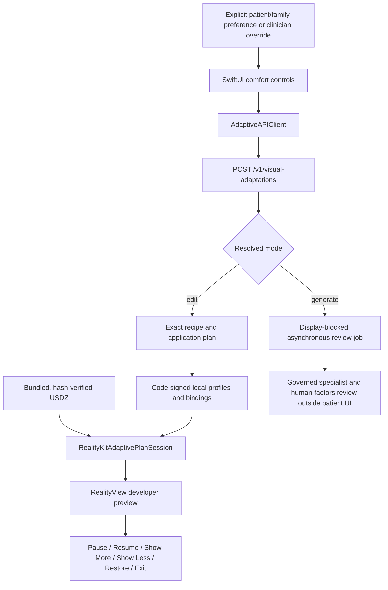

# Adaptive visual presentation: visionOS implementation instructions

## Purpose

This document is the execution handoff for a Codex agent that must turn the
existing adaptive-visual prototype into a native Apple Vision Pro application
feature. Follow it in order. Do not interpret a successful Swift type-check as
a finished app, and do not describe any developer-preview output as approved
for patients.

There is no honest way to guarantee that a medical spatial-computing feature
will work “flawlessly” before it is exercised in the real app, in Apple Vision
Pro Simulator, on physical Apple Vision Pro hardware, and in clinical and
human-factors review. In this document, *complete* means every acceptance gate
in the final checklist has recorded evidence.

## Read these files completely before editing

1. [`README.md`](README.md) — repository truth, asset counts, collaboration
   rules, and current build limitations.
2. [`MASTER.md`](MASTER.md) — asset composition, exclusions, physics boundaries,
   performance guidance, and clinical pathway rules.
3. [`Services/AdaptiveAssetService/README.md`](Services/AdaptiveAssetService/README.md)
   — HTTP contract, explicit preference inputs, edit/generate behavior, and
   service security boundary.
4. [`Services/AdaptiveAssetService/clients/README.md`](Services/AdaptiveAssetService/clients/README.md)
   — exact native executor contract and compile commands.
5. [`Services/AdaptiveAssetService/DEVELOPER_PREVIEW_HANDOFF.md`](Services/AdaptiveAssetService/DEVELOPER_PREVIEW_HANDOFF.md)
   — developer-panel and app-integration handoff.
6. [`docs/adaptive-visuals/RESEARCH_AND_SAFETY.md`](docs/adaptive-visuals/RESEARCH_AND_SAFETY.md)
   — research, privacy, trauma-informed presentation, and non-diagnostic rules.
7. [`docs/adaptive-visuals/ADAPTIVE_ENDPOINT_VALIDATION.md`](docs/adaptive-visuals/ADAPTIVE_ENDPOINT_VALIDATION.md)
   — current engineering evidence and unpassed gates.
8. [`docs/adaptive-visuals/CATALOG_ADAPTATION_PROFILES.md`](docs/adaptive-visuals/CATALOG_ADAPTATION_PROFILES.md)
   — the 135-asset profile and semantic-routing boundary.

If any of these disagree with the code or committed manifests, stop and resolve
the discrepancy before integrating the app.

## Current repository truth

The repository currently contains:

- 135 released USDZ assets across 12 manifests;
- one adaptation profile and one exact RealityKit mapping for every released
  asset;
- a captured topology of 7,243 RealityKit entities, including 3,472 model
  entities and 24 authored animation resources;
- a Python 0.2.0 local service with a developer control panel and API;
- an immediate, non-destructive edit path;
- an asynchronous deterministic USDA review-draft generator;
- the native reference executor
  [`RealityKitAdaptivePlanApplier.swift`](Services/AdaptiveAssetService/clients/RealityKitAdaptivePlanApplier.swift);
- a command-line RealityKit harness; and
- a display-blocked calm orientation asset candidate.

The repository does **not** currently contain an Xcode project, a visionOS app
target, a built simulator app, or a patient-display approval. The app scaffold
and its tests are the principal work still required.

The complete adaptive service, native client, runtime-profile, UI, test, and
handoff baseline is committed on `codex/adaptive-visual-comfort`. A fresh clone
must check out that branch, or a later branch that contains it, before starting
app integration. Verify that `git ls-files` includes the service, native
executor, runtime JSON, tests, this handoff, and the calm asset records. Do not
build the app against an accidental mixture of branches or local-only files.

The current native executor intentionally accepts only
`AdaptiveExecutionContext.developerPreview`. Every source asset, edit response,
generated draft, and calm-orientation candidate remains
`patient_display_authorized=false`.

## Non-negotiable product and medical boundaries

The integrating agent must preserve all of these rules:

- Never infer anxiety from pupils, gaze, eye position, hand motion, joint motion,
  head motion, or any other biometric or behavioral signal.
- Visual selection comes only from `self_report_preference`, a governed
  `clinician_override`, or a clearly labelled `simulated_demo`.
- Never describe a presentation preference as an anxiety score, diagnosis, or
  treatment.
- Never remove clinician-determined material facts, risks, alternatives,
  uncertainty, or access to the original reviewed presentation.
- Keep Show Less, Show More, Pause, Restore Original, and Exit/Return available.
- Never automatically escalate visual detail.
- Require both patient participation/authorization and privacy confirmation
  before family mode.
- Never load a generated USDA draft or the calm asset candidate into a patient
  scene while its display authorization is false.
- Never co-load a replacement or aggregate with the components it replaces.
- Never rename, re-export, optimize, or rewrite a USDZ without regenerating and
  revalidating the exact package-bound topology and profiles.
- Never select a RealityKit entity by display name or debug path. Only the
  package-SHA-bound `child_index_path` selectors are executable.
- Do not convert conceptual blood flow, tool placement, collision, or animation
  into clinical simulation, device guidance, quantitative physics, or outcome
  prediction.

## Target architecture



Keep the HTTP policy, local authorization resources, loaded asset revision,
SwiftUI state, and RealityKit state as distinct layers. The server proposes a
plan; the code-signed app policy authorizes it; the session applies it; the app
owns all user-visible controls and disclosures.

## Phase 0 — preserve the current work

Before creating an Xcode project:

```bash
git status --short
git branch --show-current
git diff --check
```

Do not discard unrelated modified or untracked files. Create the app integration
branch only after the adaptive branch is committed or after the project lead
explicitly approves basing the app branch on the adaptive branch. Use a focused
name such as `codex/visionos-adaptive-integration`.

Record these toolchain facts in the pull request and in `README.md` when the app
scaffold exists:

```bash
sw_vers
xcodebuild -version
xcode-select -p
xcrun --sdk xros --show-sdk-version
xcrun --sdk xrsimulator --show-sdk-version
```

Do not copy the existing `xros27.0` validation target blindly into project
settings. Select and document the deployment target actually supported by the
installed Xcode and the team’s devices.

## Phase 1 — verify the service before app work

From `Services/AdaptiveAssetService`:

```bash
python3 -m compileall -q adaptive_asset_service
python3 -m json.tool openapi.json >/dev/null
python3 profiles/build_catalog_adaptation_profiles.py --check
python3 -m unittest discover -s tests -v
python3 -m adaptive_asset_service --port 8765
```

In another terminal:

```bash
curl --fail --silent http://127.0.0.1:8765/healthz | python3 -m json.tool
curl --fail --silent http://127.0.0.1:8765/v1/catalog > /tmp/adaptive-catalog.json
python3 -m json.tool /tmp/adaptive-catalog.json >/dev/null
```

The health response must report:

- service version `0.2.0`;
- 135 assets;
- 12 manifests;
- executable mapping configured;
- 135 profiled assets;
- 135 entity-mapped assets; and
- diagnostic inference `false`.

If any count or revision differs, do not make the client “more tolerant.” Fix
the catalog/profile/binding mismatch and rerun validation.

## Phase 2 — create one canonical Xcode scaffold

Use Xcode’s native **visionOS App** template with SwiftUI. A Mac with Apple
silicon and the matching visionOS platform component are required. Install the
platform component through Xcode settings if the Apple Vision Pro run
destination is unavailable.

Create exactly one project owned by one integration branch. Suggested layout:

```text
StrokeVisionOS.xcodeproj
StrokeVisionOS/
├── App/
│   ├── StrokeVisionOSApp.swift
│   └── AppConfiguration.swift
├── AdaptivePresentation/
│   ├── AdaptiveAPIClient.swift
│   ├── AdaptiveExperienceStore.swift
│   ├── AdaptiveRealityView.swift
│   ├── AdaptiveControlsView.swift
│   ├── AdaptiveAnimationCoordinator.swift
│   └── AdaptiveErrors.swift
├── Catalog/
│   ├── AssetCatalogStore.swift
│   └── AssetResourceResolver.swift
├── Resources/
│   ├── AdaptiveRuntimeProfiles/
│   │   ├── catalog_adaptation_profiles.json
│   │   └── realitykit_entity_bindings.json
│   └── Assets/                         # Exact released USDZ bytes
└── SupportingFiles/
Tests/
├── AdaptiveContractTests/
├── AdaptiveRealityKitTests/
└── AdaptiveUITests/
```

Add
[`Services/AdaptiveAssetService/clients/RealityKitAdaptivePlanApplier.swift`](Services/AdaptiveAssetService/clients/RealityKitAdaptivePlanApplier.swift)
to the app target without weakening its checks.

Add these two generated files to the app’s code-signed resources:

- `Services/AdaptiveAssetService/adaptive_asset_service/runtime_profiles/catalog_adaptation_profiles.json`
- `Services/AdaptiveAssetService/adaptive_asset_service/runtime_profiles/realitykit_entity_bindings.json`

Keep `adaptive_asset_service/runtime_profiles/` as the canonical source. Prefer
referencing those exact two files from the Xcode resource build phase. If the
project requires a generated copy under `StrokeVisionOS/Resources`, add a
deterministic sync/check step and a test that proves both copies are byte-identical;
never hand-edit the app copy. The topology file is evidence for regeneration and
tests; the current executor does not require it as an app runtime resource.
Never download authorization JSON at runtime and never place it in a mutable
Documents or cache directory.

Add exact USDZ files through a folder reference or Copy Bundle Resources. Preserve
their filenames and bytes. At minimum, first integrate
`brain_anatomy_realistic_v2.usdz`; then run catalog-wide resource tests before
claiming all 135 assets are available. Large assemblies must remain lazy-loaded
and mutually exclusive with their components.

Use a SwiftUI window or volume for the first integration. Add an immersive space
only after the window/volume path passes state-restoration, accessibility, and
performance tests. Direct USDZ loading is sufficient; a Reality Composer Pro
package is optional rather than a prerequisite.

Apple references:

- [Creating your first visionOS app](https://developer.apple.com/documentation/visionos/creating-your-first-visionos-app)
- [RealityView](https://developer.apple.com/documentation/realitykit/realityview)
- [Loading entities from a file](https://developer.apple.com/documentation/realitykit/loading-entities-from-a-file)

## Phase 3 — make service configuration environment-specific

Create `AppConfiguration` with a read-only base URL selected by build
configuration. Do not scatter literal URLs through views.

Recommended behavior:

- Simulator developer build: attempt `http://127.0.0.1:8765` only after a
  successful `/healthz` check.
- Physical-device developer build: use a separately configured HTTPS endpoint
  reachable from Apple Vision Pro.
- Production or clinical-candidate build: no unauthenticated Python development
  server. Use an approved authenticated TLS gateway or a separately reviewed
  fully local policy implementation.
- Offline or unavailable service: keep the unmodified source asset available,
  show a concise unavailable state, and disable adaptation. Never guess a plan.

The current server is deliberately loopback-only and has no authentication.
Binding it directly to `0.0.0.0` is not an acceptable physical-device deployment.
For a temporary internal device experiment, place it behind an authenticated
TLS reverse proxy, restrict access to the test device/team, and avoid logging
preference or patient identifiers.

If the development app uses the local network, add a truthful
`NSLocalNetworkUsageDescription`. If a development-only plain-HTTP local endpoint
is absolutely required, use the narrow `NSAllowsLocalNetworking` ATS setting in
the development configuration only. Do not enable arbitrary loads globally and
do not ship an ATS exception as the production architecture.

Apple references:

- [`NSLocalNetworkUsageDescription`](https://developer.apple.com/documentation/bundleresources/information-property-list/nslocalnetworkusagedescription)
- [`NSAllowsLocalNetworking`](https://developer.apple.com/documentation/bundleresources/information-property-list/nsapptransportsecurity/nsallowslocalnetworking)
- [App Transport Security](https://developer.apple.com/documentation/bundleresources/information-property-list/nsapptransportsecurity)

## Phase 4 — implement the Swift networking boundary

Create an `actor AdaptiveAPIClient` using `URLSession`. It must:

- call only the canonical `/v1/visual-adaptations` route;
- send `Content-Type: application/json` and `Accept: application/json`;
- allow only the documented request fields;
- treat non-2xx responses as typed failures;
- require a JSON response media type;
- cap accepted response size to a reasonable value above the current maximum
  mapped response, such as 2 MiB;
- use finite request and resource timeouts;
- support task cancellation when the view disappears or a new preference wins;
- never log bodies, asset paths, patient identifiers, preference values, seeds,
  or network addresses;
- retain the app’s requested audience, detail, and motion independently for
  later native authorization; and
- decode edit responses only through
  `RealityKitAdaptivePlanSession.decodeResponse(_:)`.

Request shape:

```json
{
  "asset_id": "brain_anatomy_realistic_v2",
  "audience": "patient",
  "mode": "edit",
  "adaptation_source": "self_report_preference",
  "detail_preference": "overview",
  "motion_preference": "static"
}
```

Do not add an anxiety value or sensor payload. `simulated_demo` must remain
visibly labelled and must never be stored as a patient preference.

## Phase 5 — load and bind RealityKit content correctly

At app startup, load the code-signed authorization resources once:

```swift
let bindingsURL = try requiredBundleURL(
    name: "realitykit_entity_bindings",
    extension: "json",
    subdirectory: "AdaptiveRuntimeProfiles"
)
let profilesURL = try requiredBundleURL(
    name: "catalog_adaptation_profiles",
    extension: "json",
    subdirectory: "AdaptiveRuntimeProfiles"
)
let authorization = try AdaptiveLocalPlanAuthorization(
    bindingsURL: bindingsURL,
    profilesURL: profilesURL
)
```

Load every selected USDZ through the secure session factory:

```swift
let session = try RealityKitAdaptivePlanSession.load(contentsOf: assetURL)
let root = session.rootEntity
```

Do not load an `Entity` separately and attempt to associate it with a hash later.
The session hashes the file before and after RealityKit load and binds that exact
root to the observed bytes.

Put the returned root below a separate placement entity:

```text
RealityView content
└── ExperiencePlacementRoot       # app-owned translate/orbit/fit/reset
    └── AdaptiveSessionRoot        # exact session.rootEntity; do not reorder children
```

Never reorder, insert, delete, or reparent children inside `session.rootEntity`.
The selector map is an exact child-index topology. Apply centering, fit, orbit,
zoom, and world placement only to `ExperiencePlacementRoot`.

The existing session load is synchronous. For the first correct integration,
show a loading state and prevent duplicate loads. A prioritized improvement is
an asynchronous session factory using RealityKit’s asynchronous load API while
retaining the before/after package hash and non-forgeable root/revision binding.
Do not move mutable RealityKit entities across actors unsafely merely to hide a
loading pause.

## Phase 6 — apply an edit only through the native authorization gate

On the main actor:

1. Keep the app’s requested audience, detail tier, and motion preference.
2. Decode the response.
3. Present any required content warning or progressive-disclosure UI.
4. Present the exact fallback named by the plan when fallback is required.
5. Confirm all comfort controls are visible and usable.
6. Apply with explicit developer-preview context.

Integration sketch:

```swift
let decoded = try RealityKitAdaptivePlanSession.decodeResponse(responseData)

let expected = AdaptiveExpectedPresentation(
    audience: requestedAudience,
    detailPreference: requestedDetail,
    motionPreference: requestedMotion,
    familyParticipationAuthorized: familyAuthorizationConfirmed,
    familyPrivacyConfirmed: familyPrivacyConfirmed
)

let fallback: AdaptiveFallbackPresentation =
    decoded.applicationContract.fallbackRequired
    ? .appPresented(decoded.applicationPlan.fallbackIfUnresolved)
    : .notRequired

let readiness = AdaptivePresentationUIReadiness(
    adaptationDisclosureVisible: true,
    comfortControlsAvailable: true,
    contentWarningPresented: contentWarningWasPresented,
    progressiveDisclosureAvailable: progressiveDisclosureControlIsAvailable
)

let report = try session.apply(
    decoded,
    executionContext: .developerPreview,
    authorization: authorization,
    animationBaseline: .pristineLoadedRoot,
    fallbackPresentation: fallback,
    expectedPresentation: expected,
    uiReadiness: readiness
)
```

Use `.pristineLoadedRoot` only before the app creates animation playback. If the
app already owns controllers, implement `AdaptiveAnimationStateManaging` and use
`.appManaged(manager)`. Its preparation method must capture and suspend the
app-owned animation state, and its restore method must recreate that state.

Treat `AdaptiveApplyReport.patientDisplayAuthorized == false` as a blocking fact,
not an informational warning. Display an “Adapted developer preview” badge while
the presentation is active.

## Phase 7 — own the full user interaction state in SwiftUI

Create one `@MainActor` experience store. It should own:

- selected asset ID and package URL;
- selected audience, detail tier, and motion preference;
- family authorization and privacy confirmation state;
- active request task and request-generation token;
- session and authorization objects;
- source/adapted/loading/error state;
- content-warning and progressive-disclosure state;
- exact fallback currently displayed;
- active-adaptation badge state;
- zoom, orbit, translation, fit, and reset state; and
- app-owned animation state.

Implement these commands as explicit state-machine events:

- Show Less: move one tier toward overview and issue a new request.
- Show More: move one tier toward clinical detail only after explicit selection.
- Pause/Resume: call the session animation methods.
- Restore Original: call `restoreOriginalPresentation()` and clear adaptive UI.
- Exit/Return: restore first, cancel outstanding work, then dismiss or return.
- Change asset: restore and remove the prior root before loading the new package.
- Change audience: restore first and rerun authorization/privacy UI.
- Reset/Home: restore view placement, layer state, animation, and adaptation—not
  just camera or scale.

If two requests race, only the latest request token may update the scene. A late
response from an earlier preference must be discarded before decode/application.

## Phase 8 — render with RealityView

Use `RealityView` for the 3D content and SwiftUI attachments or an adjacent
window for controls. Load once, add `ExperiencePlacementRoot`, and mutate the
session only through the store. Do not recreate the entity hierarchy in every
SwiftUI update pass.

Required persistent UI:

- current detail level;
- current motion mode;
- “presentation adapted” disclosure;
- Show Less and Show More;
- Pause/Resume when animation exists;
- Restore Original;
- Exit/Return;
- required content warning;
- fallback card when requested changes cannot be safely applied; and
- clear developer-preview / not-approved-for-patient-display status until a
  future governed release changes the complete approval contract.

Honor Reduce Motion and accessibility settings. Do not rely on color alone for
meaning. Use plain-language labels, large hit targets, VoiceOver labels, adequate
contrast, and predictable focus order. Avoid rapid peripheral motion and large
automatic camera movement.

## Phase 9 — keep generation separate from runtime patient presentation

`mode: generate` currently queues a deterministic, non-AI procedural template.
It creates:

- `scene.usda`, an abstract head/neck/orientation-ring scene made from USD
  primitives; and
- `recipe.json`, a review envelope containing the exact visual recipe.

The app may expose job status to an authenticated developer/reviewer tool, but a
patient build must not download, catalog, or display the artifacts. They remain:

- `display_authorized=false`;
- `abstract_procedural_review_draft`;
- non-anatomical;
- non-patient-specific; and
- subject to specialist and human-factors review.

There is no external AI model call, prompt-to-anatomy generator, DICOM synthesis,
or self-approval endpoint. Do not advertise otherwise. A future generative
pipeline must be asynchronous, provenance-preserving, exact-versioned,
clinician-reviewed, and unable to overwrite the approved source.

## Phase 10 — simulator build and test

After the Xcode scaffold exists, discover the actual scheme and destinations:

```bash
xcodebuild -list -project StrokeVisionOS.xcodeproj
xcodebuild -showdestinations \
  -project StrokeVisionOS.xcodeproj \
  -scheme StrokeVisionOS
```

Select an available Apple Vision Pro simulator in Xcode or Device Hub. Record
the destination ID and use it in reproducible commands:

```bash
xcodebuild \
  -project StrokeVisionOS.xcodeproj \
  -scheme StrokeVisionOS \
  -destination 'id=<SIMULATOR-DESTINATION-ID>' \
  -derivedDataPath build/DerivedData \
  build

xcodebuild \
  -project StrokeVisionOS.xcodeproj \
  -scheme StrokeVisionOS \
  -destination 'id=<SIMULATOR-DESTINATION-ID>' \
  -derivedDataPath build/DerivedData \
  test
```

Do not publish `<SIMULATOR-DESTINATION-ID>` or a local DerivedData/container path
in committed documentation. Record the command template plus the Xcode and SDK
versions.

Simulator acceptance must include visible loaded geometry—not a spinner,
placeholder, browser mockup, or empty RealityView—and all of the following:

1. Service health succeeds.
2. `brain_anatomy_realistic_v2` loads from the bundle.
3. Overview/static returns and applies an exact plan.
4. The disclosure, comfort controls, warning, and fallback appear when required.
5. Restore Original returns materials, visibility, and animation to their source
   state.
6. Rapid preference changes cannot apply an obsolete response.
7. Missing service, bad JSON, wrong SHA, stale mappings, missing resource,
   reordered hierarchy, and missing fallback all fail closed.
8. Family mode fails until both authorization and privacy confirmations are
   present.
9. Generated artifacts and the calm candidate remain blocked.
10. Memory does not grow without bound while switching representative assets.

Apple notes that simulators do not reproduce all physical-device features or
performance. Simulator success is necessary but not device proof.

Apple references:

- [Running on simulated or physical devices](https://developer.apple.com/documentation/xcode/running-your-app-on-simulated-or-physical-devices)
- [Managing devices in Device Hub](https://developer.apple.com/documentation/xcode/pairing-your-devices-with-your-mac)

## Phase 11 — physical Apple Vision Pro test

For the project’s Apple Vision Pro named `XCAT`:

1. Put the Mac and XCAT on the same suitable Wi-Fi network.
2. In Xcode, open Device Hub and start pairing a nearby visionOS device.
3. On XCAT, open Settings > General > Remote Devices when prompted.
4. Ensure the network supports the discovery requirements shown by Device Hub,
   including IPv6 for visionOS device pairing.
5. Follow the PIN/trust flow.
6. Enable Developer Mode from Settings > Privacy & Security after pairing begins,
   then restart and reconfirm if visionOS requests it.
7. Sign the app with the team’s development identity and automatic signing.
8. Select XCAT as the run destination and run from Xcode.
9. Use the authenticated HTTPS service endpoint configured for the device; the
   device’s `127.0.0.1` is the device itself, not the Mac service.

Physical-device acceptance must additionally cover:

- legibility at intended distance and scale;
- comfort during transitions, rotation, and animation;
- eye/hand interaction without collecting raw gaze or using it for adaptation;
- Reduce Motion, VoiceOver, Dynamic Type where applicable, contrast, and
  color-independent meaning;
- frame timing, memory, thermal behavior, and loading stalls;
- recovery from Wi-Fi interruption and app background/foreground transitions;
- exact Restore Original behavior after every exit path; and
- clinician and representative patient/family review of comprehension and
  distress, not merely visual attractiveness.

Use RealityKit Trace and Instruments on the real assembled scene. Do not infer
device performance from the existing desktop RealityKit harness.

Apple references:

- [Enabling Developer Mode](https://developer.apple.com/documentation/xcode/enabling-developer-mode-on-a-device)
- [Managing and pairing devices](https://developer.apple.com/documentation/xcode/pairing-your-devices-with-your-mac)

## Phase 12 — tests the app must add

### Unit and contract tests

- Request encoding contains only allowed fields.
- No biometric or anxiety field can enter the request model.
- Every detail and motion combination maps to the expected app state.
- Service URL selection is configuration-specific.
- Non-2xx, non-JSON, oversized, slow, cancelled, and malformed responses fail
  without changing the scene.
- Local profile/binding resources are present and immutable.
- Every bundled USDZ byte count and SHA matches its manifest/binding record.
- Patient context remains rejected.
- Family mode requires both gates.
- Required fallback and UI readiness are enforced.
- Latest-request-wins behavior is deterministic.
- State restoration is idempotent.

### RealityKit integration tests

- Load/hash/apply/restore representative light, heavy, animated, aggregate,
  pathology, tool, and micro-detail assets.
- Verify no child reordering below the session root.
- Verify unsupported material slots are preserved.
- Verify mapped labels and primary pathology remain protected.
- Verify app-managed animation state is restored after success and failure.
- Verify aggregate/component mutual exclusion.
- Verify no generated or held asset enters the runtime catalog.

### UI tests

- Controls remain available at every tier.
- Content warning and progressive disclosure appear before application when
  required.
- Restore and Exit work from loading, success, failure, and cancellation states.
- Family privacy flow cannot be bypassed.
- Adaptation status is transparent.
- Reduce Motion disables autoplay and uses the correct plan.
- Accessibility labels, focus order, and large text remain usable.

### Regression commands

Keep the existing service/native gates green:

```bash
cd Services/AdaptiveAssetService
python3 -m compileall -q adaptive_asset_service
python3 -m json.tool openapi.json >/dev/null
python3 profiles/build_catalog_adaptation_profiles.py --check
python3 -m unittest discover -s tests -v

xcrun --sdk macosx swiftc \
  -warnings-as-errors -strict-concurrency=complete -typecheck \
  clients/RealityKitAdaptivePlanApplier.swift \
  tools/ValidateRealityKitAdaptivePlan.swift

xcrun --sdk xros swiftc \
  -target arm64-apple-xros27.0 \
  -warnings-as-errors -strict-concurrency=complete -typecheck \
  clients/RealityKitAdaptivePlanApplier.swift \
  tools/ValidateRealityKitAdaptivePlan.swift

xcrun --sdk xrsimulator swiftc \
  -target arm64-apple-xros27.0-simulator \
  -warnings-as-errors -strict-concurrency=complete -typecheck \
  clients/RealityKitAdaptivePlanApplier.swift \
  tools/ValidateRealityKitAdaptivePlan.swift
```

The standalone type-check commands use the environment that validated the
current reference source. After the project chooses a deployment target, add
project-owned `xcodebuild` tests and update these commands only with recorded
evidence.

## Regenerating mappings after an asset change

Do this only when a released USDZ is intentionally replaced. Any byte or child
topology change invalidates exact authorization.

1. Update the source asset and manifest with licence/provenance review.
2. Run strict USD and RealityKit asset validation.
3. Rebuild the complete RealityKit entity map:

```bash
cd Services/AdaptiveAssetService
xcrun --sdk macosx swiftc -O \
  tools/ExtractRealityKitEntityMap.swift \
  -o /tmp/ExtractRealityKitEntityMap

/tmp/ExtractRealityKitEntityMap \
  ../../RealityKitContent/Assets \
  adaptive_asset_service/runtime_profiles/realitykit_entity_map.json
```

4. Regenerate exact bindings:

```bash
python3 profiles/build_realitykit_entity_bindings.py \
  --catalog-root ../../RealityKitContent/Assets \
  --entity-map adaptive_asset_service/runtime_profiles/realitykit_entity_map.json \
  --output adaptive_asset_service/runtime_profiles/realitykit_entity_bindings.json
```

5. Regenerate or check profiles:

```bash
python3 profiles/build_catalog_adaptation_profiles.py
python3 profiles/build_catalog_adaptation_profiles.py --check
python3 -m unittest discover -s tests -v
```

6. Recopy the changed code-signed runtime JSON and exact USDZ bytes into the app
   target.
7. Rerun catalog-wide native authorization and app tests.
8. Obtain fresh semantic, clinical, human-factors, accessibility, and visual QA
   for the changed mapping. Automated topology success does not validate the
   semantic classification.

## Prioritized improvements

### P0 — required for a credible simulator integration

1. Create and commit the single canonical Xcode project and scheme.
2. Implement the API client, experience state machine, RealityView container,
   comfort controls, fallback UI, and full restoration lifecycle.
3. Bundle and integrity-test all required USDZ and authorization resources.
4. Add asynchronous/cancellable asset loading without weakening hash/root
   binding.
5. Add app-owned animation-state capture/restoration.
6. Add simulator build, test, launch, and visible-content evidence.
7. Make the service base URL build-configured and fail closed when unavailable.
8. Preserve the committed adaptive service/executor/profile baseline and record
   its exact branch/commit before asking another agent or clean worktree to
   build on it.

### P1 — required before governed patient studies

1. Have specialists review all semantic groups and automatic hide/material rules.
2. Introduce an external approval registry binding the exact asset SHA, mapping
   SHA, profile SHA, policy version, app version, reviewer, and approval scope.
3. Keep patient context blocked until that complete tuple is approved.
4. Conduct accessibility and trauma-informed human-factors tests with stroke
   patients, family members, older adults, motion-sensitive participants, and
   clinicians.
5. Add comprehension and recall measures; do not optimize only for reported
   calmness.
6. Add localized clinician-approved plain-language content.
7. Profile representative and worst-case asset combinations on physical Vision
   Pro and implement lazy loading, unload policy, and memory-pressure handling.

### P2 — quality and scalability

1. Add reviewed LOD/proxy variants instead of relying on the current requested
   `lod_bias`, which has no runtime LOD implementation.
2. Add reviewed, asset-specific comfort material variants rather than applying
   one generic transform to every suitable material.
3. Add deterministic visual-regression screenshots for each tier on a curated
   representative set.
4. Add an offline-first signed policy bundle so patient education does not depend
   on a nearby development server.
5. Separate developer generation/review tooling from the patient app target.
6. Add observability containing only allowlisted operational metrics—never raw
   gaze, motion, preference, patient identity, request body, or asset path.
7. If future AI-assisted textures or models are explored, keep them offline from
   patient display until provenance, anatomical comparison, specialist review,
   accessibility review, and exact-version approval all pass.

## Do not “improve” the system in these unsafe ways

- Do not add pupil or gesture heuristics as a shortcut for preference selection.
- Do not make `clinician_override` proof of identity; authentication belongs to
  the gateway/app workflow.
- Do not change `patient_display_authorized` to true to make a demo run.
- Do not disable package hashes or topology checks to accommodate a mismatched
  resource.
- Do not download authorization JSON from the same mutable endpoint that returns
  the plan.
- Do not show a partial adaptation when the plan requires a fallback.
- Do not restore only camera position; restore the entire presentation state.
- Do not turn alpha transparency into the default solution for layered anatomy.
- Do not treat the abstract generated USDA as anatomy.
- Do not claim the pastel calm asset reduces anxiety.
- Do not claim simulator evidence is physical-device, clinical, usability, or
  performance evidence.

## Definition of done

Another agent may call the feature integrated only when all applicable boxes are
checked and the evidence paths are recorded:

- [ ] One canonical Xcode project, target, and shared scheme exist.
- [ ] The project records Xcode, SDK, and deployment-target versions.
- [ ] The service regression suite passes.
- [ ] Native strict macOS/device/simulator type-checks pass.
- [ ] App unit, integration, and UI tests pass.
- [ ] All bundled USDZ and authorization resources match expected hashes.
- [ ] Simulator build and test commands pass from a clean checkout.
- [ ] The simulator visibly loads real USDZ content.
- [ ] Edit/apply/pause/resume/restore/exit work through the native executor.
- [ ] Failure, cancellation, stale response, and offline cases preserve or
      restore the original source.
- [ ] Family authorization/privacy and all UI-readiness gates fail closed.
- [ ] Generated artifacts and unapproved candidates never enter patient UI.
- [ ] Representative light/heavy/static/animated/aggregate/pathology assets pass.
- [ ] Performance, comfort, interaction, and accessibility are checked on XCAT.
- [ ] RealityKit Trace/Instruments evidence is recorded for the real device.
- [ ] Clinical semantic review and human-factors review status are explicit.
- [ ] Patient display remains blocked unless a future governed exact-version
      approval process authorizes the complete asset/mapping/profile/policy/app
      tuple.
- [ ] `README.md`, validation evidence, and the pull request distinguish clearly
      between type-check, simulator, physical-device, clinical, and human-test
      results.

## Required handoff from the implementing Codex agent

At the end of the implementation, report:

1. Branch and commit.
2. Exact files added or changed.
3. Xcode, visionOS SDK, project, scheme, and deployment target.
4. Exact service, `xcodebuild`, simulator, and device commands used.
5. Test counts and results.
6. Simulator destination class without committing its private UUID.
7. Physical device used, if any, and whether it was XCAT.
8. Screenshots showing loaded content and every adaptive control.
9. Package/profile/binding hashes and whether they match the app bundle.
10. Known limitations and every gate not yet passed.
11. Confirmation that no biometric inference was added and patient display is
    still blocked unless an approved release record exists.

Do not end the task at “the code compiles.” Continue until the next unchecked
acceptance gate is genuinely external—such as clinical review or unavailable
physical hardware—and document that blocker precisely.
